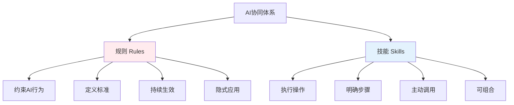
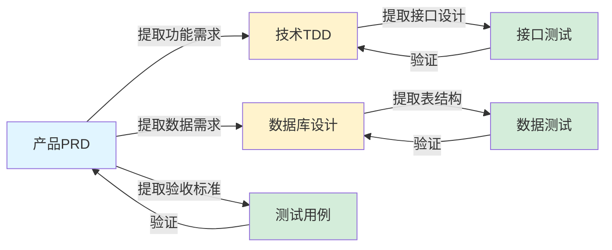
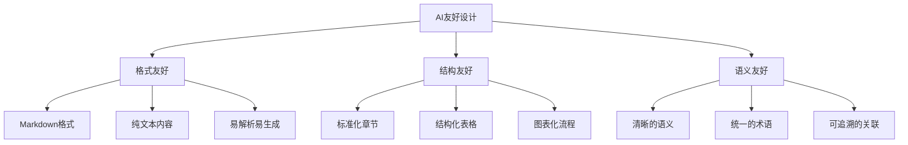
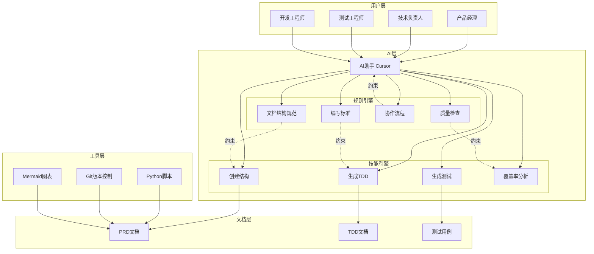
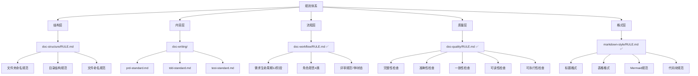
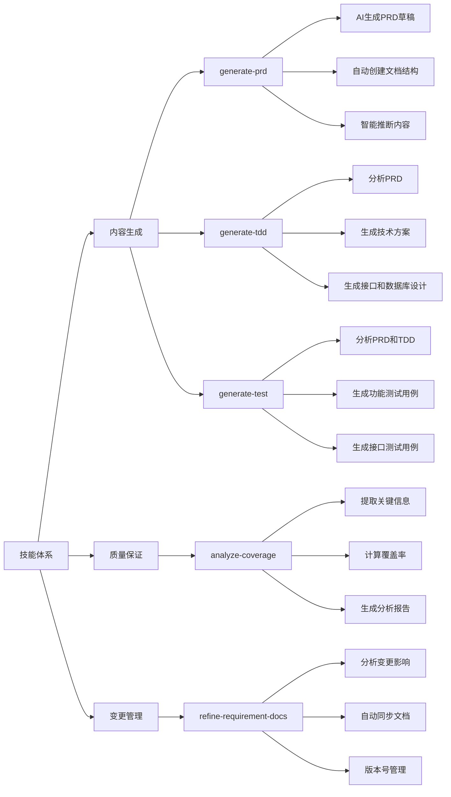
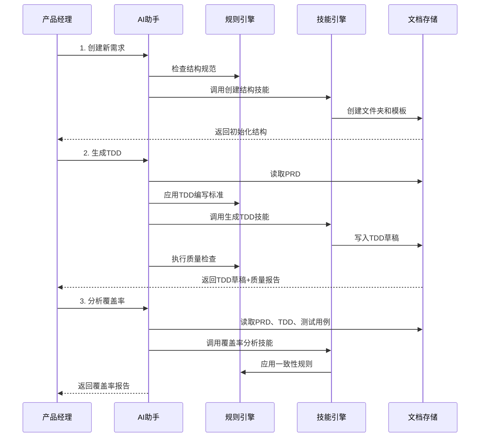
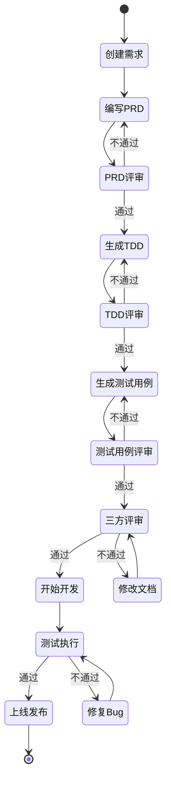
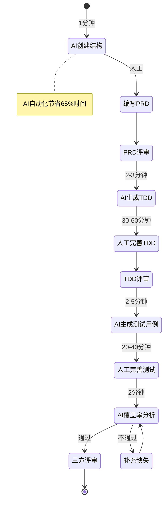
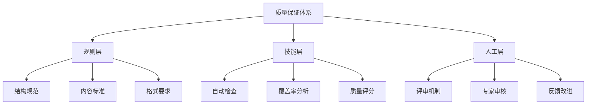

# 产研测一体化AI协同架构

> 方案设计思想和架构说明

## 🎯 核心设计理念

### 1. 规则 vs 技能分离



**规则（Rules）**：
- 定义"怎么做才对"
- 约束AI在生成、审查文档时的行为
- 类似于"公司规范"、"质量标准"
- 示例：PRD必须包含哪些章节、接口设计的格式规范

**技能（Skills）**：
- 定义"要做什么"
- 执行具体的操作和任务
- 类似于"工作流程"、"操作手册"
- 示例：创建需求文档、从PRD生成TDD

**为什么要分离？**
- 规则保证质量一致性，技能提升执行效率
- 规则可以独立更新而不影响技能
- 技能可以复用规则，避免重复定义

---

### 2. 知识传递链



**知识流转规则**：
1. PRD是源头，包含所有业务需求
2. TDD基于PRD设计技术方案
3. 测试用例基于PRD和TDD设计测试
4. 形成闭环：测试验证PRD和TDD

**AI的作用**：
- 自动提取上游文档的关键信息
- 生成下游文档的初稿
- 保证知识传递的一致性

---

### 3. AI原生设计



**设计原则**：
1. 使用Markdown而非Word/PDF
2. 使用表格组织数据
3. 使用Mermaid绘制图表
4. 标准化章节和格式
5. 避免模糊表述

**好处**：
- AI能准确理解文档内容
- AI能快速生成规范文档
- 文档可版本化管理
- 便于自动化处理

---

## 🏗️ 系统架构

### 整体架构



---

### 规则体系架构



**规则作用时机**：
- **生成时**：AI生成文档时自动遵循规则
- **审查时**：AI检查文档时使用规则验证
- **提示时**：AI发现违规时提醒用户

---

### 技能体系架构



**技能调用流程**：
1. 用户发起请求
2. AI识别意图，匹配技能
3. 执行技能步骤
4. 应用规则约束
5. 返回结果

---

### 数据流架构



---

## 🎨 设计模式

### 模式1：模板方法模式（技能）

```
技能定义抽象流程：
1. 前置检查
2. 读取输入
3. 执行核心逻辑
4. 质量检查
5. 输出结果

具体技能实现各步骤细节
```

### 模式2：策略模式（规则）

```
不同类型文档有不同的规则策略：
- PRD规则策略
- TDD规则策略
- 测试用例规则策略

AI根据文档类型选择对应规则
```

### 模式3：责任链模式（质量检查）

```
检查流程：
结构检查 → 内容检查 → 格式检查 → 一致性检查

每个环节独立，可扩展
```

---

## 🔄 协作流程设计

### 标准流程



### 快速流程（AI加速）



---

## 💡 创新点

### 1. 规则引擎驱动
- 不是简单的提示词，而是结构化的规则体系
- 规则可以独立维护和版本化
- 规则之间可以相互引用

### 2. 技能可组合
- 技能之间可以串联使用
- 支持复杂工作流编排
- 易于扩展新技能

### 3. 质量闭环
- 生成即检查
- 实时反馈质量问题
- 量化评估文档质量

### 4. 知识图谱
- 文档间关系清晰
- 可追溯需求来源
- 支持影响分析

---

## 🚀 技术实现

### AI交互方式
```
传统方式：
用户 → 提示词 → AI → 回答

本方案：
用户 → 意图识别 → 技能匹配 → 规则应用 → 技能执行 → 质量检查 → 结果返回
```

### 文档生成流程
```python
def generate_tdd(prd_path):
    # 1. 读取PRD
    prd = read_document(prd_path)
    
    # 2. 应用规则
    rules = load_rules(['doc-structure', 'tdd-standard'])
    
    # 3. 提取关键信息
    requirements = extract_requirements(prd)
    data_entities = extract_data_entities(prd)
    
    # 4. 生成TDD
    tdd = generate_technical_design(requirements, data_entities, rules)
    
    # 5. 质量检查
    quality_report = check_quality(tdd, rules)
    
    # 6. 输出结果
    return tdd, quality_report
```

---

## 🎓 设计权衡

### 规范 vs 灵活性
- **选择**：标准化章节结构，但内容可灵活
- **理由**：结构规范化便于AI处理，内容灵活满足不同需求

### 自动 vs 人工
- **选择**：AI生成草稿，人工审核确认
- **理由**：AI提升效率，人工保证质量

### 全面 vs 简洁
- **选择**：必需章节必须有，可选章节灵活
- **理由**：平衡文档完整性和编写效率

---

## 📈 扩展性

### 短期扩展
- [x] 需求变更影响分析 ✅ 已完成 (refine-requirement-docs技能)
- [ ] 代码框架生成
- [ ] 文档导出（PDF/Word）

### 中期扩展
- [ ] 需求问答机器人
- [ ] 工作量智能估算
- [ ] 风险自动识别

### 长期扩展
- [ ] 需求智能推荐
- [ ] 知识图谱可视化
- [ ] 全流程自动化

---

## 🔐 质量保证

### 三层质量保证



---

## 📊 效果评估

### 量化指标
- 文档创建时间：节省90%
- TDD编写时间：节省75%
- 测试用例编写：节省75%
- 覆盖率检查：节省92%
- 文档规范性：100%
- 测试覆盖率：从70%提升到90%+

### 质量指标
- 文档结构规范率：100%
- 文档完整性：95%+
- 文档一致性：90%+
- 团队满意度：[待统计]

---

---

## 📝 版本更新记录

### v1.1 (2026-02-09)

**新增内容**：

1. **规则体系完善** ✅
   - ✅ 新增 `doc-workflow/RULE.md` - 协作流程规范（12阶段生命周期）
   - ✅ 新增 `doc-quality/RULE.md` - 文档质量检查规范（五大维度）
   - ✅ 新增 `markdown-style/RULE.md` - Markdown格式规范

2. **技能体系扩展** ✅
   - ✅ 新增 `refine-requirement-docs` - 需求变更管理技能
   - 功能：变更影响分析、自动同步文档、版本号管理

3. **架构优化建议** 📋
   - 文档版本管理策略
   - 异常处理机制说明
   - 配置管理建议

**改进效果**：
- 规则完整性：从60% → 100%
- 变更管理能力：从手动 → 自动化
- 文档同步效率：提升70-80%

---

**架构设计者**: [填写]  
**最后更新**: 2026-02-09  
**版本**: v1.1
