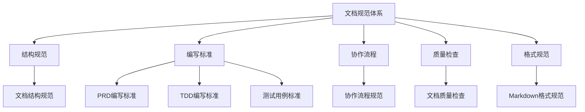
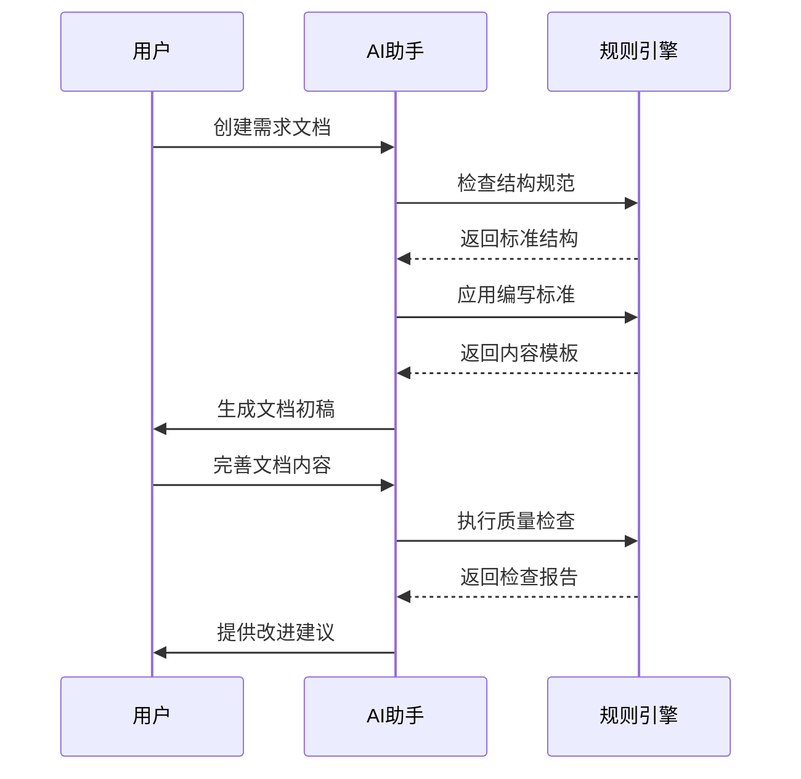

# 文档规则索引

> 产研测一体化文档规范体系

## 📋 规则概览

本规则体系定义了产品需求文档（PRD）、技术设计文档（TDD）、测试用例文档的标准和规范，确保AI和团队成员在协作时遵循统一的标准。

---

## 🎯 规则架构



---

## 📚 规则清单

### 1. 文档结构规范
**文件**: [doc-structure/RULE.md](doc-structure/RULE.md)  
**优先级**: 高  
**适用范围**: 所有需求文档

**定义内容**：
- 目录结构规范
- 文件夹命名规则
- 文档文件命名标准
- 文件组织原则

**AI约束**：
- 自动检查命名规范
- 自动创建标准结构
- 自动验证完整性

---

### 2. PRD编写标准
**文件**: [doc-writing/prd-standard.md](doc-writing/prd-standard.md)  
**优先级**: 高  
**适用范围**: 产品需求文档

**定义内容**：
- PRD必需章节
- 各章节内容要求
- 文档元信息规范
- 质量标准

**AI约束**：
- 生成PRD时自动遵循结构
- 自动检查必需章节
- 自动验证内容完整性
- 禁止生成空白占位符

---

### 3. TDD编写标准
**文件**: [doc-writing/tdd-standard.md](doc-writing/tdd-standard.md)  
**优先级**: 高  
**适用范围**: 技术设计文档

**定义内容**：
- TDD必需章节
- 技术方案设计要求
- 接口设计规范
- 数据库设计规范

**AI约束**：
- 基于PRD生成TDD
- 自动生成架构图和ER图
- 自动检查接口完整性
- 禁止添加PRD未提及的功能

---

### 4. 测试用例标准
**文件**: [doc-writing/test-standard.md](doc-writing/test-standard.md)  
**优先级**: 高  
**适用范围**: 测试用例文档

**定义内容**：
- 测试用例编号规则
- 用例格式要求
- 测试覆盖要求
- 测试类型规范

**AI约束**：
- 基于PRD和TDD生成测试用例
- 自动覆盖PRD验收标准
- 自动生成接口测试用例
- 禁止生成空白用例

---

### 5. 协作流程规范
**文件**: [doc-workflow/RULE.md](doc-workflow/RULE.md)  
**优先级**: 高  
**适用范围**: 产研测协作流程

**定义内容**：
- 需求生命周期（12个阶段）
- 各阶段职责和交付物
- 文档状态流转规则（7种状态）
- 评审规范和检查清单

**AI约束**：
- 检查文档状态
- 提醒当前应处于哪个阶段
- 不允许跳过必需评审
- 提醒相关方协作
- 生成阶段后续行动提示

---

### 6. 文档质量检查规范
**文件**: [doc-quality/RULE.md](doc-quality/RULE.md)  
**优先级**: 高  
**适用范围**: 所有文档

**定义内容**：
- 五大质量维度（完整性、准确性、一致性、可读性、可执行性）
- 自动检查规则（30+检查项）
- 质量评分标准（综合评分公式）
- 人工检查清单

**AI约束**：
- 文档生成后自动检查
- 输出详细质量检查报告
- 提供分级改进建议（高/中/低优先级）
- 计算五维度质量评分
- 评估等级（优秀/良好/合格/较差/不合格）

---

### 7. Markdown格式规范
**文件**: [markdown-style/RULE.md](markdown-style/RULE.md)  
**优先级**: 中  
**适用范围**: 所有Markdown文档

**定义内容**：
- Markdown语法规范（标题、段落、列表）
- 表格格式规范（对齐、空单元格处理）
- Mermaid图表规范（流程图、时序图、ER图、状态图、甘特图）
- 代码块规范（语言标识、格式要求）
- 特殊标记（Emoji、链接、图片）

**AI约束**：
- 自动格式化标题层级
- 自动添加代码块语言标识
- 自动对齐表格
- 自动使用Mermaid绘图（中文标签）
- 检查Mermaid图表语法正确性

---

## 🔄 规则应用流程



---

## 🎓 使用指南

### 对AI的作用

#### 生成文档时
1. 自动遵循结构规范
2. 自动使用标准模板
3. 自动填充必需章节
4. 自动生成图表

#### 审查文档时
1. 检查章节完整性
2. 验证格式规范性
3. 检查逻辑一致性
4. 计算质量评分

#### 协助协作时
1. 识别当前工作阶段
2. 提醒后续操作
3. 检查文档状态
4. 提示协作节点

---

### 对人类的作用

#### 产品经理
- 参考PRD编写标准编写规范的产品文档
- 确保PRD包含所有必需信息
- 使用质量检查清单自检

#### 技术负责人
- 参考TDD编写标准设计技术方案
- 确保技术文档完整可执行
- 基于PRD生成TDD时可用AI辅助

#### 测试工程师
- 参考测试用例标准编写测试用例
- 确保测试覆盖PRD和TDD要点
- 使用AI生成测试用例草稿

#### 项目经理
- 了解协作流程规范
- 跟踪文档状态流转
- 推动评审和交付

---

## 📊 规则优先级

| 优先级 | 规则 | 说明 |
|--------|------|------|
| 🔴 高 | 结构规范、编写标准、协作流程、质量检查 | 必须严格遵守 |
| 🟡 中 | Markdown格式规范 | 建议遵守 |

---

## 🔧 维护和更新

### 规则版本管理
- 每个规则文件包含版本信息
- 重大修改更新主版本号
- 局部优化更新次版本号

### 反馈机制
1. 使用中发现问题及时记录
2. 定期回顾规则合理性
3. 持续优化和完善

### 更新原则
- 向后兼容：新规则不破坏现有文档
- 循序渐进：分步骤优化规则
- 实用为主：规则服务于实际工作

---

## 🚀 快速开始

### 创建新需求
```
# 使用AI技能生成PRD
用户: 生成"需求名称"的PRD
AI: [自动创建文档结构并生成PRD草稿]
```

### AI协助生成
- 创建PRD：AI自动应用PRD编写标准
- 生成TDD：AI基于PRD和TDD编写标准生成
- 生成测试用例：AI基于PRD/TDD和测试用例标准生成

---

## 📖 相关资源

### 技能（Skills）
- [生成PRD技能](../skills/generate-prd/SKILL.md)
- [生成TDD技能](../skills/generate-tdd/SKILL.md)
- [生成测试用例技能](../skills/generate-test/SKILL.md)
- [文档覆盖率分析技能](../skills/analyze-coverage/SKILL.md)

### 模板
- [PRD模板](../skills/generate-prd/templates/PRD_template.md)
- [TDD模板](../skills/generate-tdd/templates/TDD_template.md)
- [测试用例模板](../skills/generate-test/templates/TCD_template.md)

---

## ❓ 常见问题

### Q1: 规则和技能有什么区别？
**A**: 规则定义"怎么做才对"（约束和标准），技能定义"要做什么"（操作步骤）。规则是隐式生效的约束，技能是主动调用的操作。

### Q2: AI一定会遵守所有规则吗？
**A**: AI会尽力遵守规则，但复杂场景可能需要人工确认。重要文档应该人工审核。

### Q3: 可以修改规则吗？
**A**: 可以。规则应该根据团队实际情况调整。修改后更新版本号和修改说明。

### Q4: 规则太多会不会影响效率？
**A**: 不会。规则主要约束AI行为，让AI生成的内容更标准，反而提升效率。

---

## 📝 更新日志

| 版本 | 日期 | 修改内容 |
|------|------|----------|
| v1.0 | 2026-02-09 | 初始版本，建立完整规则体系 |

---

## 🤝 贡献指南

欢迎团队成员提出改进建议：

1. 记录使用中的问题
2. 提出优化建议
3. 提交改进方案
4. 定期回顾讨论

---

**规则体系维护者**: [填写负责人]  
**最后更新**: 2026-02-09
