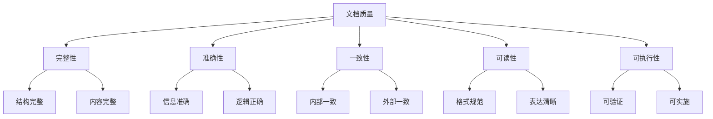
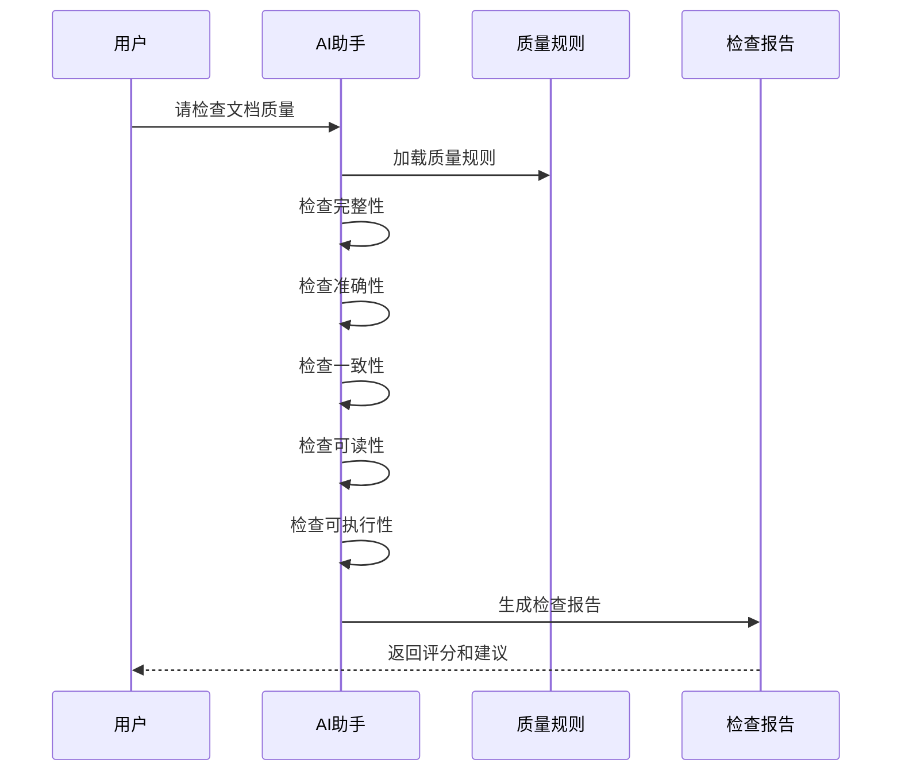

# 文档质量检查规范

> 定义文档质量的评估标准和自动检查规则

## 规则概述

本规范定义了PRD、TDD、测试用例等文档的质量标准，包括自动检查规则和人工检查清单，确保文档质量达标。

---

## 质量维度

### 五大质量维度



---

## 维度1：完整性 (Completeness)

### 定义
文档是否包含所有必需的章节和内容。

### PRD完整性检查

**必需章节**（占60%权重）：
- [ ] 文档元信息表格
- [ ] 一、需求概述
- [ ] 二、功能需求
- [ ] 三、非功能需求
- [ ] 四、交互设计
- [ ] 五、数据需求
- [ ] 六、验收标准
- [ ] 七、项目计划
- [ ] 八、附录
- [ ] 九、版本历史
- [ ] 十、评审记录

**必需元素**（占40%权重）：
- [ ] 至少1个功能架构图（Mermaid）
- [ ] 至少1个流程图或数据流图（Mermaid）
- [ ] 至少1个量化的需求目标
- [ ] 至少3个验收标准
- [ ] 数据字典表格
- [ ] 用户故事

**评分规则**：
- 缺少1个必需章节：-10分
- 缺少1个必需元素：-5分
- 满分：100分

---

### TDD完整性检查

**必需章节**（占60%权重）：
- [ ] 文档元信息表格
- [ ] 一、需求理解
- [ ] 二、技术方案
- [ ] 三、详细设计
- [ ] 四、数据库设计
- [ ] 五、接口设计
- [ ] 六、安全设计
- [ ] 七、性能优化
- [ ] 八、测试方案
- [ ] 九、部署方案
- [ ] 十、监控告警

**必需元素**（占40%权重）：
- [ ] 技术栈版本号
- [ ] 至少1个架构图（Mermaid）
- [ ] 至少1个ER图（Mermaid）
- [ ] 至少1个完整接口示例
- [ ] 数据库表设计包含索引
- [ ] 引用的PRD版本号

**评分规则**：
- 缺少1个必需章节：-10分
- 缺少1个必需元素：-8分
- 满分：100分

---

### 测试用例完整性检查

**必需章节**（占60%权重）：
- [ ] 文档元信息表格
- [ ] 一、测试概述
- [ ] 二、功能测试用例
- [ ] 三、边界值测试
- [ ] 四、异常测试
- [ ] 五、接口测试
- [ ] 六、UI测试
- [ ] 七、性能测试
- [ ] 八、安全测试

**必需元素**（占40%权重）：
- [ ] 至少10个功能测试用例
- [ ] 至少5个接口测试用例
- [ ] 引用的PRD版本号
- [ ] 引用的TDD版本号
- [ ] 用例编号规范

**评分规则**：
- 缺少1个必需章节：-12分
- 缺少必需元素：-10分
- 满分：100分

---

## 维度2：准确性 (Accuracy)

### 定义
文档内容是否准确无误，逻辑是否正确。

### 检查项

**信息准确性**（占50%权重）：
- [ ] 数据类型定义准确
- [ ] 枚举值定义准确
- [ ] 业务规则描述准确
- [ ] 技术术语使用准确

**逻辑正确性**（占50%权重）：
- [ ] 业务流程逻辑正确
- [ ] 数据流转逻辑正确
- [ ] 状态流转逻辑正确
- [ ] 无自相矛盾的描述

### 自动检查规则

**规则1：数据类型一致性**
```
检查同一字段在不同地方的数据类型是否一致：
- PRD数据字典中的类型
- TDD数据库表中的类型
- 接口定义中的类型

不一致示例：
PRD: user_id (整数)
TDD: user_id VARCHAR(50)  ❌ 类型不匹配
```

**规则2：枚举值完整性**
```
检查枚举值定义是否完整：
- 状态字段：0,1,2... 必须有说明
- 类型字段：type=1,2,3 必须定义含义

不完整示例：
status: 0-正常, 1-禁用  ❌ 缺少2的定义
```

**规则3：逻辑矛盾检测**
```
检查是否存在矛盾描述：
- "用户必须登录" vs "支持匿名访问"
- "实时更新" vs "每天凌晨同步"
```

**评分规则**：
- 发现1处数据类型不一致：-5分
- 发现1处枚举值缺失：-3分
- 发现1处逻辑矛盾：-8分
- 满分：100分

---

## 维度3：一致性 (Consistency)

### 定义
文档内部和文档之间的内容是否一致。

### 内部一致性检查

**PRD内部一致性**：
- [ ] 功能架构图与功能详述对应
- [ ] 数据字典与数据流转图对应
- [ ] 验收标准与功能需求对应
- [ ] 专业术语前后一致

**TDD内部一致性**：
- [ ] 模块划分与架构图对应
- [ ] 接口清单与接口详述对应
- [ ] ER图与表结构对应
- [ ] 技术栈在全文一致

**测试用例内部一致性**：
- [ ] 用例编号规范统一
- [ ] 优先级定义统一
- [ ] 测试数据格式统一

---

### 外部一致性检查

**PRD ↔ TDD 一致性**：
- [ ] 需求名称一致
- [ ] 功能需求在TDD有对应模块
- [ ] 数据实体在TDD有对应表
- [ ] 性能要求在TDD有对应方案

**PRD ↔ 测试用例 一致性**：
- [ ] 需求名称一致
- [ ] 功能需求有对应测试用例
- [ ] 验收标准有对应测试用例

**TDD ↔ 测试用例 一致性**：
- [ ] 接口在测试用例中有覆盖
- [ ] 数据库表有对应数据测试

### 自动检查规则

**规则1：术语一致性**
```
扫描三个文档，检查核心术语：
- "用户" vs "User" vs "user" → 建议统一
- "订单" vs "Order" → 建议统一
```

**规则2：版本引用一致性**
```
检查版本引用：
TDD引用PRD版本 = PRD实际版本
TCD引用PRD版本 = PRD实际版本
TCD引用TDD版本 = TDD实际版本
```

**评分规则**：
- 术语不一致：-3分/处
- 版本引用错误：-10分
- 功能遗漏：-5分/个
- 满分：100分

---

## 维度4：可读性 (Readability)

### 定义
文档格式是否规范，表达是否清晰。

### 格式规范检查

**Markdown格式**（占40%权重）：
- [ ] 标题层级正确（H1→H2→H3）
- [ ] 表格格式正确
- [ ] 代码块有语言标识
- [ ] 列表格式统一
- [ ] 无多余空行（不超过2行）

**Mermaid图表**（占30%权重）：
- [ ] 图表语法正确
- [ ] 图表可正常渲染
- [ ] 节点命名清晰
- [ ] 使用中文标签

**表格规范**（占30%权重）：
- [ ] 表头清晰
- [ ] 列对齐
- [ ] 无空单元格（应用"-"填充）
- [ ] 表格有表头分隔线

---

### 表达清晰度检查

**禁止模糊表述**：
- ❌ "尽量"、"大概"、"可能"
- ❌ "比较快"、"相对较好"
- ❌ "等等"、"之类"
- ✅ 使用明确的数字和标准

**示例**：
```
不清晰：页面加载速度要尽量快
清晰：页面首屏加载时间 < 2秒

不清晰：支持比较多的并发用户
清晰：支持500并发用户

不清晰：提供用户管理功能等等
清晰：提供用户管理功能，包括：新增、编辑、删除、查询
```

**自动检测规则**：
```
扫描文档，标记模糊词汇：
- "尽量"、"大概"、"可能"、"比较"、"相对"
- "等等"、"之类"、"一些"、"某些"

每发现1处：-2分
```

**评分规则**：
- 格式错误：-3分/处
- 图表错误：-5分/处
- 模糊表述：-2分/处
- 满分：100分

---

## 维度5：可执行性 (Executability)

### 定义
文档内容是否可验证、可实施。

### PRD可执行性检查

**验收标准可检查性**（占50%权重）：
- [ ] 每个验收标准可验证
- [ ] 验收标准有明确判断方式
- [ ] 使用任务列表格式 `- [ ]`

**示例**：
```
不可检查：界面美观大方 ❌
可检查：界面符合设计规范，无明显样式错误 ✅

不可检查：性能良好 ❌
可检查：页面加载时间 < 2秒 ✅
```

**功能描述可实施性**（占50%权重）：
- [ ] 功能描述具体明确
- [ ] 业务规则可实现
- [ ] 数据来源明确

---

### TDD可执行性检查

**技术方案可实施性**（占40%权重）：
- [ ] 技术方案具体可操作
- [ ] 不包含"待定"、"待确认"
- [ ] 技术栈版本明确

**接口可实施性**（占30%权重）：
- [ ] 接口定义完整
- [ ] 参数类型明确
- [ ] 响应格式明确
- [ ] 错误码定义完整

**数据库可执行性**（占30%权重）：
- [ ] 表结构可直接执行
- [ ] 字段类型明确
- [ ] 索引设计合理
- [ ] 无"待定"字段

---

### 测试用例可执行性检查

**用例可执行性**（占70%权重）：
- [ ] 前置条件明确
- [ ] 测试步骤具体
- [ ] 测试数据明确
- [ ] 预期结果可验证

**示例**：
```
不可执行：
步骤：输入用户名和密码
预期：登录成功 ❌

可执行：
步骤：输入用户名"admin"，密码"123456"，点击登录按钮
预期：跳转到首页，显示用户名"admin" ✅
```

**测试数据有效性**（占30%权重）：
- [ ] 测试数据真实可用
- [ ] 边界值数据合理
- [ ] 异常数据覆盖全面

**评分规则**：
- 发现不可检查的验收标准：-5分/个
- 发现不可执行的接口：-8分/个
- 发现不可执行的用例：-3分/个
- 满分：100分

---

## 综合评分标准

### 评分公式

```
总分 = (完整性得分 × 30%) + 
       (准确性得分 × 25%) + 
       (一致性得分 × 20%) + 
       (可读性得分 × 15%) + 
       (可执行性得分 × 10%)
```

### 等级划分

| 总分 | 等级 | 评价 | 建议 |
|------|------|------|------|
| 90-100 | ⭐⭐⭐⭐⭐ | 优秀 | 可直接使用 |
| 80-89 | ⭐⭐⭐⭐ | 良好 | 小幅优化后使用 |
| 70-79 | ⭐⭐⭐ | 合格 | 修改后使用 |
| 60-69 | ⭐⭐ | 较差 | 大幅修改 |
| <60 | ⭐ | 不合格 | 重新编写 |

---

## 自动检查流程

### AI执行流程



---

### 检查报告格式

```markdown
# 文档质量检查报告

**文档**: PRD.md  
**检查时间**: 2026-02-09 10:00:00  
**文档版本**: v1.0

---

## 📊 质量评分

| 维度 | 得分 | 权重 | 加权得分 |
|------|------|------|---------|
| 完整性 | 95 | 30% | 28.5 |
| 准确性 | 88 | 25% | 22.0 |
| 一致性 | 90 | 20% | 18.0 |
| 可读性 | 85 | 15% | 12.75 |
| 可执行性 | 92 | 10% | 9.2 |
| **总分** | **90.45** | **100%** | **90.45** |

**等级**: ⭐⭐⭐⭐⭐ 优秀

---

## ✅ 通过项 (20项)

### 完整性 ✅
- ✅ 包含所有必需章节
- ✅ 包含功能架构图
- ✅ 包含流程图
- ✅ 验收标准使用任务列表

### 准确性 ✅
- ✅ 数据类型定义准确
- ✅ 业务逻辑正确
- ✅ 无矛盾描述

[更多...]

---

## ❌ 问题项 (5项)

### 完整性 ⚠️
1. **缺少量化指标**
   - 位置：1.2 需求目标
   - 问题：需求目标没有量化指标
   - 建议：补充至少1个可量化的目标，如"用户增长30%"
   - 扣分：-5分

### 一致性 ⚠️
2. **术语不一致**
   - 位置：2.2 功能详述 vs 5.1 数据字典
   - 问题："用户" vs "User"
   - 建议：统一使用"用户"
   - 扣分：-3分

### 可读性 ⚠️
3. **模糊表述**
   - 位置：3.1 性能要求
   - 问题：使用"尽量快"
   - 建议：改为"< 2秒"
   - 扣分：-2分

[更多...]

---

## 💡 改进建议

### 高优先级（必须修复）
1. 补充量化目标指标
2. 统一术语使用

### 中优先级（建议修复）
3. 消除模糊表述
4. 补充完整示例

### 低优先级（可选优化）
5. 优化表格格式

---

## 📋 检查清单

- [x] 完整性检查完成
- [x] 准确性检查完成
- [x] 一致性检查完成
- [x] 可读性检查完成
- [x] 可执行性检查完成

---

**检查完成时间**: 2026-02-09 10:05:00  
**检查耗时**: 2分钟
```

---

## 人工检查清单

### PRD人工检查清单

**业务理解**：
- [ ] 需求背景是否真实合理
- [ ] 需求目标是否符合业务战略
- [ ] 目标用户定义是否准确
- [ ] 竞品分析是否充分

**功能设计**：
- [ ] 功能设计是否满足用户需求
- [ ] 业务流程是否合理
- [ ] 异常场景是否考虑全面
- [ ] 是否有创新点

**可行性**：
- [ ] 技术上是否可行
- [ ] 成本是否可控
- [ ] 时间是否充足

---

### TDD人工检查清单

**技术方案**：
- [ ] 技术选型是否合理
- [ ] 架构设计是否可扩展
- [ ] 是否考虑高可用
- [ ] 是否考虑容灾

**性能设计**：
- [ ] 性能方案是否满足需求
- [ ] 缓存策略是否合理
- [ ] 数据库索引是否充分
- [ ] 是否有性能瓶颈

**安全设计**：
- [ ] 认证授权方案是否安全
- [ ] 数据加密是否充分
- [ ] 是否考虑常见安全风险
- [ ] 是否符合合规要求

---

### 测试用例人工检查清单

**覆盖率**：
- [ ] 是否覆盖所有功能点
- [ ] 是否覆盖所有验收标准
- [ ] 是否覆盖所有接口
- [ ] 边界值测试是否充分

**用例设计**：
- [ ] 用例是否可执行
- [ ] 用例是否可复现
- [ ] 测试数据是否真实
- [ ] 预期结果是否明确

---

## AI行为约束

### 自动质量检查

**触发时机**：
1. 文档生成后自动执行
2. 用户明确请求检查
3. 文档提交评审前

**执行流程**：
1. 加载对应的质量规则
2. 逐项检查五大维度
3. 计算各维度得分
4. 生成检查报告
5. 提供改进建议

---

### 质量门禁

**文档生成时**：
- 如果质量评分 < 70分，警告用户
- 如果缺少必需章节，拒绝生成

**文档评审时**：
- 提示质量评分
- 建议是否可以提交评审

---

### 改进建议

**智能建议**：
- 根据扣分项提供具体建议
- 按优先级排序建议
- 提供修改示例

**示例**：
```
发现问题：性能要求使用"尽量快"
建议：改为具体指标"< 2秒"
修改示例：
  不清晰：页面加载速度要尽量快
  清晰：页面首屏加载时间 < 2秒
```

---

## 质量提升建议

### 编写阶段

1. **使用模板**：基于标准模板创建文档
2. **使用AI**：让AI辅助生成草稿
3. **边写边检**：及时运行质量检查

---

### 审查阶段

1. **自动检查**：使用AI质量检查
2. **同行评审**：团队成员互相审查
3. **专家评审**：关键文档请专家审查

---

### 持续改进

1. **收集反馈**：记录质量问题
2. **更新规则**：根据实践优化规则
3. **培训团队**：提升文档编写能力

---

## 相关规范

- [文档结构规范](../doc-structure/RULE.md)
- [PRD编写标准](../doc-writing/prd-standard.md)
- [TDD编写标准](../doc-writing/tdd-standard.md)
- [测试用例标准](../doc-writing/test-standard.md)
- [协作流程规范](../doc-workflow/RULE.md)
- [Markdown格式规范](../markdown-style/RULE.md)

---

**版本**: v1.0  
**最后更新**: 2026-02-09  
**维护者**: [填写]
