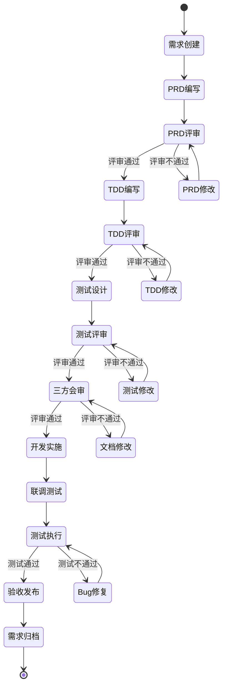
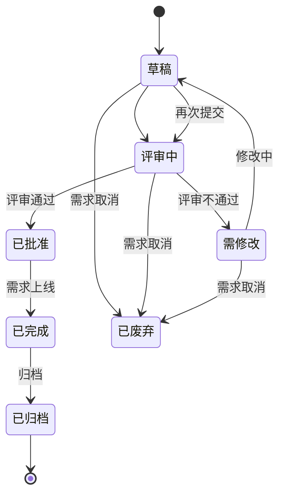

# 协作流程规范

> 定义产研测协作的标准流程和各角色职责

## 规则概述

本规范定义了从需求提出到上线发布的完整协作流程，明确各阶段的交付物、评审标准和文档状态流转规则。

---

## 需求生命周期

### 完整流程图



---

## 阶段定义

### 阶段1：需求创建

**负责人**：产品经理

**主要工作**：
1. 创建需求文件夹结构
2. 初始化PRD文档
3. 收集需求背景和目标

**交付物**：
- 需求文件夹（按规范命名）
- PRD初稿（可使用AI生成）

**文档状态**：
- PRD: 🔵 草稿

**时长估计**：1-2小时

---

### 阶段2：PRD编写

**负责人**：产品经理

**主要工作**：
1. 完善PRD各章节内容
2. 绘制功能架构图和流程图
3. 定义验收标准
4. 补充原型图或设计稿

**交付物**：
- 完整的PRD文档
- 原型图/设计稿（如有）

**文档状态**：
- PRD: 🟡 评审中

**质量要求**：
- [ ] 包含所有必需章节
- [ ] 需求目标可量化（至少1个指标）
- [ ] 至少包含1个功能架构图
- [ ] 验收标准明确可检查
- [ ] 使用AI质量检查，评分≥80分

**时长估计**：1-3天

---

### 阶段3：PRD评审

**负责人**：产品经理（组织）

**参与方**：
- 产品经理（主讲）
- 技术负责人（必须）
- 测试负责人（必须）
- 项目经理（可选）
- 相关开发人员（可选）

**评审内容**：
1. **需求合理性**：需求背景是否充分，目标是否明确
2. **需求完整性**：功能描述是否完整，有无遗漏
3. **技术可行性**：技术实现是否可行，有无技术风险
4. **测试可行性**：验收标准是否明确，是否可测试
5. **项目影响**：工作量评估，对现有系统的影响

**评审方式**：
- 会议评审（推荐）：集中讨论，现场决策
- 邮件评审（可选）：异步评审，适合简单需求

**评审结论**：
- ✅ **通过**：进入TDD编写阶段
- 🔄 **修改后通过**：小问题，修改后直接进入下一阶段
- ❌ **不通过**：重大问题，修改后需重新评审

**文档更新**：
- 更新评审记录表格
- 记录评审意见和处理状态
- 更新文档版本（如有修改）

**文档状态**：
- PRD: 🟢 已批准 或 🔴 需修改

**时长估计**：1-2小时（会议）

---

### 阶段4：TDD编写

**负责人**：技术负责人

**主要工作**：
1. 基于PRD生成TDD草稿（可使用AI）
2. 完善技术方案设计
3. 设计数据库表结构和ER图
4. 设计API接口
5. 补充性能和安全方案

**交付物**：
- 完整的TDD文档
- 架构图、ER图、接口文档

**文档状态**：
- TDD: 🔵 草稿 → 🟡 评审中

**质量要求**：
- [ ] 技术方案完整可行
- [ ] 至少包含架构图和ER图
- [ ] 接口设计至少有1个完整示例
- [ ] 数据库设计包含索引
- [ ] 引用的PRD版本号正确
- [ ] 使用AI质量检查，评分≥80分

**时长估计**：2-5天

---

### 阶段5：TDD评审

**负责人**：技术负责人（组织）

**参与方**：
- 技术负责人（主讲）
- 产品经理（必须）
- 测试负责人（必须）
- 开发工程师（必须）
- 架构师（可选）

**评审内容**：
1. **技术方案合理性**：技术选型是否合理
2. **架构设计**：架构是否清晰，是否可扩展
3. **接口设计**：接口是否完整，参数是否合理
4. **数据库设计**：表结构是否合理，索引是否充分
5. **性能方案**：是否满足PRD性能要求
6. **安全方案**：是否考虑安全风险

**评审结论**：
- ✅ **通过**：进入测试设计阶段
- 🔄 **修改后通过**：小问题，修改后直接进入下一阶段
- ❌ **不通过**：重大问题，修改后需重新评审

**文档状态**：
- TDD: 🟢 已批准 或 🔴 需修改

**时长估计**：1-2小时（会议）

---

### 阶段6：测试设计

**负责人**：测试负责人

**主要工作**：
1. 基于PRD和TDD生成测试用例草稿（可使用AI）
2. 完善功能测试用例
3. 设计接口测试用例
4. 设计性能和安全测试用例
5. 执行覆盖率分析

**交付物**：
- 完整的测试用例文档（TCD）
- 覆盖率分析报告

**文档状态**：
- TCD: 🔵 草稿 → 🟡 评审中

**质量要求**：
- [ ] 覆盖PRD所有核心功能
- [ ] 覆盖PRD所有验收标准
- [ ] 覆盖TDD所有接口
- [ ] 包含正向、异常、边界测试
- [ ] 使用AI覆盖率分析，覆盖率≥90%

**时长估计**：2-4天

---

### 阶段7：测试评审

**负责人**：测试负责人（组织）

**参与方**：
- 测试负责人（主讲）
- 产品经理（必须）
- 技术负责人（必须）
- 测试工程师（必须）

**评审内容**：
1. **测试覆盖率**：是否覆盖所有功能点
2. **用例设计**：用例是否合理，是否可执行
3. **验收对齐**：是否覆盖PRD验收标准
4. **接口对齐**：是否覆盖TDD所有接口

**评审结论**：
- ✅ **通过**：进入三方会审
- 🔄 **修改后通过**：小问题，修改后直接进入下一阶段
- ❌ **不通过**：重大问题，修改后需重新评审

**文档状态**：
- TCD: 🟢 已批准 或 🔴 需修改

**时长估计**：1小时（会议）

---

### 阶段8：三方会审

**负责人**：项目经理或产品经理

**参与方**：
- 产品经理（必须）
- 技术负责人（必须）
- 测试负责人（必须）
- 项目经理（可选）

**评审内容**：
1. **整体一致性**：PRD、TDD、TCD是否一致
2. **覆盖率确认**：使用AI覆盖率分析报告
3. **遗漏检查**：是否有遗漏的功能或测试点
4. **风险评估**：技术风险、进度风险
5. **Go/No-Go决策**：是否开始开发

**评审结论**：
- ✅ **通过**：进入开发实施阶段
- ❌ **不通过**：返回相应阶段修改

**文档状态**：
- PRD: 🟢 已批准
- TDD: 🟢 已批准
- TCD: 🟢 已批准

**时长估计**：1小时（会议）

---

### 阶段9：开发实施

**负责人**：技术负责人

**主要工作**：
1. 分配开发任务
2. 开发编码
3. 单元测试
4. 代码评审
5. 联调测试

**交付物**：
- 功能代码
- 单元测试代码
- 部署脚本

**文档状态**：
- PRD/TDD/TCD: 🟢 已批准（状态不变）

**时长估计**：根据工作量

---

### 阶段10：测试执行

**负责人**：测试负责人

**主要工作**：
1. 执行功能测试
2. 执行接口测试
3. 执行性能测试
4. 执行安全测试
5. 记录Bug并跟踪
6. 回归测试

**交付物**：
- 测试报告
- Bug清单

**文档状态**：
- PRD/TDD/TCD: 🟢 已批准（状态不变）

**时长估计**：根据测试计划

---

### 阶段11：验收发布

**负责人**：产品经理

**主要工作**：
1. 产品验收
2. 发布审批
3. 生产部署
4. 灰度发布（如有）
5. 全量发布

**交付物**：
- 验收报告
- 发布报告

**文档状态**：
- PRD/TDD/TCD: ✅ 已完成

**时长估计**：1-2天

---

### 阶段12：需求归档

**负责人**：产品经理

**主要工作**：
1. 更新文档最终状态
2. 整理相关资料
3. 总结经验教训
4. 归档文档

**交付物**：
- 完整的需求文档包
- 项目总结（可选）

**文档状态**：
- PRD/TDD/TCD: 📦 已归档

---

## 角色职责

### 产品经理

**主要职责**：
- 需求分析和PRD编写
- 组织PRD评审
- 产品验收
- 需求归档

**在各阶段的职责**：
- 需求创建：负责人
- PRD编写：负责人
- PRD评审：负责人（组织者）
- TDD评审：参与者
- 测试评审：参与者
- 三方会审：参与者（必须）
- 验收发布：负责人

---

### 技术负责人

**主要职责**：
- 技术方案设计和TDD编写
- 组织TDD评审
- 开发实施管理
- 技术决策

**在各阶段的职责**：
- PRD评审：参与者（必须）
- TDD编写：负责人
- TDD评审：负责人（组织者）
- 测试评审：参与者
- 三方会审：参与者（必须）
- 开发实施：负责人

---

### 测试负责人

**主要职责**：
- 测试用例设计
- 组织测试评审
- 测试执行管理
- 质量把关

**在各阶段的职责**：
- PRD评审：参与者（必须）
- TDD评审：参与者（必须）
- 测试设计：负责人
- 测试评审：负责人（组织者）
- 三方会审：参与者（必须）
- 测试执行：负责人

---

### 开发工程师

**主要职责**：
- 代码实现
- 单元测试
- 技术问题解决

**在各阶段的职责**：
- TDD评审：参与者（必须）
- 开发实施：执行者

---

### 测试工程师

**主要职责**：
- 测试用例编写
- 测试执行
- Bug管理

**在各阶段的职责**：
- 测试设计：协助测试负责人
- 测试评审：参与者（必须）
- 测试执行：执行者

---

## 文档状态流转

### 状态定义

| 状态 | 图标 | 说明 |
|------|------|------|
| 草稿 | 🔵 | 文档正在编写中 |
| 评审中 | 🟡 | 文档已提交评审 |
| 已批准 | 🟢 | 文档评审通过 |
| 需修改 | 🔴 | 文档需要修改 |
| 已完成 | ✅ | 需求已上线 |
| 已归档 | 📦 | 文档已归档 |
| 已废弃 | ⚫ | 需求已废弃 |

---

### 状态流转图



---

### 状态更新规则

**规则1：状态同步**
- PRD状态变更时，应通知相关方
- TDD和TCD的编写依赖上游文档状态

**规则2：版本对应**
- TDD必须引用明确的PRD版本
- TCD必须引用明确的PRD和TDD版本

**规则3：状态约束**
- TDD编写前，PRD必须为"已批准"
- 测试设计前，TDD必须为"已批准"
- 开发实施前，三个文档都必须为"已批准"

---

## 评审规范

### 评审准备

**提前准备**：
- [ ] 提前2天发送评审通知
- [ ] 提前1天分享文档链接
- [ ] 评审前1小时提醒参会人

**材料准备**：
- [ ] 文档已完成并自检通过
- [ ] AI质量检查已执行
- [ ] 原型图或设计稿已准备（如有）
- [ ] 评审问题清单已整理

---

### 评审会议

**会议时长**：
- PRD评审：1-2小时
- TDD评审：1-2小时
- 测试评审：1小时
- 三方会审：1小时

**会议流程**：
1. **文档讲解**（占40%时间）：负责人讲解文档内容
2. **问题讨论**（占50%时间）：参与者提问和讨论
3. **结论确认**（占10%时间）：明确评审结论和后续行动

**评审原则**：
- 聚焦问题，不发散
- 先听后评，不打断
- 建设性意见，不抱怨
- 当场决策，不拖延

---

### 评审记录

**记录内容**：
| 评审日期 | 参与人 | 评审意见 | 处理状态 |
|---------|--------|---------|---------|
| 2026-02-09 | 张三、李四 | 功能描述不够清晰 | ✅ 已修改 |
| 2026-02-09 | 王五 | 性能指标需补充 | 🔄 处理中 |

**更新要求**：
- 评审意见当天记录
- 处理状态及时更新
- 重大问题单独跟踪

---

## AI行为约束

### 文档生成时

**状态检查**：
- 生成TDD前，检查PRD状态是否为"已批准"
- 生成测试用例前，检查TDD状态是否为"已批准"
- 如状态不符，警告用户并询问是否继续

**版本引用**：
- TDD中自动引用PRD版本号
- TCD中自动引用PRD和TDD版本号

---

### 文档修改时

**状态提示**：
- 修改PRD时，提示更新版本号
- 提示同步更新TDD和TCD（如有必要）

---

### 协作提示

**阶段提示**：
- 识别当前处于哪个阶段
- 提示下一步应该做什么
- 提醒哪些角色需要参与

**例如**：
```
✅ PRD已完成并标记为"评审中"

📋 下一步行动：
1. 产品经理：组织PRD评审会议
2. 参与方：技术负责人、测试负责人
3. 评审通过后，状态更新为"已批准"
4. 然后可进入TDD编写阶段
```

---

## 异常情况处理

### 需求变更

**小变更**（不影响架构）：
1. 更新对应文档
2. 更新版本号（次版本号+1）
3. 无需重新评审
4. 通知相关方

**大变更**（影响架构）：
1. 更新对应文档
2. 更新版本号（主版本号+1）
3. 必须重新评审
4. 影响分析（使用AI）
5. 同步更新下游文档

---

### 需求取消

**处理流程**：
1. 更新文档状态为"已废弃"
2. 记录废弃原因
3. 通知相关方
4. 归档文档

---

### 评审不通过

**处理流程**：
1. 更新文档状态为"需修改"
2. 记录评审意见
3. 负责人修改文档
4. 重新提交评审

---

## 检查清单

### PRD评审检查清单

- [ ] 需求背景清晰充分
- [ ] 需求目标可量化
- [ ] 需求范围明确
- [ ] 功能描述完整
- [ ] 验收标准明确可检查
- [ ] 至少1个功能架构图
- [ ] 数据需求完整
- [ ] 性能要求明确
- [ ] AI质量检查≥80分

---

### TDD评审检查清单

- [ ] 技术方案完整可行
- [ ] 引用PRD版本正确
- [ ] 至少包含架构图
- [ ] 至少包含ER图
- [ ] 接口设计完整
- [ ] 接口至少1个完整示例
- [ ] 数据库设计包含索引
- [ ] 性能方案满足PRD要求
- [ ] AI质量检查≥80分

---

### 测试评审检查清单

- [ ] 覆盖PRD所有核心功能
- [ ] 覆盖PRD所有验收标准
- [ ] 覆盖TDD所有接口
- [ ] 包含正向、异常、边界测试
- [ ] 包含性能测试用例
- [ ] 包含安全测试用例
- [ ] AI覆盖率分析≥90%

---

### 三方会审检查清单

- [ ] PRD状态为"已批准"
- [ ] TDD状态为"已批准"
- [ ] TCD状态为"已批准"
- [ ] 版本号对应关系正确
- [ ] AI覆盖率分析≥90%
- [ ] 无重大遗漏或不一致
- [ ] 技术风险可控
- [ ] 进度可控

---

## 时间估算参考

| 阶段 | 估算时间 | 说明 |
|------|---------|------|
| 需求创建 | 1-2小时 | 使用AI可加速 |
| PRD编写 | 1-3天 | 使用AI可节省60% |
| PRD评审 | 1-2小时 | 会议时间 |
| TDD编写 | 2-5天 | 使用AI可节省75% |
| TDD评审 | 1-2小时 | 会议时间 |
| 测试设计 | 2-4天 | 使用AI可节省75% |
| 测试评审 | 1小时 | 会议时间 |
| 三方会审 | 1小时 | 会议时间 |

**总计**：文档阶段约1-2周（使用AI可缩短到3-5天）

---

## 相关规范

- [文档结构规范](../doc-structure/RULE.md)
- [PRD编写标准](../doc-writing/prd-standard.md)
- [TDD编写标准](../doc-writing/tdd-standard.md)
- [测试用例标准](../doc-writing/test-standard.md)
- [文档质量检查规范](../doc-quality/RULE.md)

---

**版本**: v1.0  
**最后更新**: 2026-02-09  
**维护者**: [填写]
