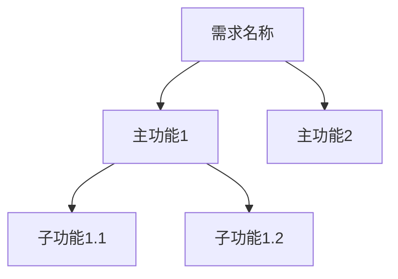

# PRD（产品需求文档）编写标准

> 定义PRD文档的结构、内容和质量要求，确保AI生成和人工编写的PRD符合统一标准

## 规则概述

PRD是需求流程的起点，必须清晰、完整、可执行。本规范约束AI在生成和审查PRD时的行为。

---

## 文档元信息

### 必填字段

每个PRD文档顶部必须包含以下信息表格：

```markdown
| 文档信息 | 内容 |
|---------|------|
| 需求名称 | [与文件夹名称一致] |
| 创建日期 | YYYY-MM-DD |
| 产品负责人 | [姓名] |
| 开发负责人 | [姓名] |
| 测试负责人 | [姓名] |
| 文档状态 | [状态标识] |
| 版本号 | vX.Y |
```

### 文档状态标识

使用表情符号标识状态，便于快速识别：

- 🔵 **草稿**：初始编写阶段
- 🟡 **评审中**：提交评审，待反馈
- 🟢 **已批准**：评审通过，可进入开发
- 🔴 **已废弃**：需求取消或被替代
- ✅ **已完成**：需求已上线

---

## 章节结构规范

### 一、需求概述（必需）

#### 1.1 需求背景
- 描述当前问题或机会
- 说明业务价值和紧迫性
- 引用数据或用户反馈支撑

**质量标准**：
- 背景描述清晰，有理有据
- 避免假设和模糊表述
- 关联业务目标或公司战略

#### 1.2 需求目标
- 使用SMART原则定义目标
- 提供可量化的成功指标
- 明确短期和长期目标

**质量标准**：
- 目标具体可衡量
- 至少有1个量化指标
- 目标与背景对应

#### 1.3 需求范围
- 明确本期实现的功能（✅包含）
- 明确本期不实现的功能（❌不包含）
- 说明边界和限制

**质量标准**：
- 范围清晰，无歧义
- 不包含范围必须说明原因
- 避免范围蔓延

#### 1.4 目标用户
- 定义用户角色和画像
- 描述典型使用场景
- 说明用户痛点

**质量标准**：
- 用户角色具体化
- 场景描述真实可信
- 痛点与需求目标对应

---

### 二、功能需求（必需）

#### 2.1 功能架构
- 使用Mermaid图展示功能层级
- 清晰划分主功能和子功能
- 体现功能间的关系

**Mermaid图要求**：


#### 2.2 核心功能详述
每个核心功能必须包含：

**功能描述**：
- 清晰说明功能是什么
- 为什么需要这个功能
- 功能的价值和影响

**用户故事**：
- 格式：作为[角色]，我想要[功能]，以便[目标]
- 体现用户视角
- 关联具体场景

**功能要点**：
- 列举关键功能点（3-5个）
- 每个要点具体明确
- 避免技术实现细节

**业务规则**：
- 明确业务逻辑规则
- 说明数据验证要求
- 定义权限和约束

**交互流程**：
- 使用Mermaid时序图
- 展示用户-系统交互
- 标注关键决策点

**质量标准**：
- 描述完整，无遗漏
- 用户故事符合标准格式
- 流程图清晰易懂

---

### 三、非功能需求（必需）

#### 3.1 性能要求
使用表格明确性能指标：

| 性能指标 | 要求 | 说明 |
|---------|------|------|
| 页面加载时间 | < X秒 | 场景说明 |
| 接口响应时间 | < X秒 | 覆盖范围 |
| 并发用户数 | X+ | 峰值时段 |

#### 3.2 安全要求
- 数据安全（加密、备份）
- 访问控制（权限、认证）
- 合规要求（隐私、审计）

#### 3.3 兼容性要求
- 浏览器兼容性（版本清单）
- 设备兼容性（PC/移动/平板）
- 分辨率支持范围

#### 3.4 可用性要求
- 易用性目标（学习时间、操作步数）
- 可维护性要求（代码规范、文档）
- 可扩展性考虑

---

### 四、交互设计（必需）

#### 4.1 页面结构
- 描述整体布局
- 使用ASCII图或原型图
- 标注关键区域

#### 4.2 页面清单
使用表格列出所有页面：

| 页面名称 | 页面路径 | 说明 | 优先级 |
|---------|---------|------|--------|
| 首页 | /home | 描述 | P0 |

**优先级定义**：
- P0：核心功能，必须实现
- P1：重要功能，尽量实现
- P2：辅助功能，可延期

#### 4.3 交互细节
- 描述关键交互行为
- 说明状态变化和反馈
- 定义异常处理方式

#### 4.4 异常处理
明确各类异常的处理方式：

| 异常场景 | 交互反馈 | 用户指引 |
|---------|---------|---------|
| 网络错误 | 提示文案 | 引导操作 |

---

### 五、数据需求（必需）

#### 5.1 数据字典
定义核心数据实体和字段：

| 字段名称 | 字段类型 | 必填 | 说明 | 示例值 |
|---------|---------|------|------|--------|
| id | 整数 | 是 | 唯一标识 | 1001 |

#### 5.2 数据来源
- 说明数据从哪里获取
- 是否需要对接外部系统
- 数据质量要求

#### 5.3 数据流转
- 使用Mermaid图展示数据流
- 标注数据处理步骤
- 说明数据存储方式

---

### 六、验收标准（必需）

#### 6.1 功能验收
使用任务列表格式：
- [ ] 功能1完整实现并可用
- [ ] 功能2满足业务规则

#### 6.2 性能验收
- [ ] 性能指标达标
- [ ] 无内存泄漏

#### 6.3 兼容性验收
- [ ] 主流浏览器测试通过
- [ ] 移动端适配正常

#### 6.4 安全验收
- [ ] 无高危漏洞
- [ ] 权限控制正常

#### 6.5 体验验收
- [ ] 界面美观符合设计规范
- [ ] 操作流畅无明显问题

---

### 七、项目计划（必需）

#### 7.1 里程碑
使用表格定义关键节点：

| 阶段 | 开始日期 | 结束日期 | 交付物 |
|------|---------|---------|--------|
| 需求评审 | YYYY-MM-DD | YYYY-MM-DD | PRD |

#### 7.2 风险管理
识别潜在风险和应对措施：

| 风险项 | 影响程度 | 可能性 | 应对措施 |
|--------|----------|--------|----------|
| [风险] | 高/中/低 | 高/中/低 | [方案] |

---

### 八、附录（可选）

#### 8.1 参考资料
- 相关文档链接
- 竞品分析报告
- 研究数据

#### 8.2 专业术语
- 术语表格
- 缩写说明

#### 8.3 原型图/设计稿
- 插入图片或提供链接

---

### 九、版本历史（必需）

记录文档的每次修改：

| 版本号 | 修改日期 | 修改人 | 修改内容 |
|--------|----------|--------|----------|
| v1.0 | YYYY-MM-DD | 姓名 | 初始版本 |
| v1.1 | YYYY-MM-DD | 姓名 | 修改说明 |

**版本号规则**：
- 主版本号（X.0）：大范围修改
- 次版本号（x.Y）：局部优化或补充

---

### 十、评审记录（必需）

记录评审反馈和处理情况：

| 评审日期 | 参与人 | 评审意见 | 处理状态 |
|---------|--------|---------|---------|
| YYYY-MM-DD | 姓名 | 意见内容 | 已处理/待处理 |

---

## 内容质量标准

### 清晰性
- 避免模糊词汇（"可能"、"大概"、"尽量"）
- 使用明确的量词和标准
- 提供具体示例

### 完整性
- 所有必需章节必须填写
- 关键信息不能遗漏
- 边界情况有说明

### 一致性
- 术语使用统一
- 数据前后一致
- 与其他文档保持同步

### 可执行性
- 开发人员能理解要做什么
- 测试人员能编写测试用例
- 验收标准明确可检查

---

## AI生成时的约束

### 自动检查项
- [ ] 所有必需章节已包含
- [ ] 文档元信息完整
- [ ] 用户故事格式正确
- [ ] 至少有1个Mermaid图
- [ ] 验收标准使用任务列表
- [ ] 版本历史已初始化

### 禁止行为
- ❌ 生成空白章节占位符
- ❌ 使用"待补充"等模糊表述
- ❌ 省略必需章节
- ❌ 生成技术实现细节

### 推荐行为
- ✅ 基于需求背景生成合理内容
- ✅ 使用表格和图表提升可读性
- ✅ 提供具体示例和数据
- ✅ 标注需要人工补充的部分

---

## 人工编写指南

### 编写流程
1. 填写文档元信息
2. 从需求背景开始，自上而下编写
3. 先写主干内容，后完善细节
4. 使用模板占位符快速填充
5. 评审后更新版本历史

### 常见问题

**问题1**：功能描述过于技术化
- 错误：使用Vue3实现响应式表单
- 正确：提供可实时验证的表单功能

**问题2**：验收标准模糊
- 错误：页面加载要快
- 正确：页面首屏加载时间 < 2秒

**问题3**：缺少用户视角
- 错误：系统需要保存数据
- 正确：用户填写表单后，点击保存按钮，数据持久化存储

---

## 检查清单

在提交PRD前，确认以下项目：

**结构检查**
- [ ] 包含所有必需章节（一至十）
- [ ] 章节顺序正确
- [ ] 标题级别符合规范

**内容检查**
- [ ] 需求背景有理有据
- [ ] 需求目标可量化
- [ ] 功能描述清晰完整
- [ ] 至少1个Mermaid流程图或架构图
- [ ] 验收标准明确可检查

**格式检查**
- [ ] 表格格式正确
- [ ] 任务列表语法正确
- [ ] Mermaid图表能正常渲染
- [ ] 无错别字和格式错误

**元信息检查**
- [ ] 文档状态已标注
- [ ] 负责人已填写
- [ ] 版本号正确
- [ ] 日期格式统一

---

## 相关规范

- [文档结构规范](../doc-structure/RULE.md)
- [TDD编写标准](./tdd-standard.md)
- [测试用例标准](./test-standard.md)
- [协作流程规范](../doc-workflow/RULE.md)
