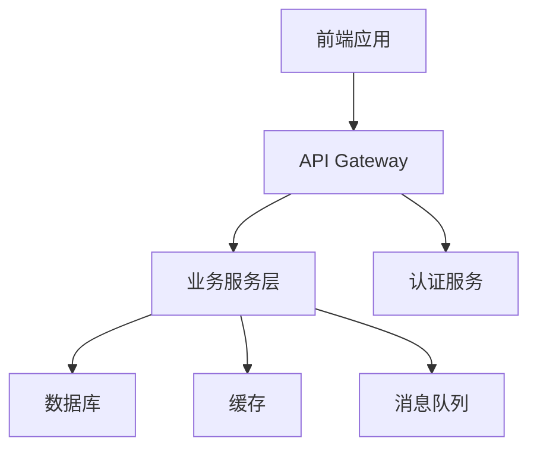
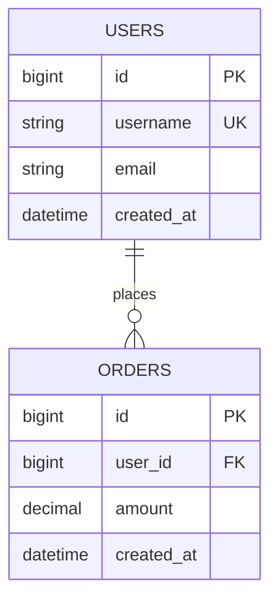

# TDD（技术设计文档）编写标准

> 定义TDD文档的结构、内容和质量要求，确保技术方案清晰可执行

## 规则概述

TDD是PRD到代码的桥梁，必须技术严谨、设计合理、便于落地。本规范约束AI生成和审查TDD时的行为。

---

## 文档元信息

### 必填字段

```markdown
| 文档信息 | 内容 |
|---------|------|
| 需求名称 | [与PRD一致] |
| 技术负责人 | [姓名] |
| 开发人员 | [姓名列表] |
| 技术评审人 | [姓名] |
| PRD版本 | [对应的PRD版本号] |
| 文档状态 | [状态标识] |
| 版本号 | vX.Y |
```

### 文档状态标识

- 🔵 **草稿**：初始设计阶段
- 🟡 **评审中**：待技术评审
- 🟢 **已批准**：可以开始编码
- 🟠 **开发中**：正在实施
- ✅ **已完成**：开发完成
- 🔴 **已废弃**：技术方案调整

---

## 章节结构规范

### 一、需求理解（必需）

#### 1.1 需求概要
- 用技术语言重述PRD核心目标
- 明确技术边界和约束
- 提取关键功能点

**质量标准**：
- 与PRD保持一致
- 聚焦技术实现范围
- 避免重复PRD全文

#### 1.2 技术目标
- 定义技术层面的目标
- 说明技术选型依据
- 明确性能和质量要求

**示例**：
- 实现高性能列表渲染（虚拟滚动）
- 采用模块化架构便于扩展
- API响应时间 < 500ms

---

### 二、技术方案（必需）

#### 2.1 技术栈选型
明确使用的技术栈和版本：

**前端技术栈**：
- 框架：Vue 3.x / React 18.x
- 状态管理：Pinia / Redux Toolkit
- UI组件库：Element Plus / Ant Design
- 构建工具：Vite / Webpack

**后端技术栈**：
- 语言：Node.js 18.x / Python 3.11 / Java 17
- 框架：Express / FastAPI / Spring Boot
- 数据库：MySQL 8.0 / PostgreSQL / MongoDB
- 缓存：Redis 7.x

**DevOps**：
- 部署：Docker + K8s / Serverless
- CI/CD：Jenkins / GitHub Actions
- 监控：Prometheus + Grafana

**选型说明**：
- 每个技术选择必须说明理由
- 对比备选方案的优劣
- 考虑团队技能栈匹配度

#### 2.2 系统架构设计

**整体架构图**（使用Mermaid）：


**架构说明**：
- 描述各层职责
- 说明服务间通信方式
- 标注关键技术决策

#### 2.3 模块划分

使用表格清晰列出模块：

| 模块名称 | 职责 | 依赖 | 负责人 |
|---------|------|------|--------|
| 用户管理模块 | 用户CRUD、权限 | 认证模块 | 张三 |
| 数据展示模块 | 列表、详情展示 | API模块 | 李四 |

**模块设计原则**：
- 高内聚低耦合
- 职责单一明确
- 接口清晰稳定

---

### 三、详细设计（必需）

#### 3.1 前端设计

**页面组件结构**：
```
pages/
├── Home/
│   ├── index.vue          # 页面入口
│   ├── components/
│   │   ├── Header.vue     # 头部组件
│   │   └── DataList.vue   # 列表组件
│   └── hooks/
│       └── useData.ts     # 业务逻辑
```

**状态管理设计**：
- Store结构定义
- 状态流转图
- 关键Actions/Mutations

**路由设计**：
| 路由路径 | 组件 | 权限 | 说明 |
|---------|------|------|------|
| /home | Home | 登录用户 | 首页 |
| /detail/:id | Detail | 登录用户 | 详情页 |

#### 3.2 后端设计

**服务分层**：
```
src/
├── controller/      # 控制器层（API接口）
├── service/        # 业务逻辑层
├── repository/     # 数据访问层
├── model/          # 数据模型
└── utils/          # 工具函数
```

**核心服务类**：
| 服务类 | 职责 | 主要方法 |
|--------|------|---------|
| UserService | 用户业务逻辑 | createUser(), updateUser() |
| AuthService | 认证授权 | login(), verifyToken() |

---

### 四、数据库设计（必需）

#### 4.1 表结构设计

**表清单**：
| 表名 | 说明 | 预计数据量 |
|------|------|-----------|
| users | 用户表 | 10万+ |
| orders | 订单表 | 100万+ |

**表结构详细设计**：

##### 用户表（users）

| 字段名 | 类型 | 长度 | 默认值 | 非空 | 索引 | 说明 |
|--------|------|------|--------|------|------|------|
| id | BIGINT | - | - | 是 | PK | 主键 |
| username | VARCHAR | 50 | - | 是 | UK | 用户名 |
| email | VARCHAR | 100 | - | 是 | IDX | 邮箱 |
| password_hash | VARCHAR | 255 | - | 是 | - | 密码哈希 |
| status | TINYINT | - | 1 | 是 | IDX | 状态:0禁用1启用 |
| created_at | DATETIME | - | CURRENT_TIMESTAMP | 是 | IDX | 创建时间 |
| updated_at | DATETIME | - | CURRENT_TIMESTAMP | 是 | - | 更新时间 |

**索引设计**：
```sql
-- 主键索引
PRIMARY KEY (id)

-- 唯一索引
UNIQUE KEY uk_username (username)

-- 普通索引
INDEX idx_email (email)
INDEX idx_status_created (status, created_at)
```

#### 4.2 ER图

使用Mermaid展示实体关系：



#### 4.3 数据迁移方案
- 说明初始化脚本
- 版本升级策略
- 数据回滚方案

---

### 五、接口设计（必需）

#### 5.1 RESTful API设计

**接口清单**：

| 接口路径 | 方法 | 说明 | 权限 |
|---------|------|------|------|
| /api/users | GET | 获取用户列表 | admin |
| /api/users/:id | GET | 获取用户详情 | login |
| /api/users | POST | 创建用户 | admin |
| /api/users/:id | PUT | 更新用户 | admin |
| /api/users/:id | DELETE | 删除用户 | admin |

#### 5.2 接口详细设计

**接口示例**：

##### 获取用户列表

**基本信息**：
- 路径：`GET /api/users`
- 权限：需要登录，管理员角色
- 描述：分页获取用户列表

**请求参数**：
| 参数名 | 类型 | 必填 | 说明 | 示例 |
|--------|------|------|------|------|
| page | number | 否 | 页码，从1开始 | 1 |
| page_size | number | 否 | 每页数量，默认20 | 20 |
| keyword | string | 否 | 搜索关键词 | "张三" |
| status | number | 否 | 状态筛选：0禁用1启用 | 1 |

**请求示例**：
```http
GET /api/users?page=1&page_size=20&status=1
Authorization: Bearer <token>
```

**响应数据**：
```json
{
  "code": 0,
  "message": "success",
  "data": {
    "total": 100,
    "page": 1,
    "page_size": 20,
    "items": [
      {
        "id": 1,
        "username": "zhangsan",
        "email": "zhangsan@example.com",
        "status": 1,
        "created_at": "2026-02-09T10:00:00Z"
      }
    ]
  }
}
```

**响应字段说明**：
| 字段 | 类型 | 说明 |
|------|------|------|
| code | number | 状态码：0成功，非0失败 |
| message | string | 提示信息 |
| data.total | number | 总记录数 |
| data.items | array | 用户列表 |

**错误码**：
| 错误码 | 说明 | HTTP状态码 |
|--------|------|-----------|
| 1001 | 参数错误 | 400 |
| 1002 | 未授权 | 401 |
| 1003 | 无权限 | 403 |
| 5000 | 服务器错误 | 500 |

#### 5.3 接口规范
- 统一响应格式
- 错误码定义
- 分页参数标准
- 时间格式规范（ISO 8601）

---

### 六、安全设计（必需）

#### 6.1 认证授权
- 认证方式：JWT Token
- Token过期时间：2小时
- 刷新策略：RefreshToken机制

#### 6.2 数据安全
- 敏感字段加密（密码、手机号）
- HTTPS传输
- SQL注入防护
- XSS防护

#### 6.3 权限控制
- 基于角色的权限控制（RBAC）
- 资源级权限控制
- 接口权限中间件

---

### 七、性能优化（必需）

#### 7.1 前端性能优化
- 代码分割（按路由）
- 懒加载（图片、组件）
- 虚拟滚动（长列表）
- 缓存策略（Service Worker）

#### 7.2 后端性能优化
- 数据库索引优化
- Redis缓存（热点数据）
- SQL查询优化（避免N+1）
- 异步处理（消息队列）

#### 7.3 性能指标
| 指标 | 目标 | 监控方式 |
|------|------|---------|
| 首屏加载 | < 2秒 | Lighthouse |
| API响应 | < 500ms | APM工具 |
| 数据库查询 | < 100ms | 慢查询日志 |

---

### 八、测试方案（必需）

#### 8.1 单元测试
- 覆盖率要求：≥ 80%
- 测试框架：Jest / Vitest
- Mock策略

#### 8.2 集成测试
- API测试（Postman/Supertest）
- 数据库集成测试
- 第三方服务Mock

#### 8.3 E2E测试
- 测试框架：Playwright / Cypress
- 关键流程覆盖
- 多浏览器兼容测试

---

### 九、部署方案（必需）

#### 9.1 部署架构


#### 9.2 环境配置
| 环境 | 说明 | 部署方式 |
|------|------|---------|
| dev | 开发环境 | 本地/Dev服务器 |
| test | 测试环境 | K8s集群 |
| staging | 预发布环境 | K8s集群 |
| production | 生产环境 | K8s集群（多副本） |

#### 9.3 发布流程
1. 代码合并到main分支
2. 自动触发CI/CD流程
3. 运行测试套件
4. 构建Docker镜像
5. 部署到staging环境
6. 人工验证通过
7. 部署到生产环境
8. 灰度发布（可选）

---

### 十、监控告警（必需）

#### 10.1 监控指标
**应用监控**：
- API成功率
- 响应时间分位数（P50/P95/P99）
- 请求量QPS
- 错误率

**系统监控**：
- CPU使用率
- 内存使用率
- 磁盘IO
- 网络流量

#### 10.2 告警规则
| 告警项 | 阈值 | 级别 | 通知方式 |
|--------|------|------|---------|
| API错误率 | > 5% | 严重 | 电话+短信 |
| 响应时间 | P95 > 2s | 警告 | 企业微信 |
| CPU使用率 | > 80% | 警告 | 邮件 |

---

### 十一、风险与应对（必需）

| 风险项 | 影响 | 可能性 | 技术应对方案 |
|--------|------|--------|-------------|
| 数据库性能瓶颈 | 高 | 中 | 读写分离+分库分表 |
| 第三方API不稳定 | 中 | 高 | 降级策略+本地缓存 |
| 高并发冲击 | 高 | 中 | 限流+熔断机制 |

---

### 十二、版本历史（必需）

| 版本号 | 修改日期 | 修改人 | 修改内容 | 对应PRD版本 |
|--------|----------|--------|----------|------------|
| v1.0 | YYYY-MM-DD | 姓名 | 初始版本 | v1.0 |

---

### 十三、评审记录（必需）

| 评审日期 | 评审人 | 评审意见 | 处理状态 |
|---------|--------|---------|---------|
| YYYY-MM-DD | 架构师 | 建议优化缓存策略 | 已处理 |

---

## 内容质量标准

### 技术严谨性
- 技术选型有依据
- 架构设计合理
- 接口设计符合RESTful规范
- 数据库设计符合范式

### 可执行性
- 开发人员能直接编码
- 接口定义明确无歧义
- 表结构完整可用
- 部署流程可操作

### 完整性
- 前后端设计都包含
- 安全性考虑周全
- 性能优化有方案
- 监控告警有规划

---

## AI生成时的约束

### 自动检查项
- [ ] 所有必需章节已包含
- [ ] 至少有2个Mermaid图（架构图+ER图或流程图）
- [ ] 接口设计至少包含1个完整示例
- [ ] 数据库表设计包含索引
- [ ] 错误码定义清晰

### 基于PRD生成TDD的规则
- ✅ 提取PRD中的功能需求转化为技术模块
- ✅ 根据非功能需求设计性能方案
- ✅ 从数据需求生成数据库设计
- ✅ 基于页面清单设计路由和API
- ❌ 不要添加PRD中未提及的功能
- ❌ 不要省略PRD中的核心功能

### 禁止行为
- ❌ 生成空白占位符
- ❌ 技术选型无说明
- ❌ 接口设计缺少示例
- ❌ 数据库设计无索引

---

## 检查清单

**结构检查**
- [ ] 包含所有必需章节
- [ ] 章节顺序正确
- [ ] 与PRD版本对应

**内容检查**
- [ ] 技术栈明确且有版本号
- [ ] 至少1个系统架构图（Mermaid）
- [ ] 数据库设计包含ER图和索引
- [ ] 接口设计有完整示例
- [ ] 部署方案可操作

**质量检查**
- [ ] 技术选型有理由
- [ ] 性能优化有具体方案
- [ ] 安全设计考虑周全
- [ ] 监控告警规则明确

---

## 相关规范

- [PRD编写标准](./prd-standard.md)
- [测试用例标准](./test-standard.md)
- [API设计规范](../../开发文档/API设计规范.md)
- [数据库设计规范](../../开发文档/数据库设计规范.md)
