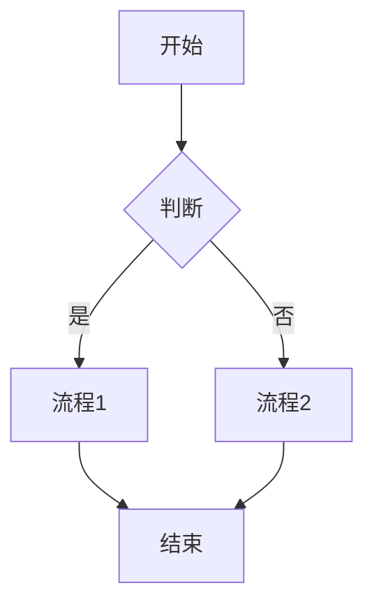
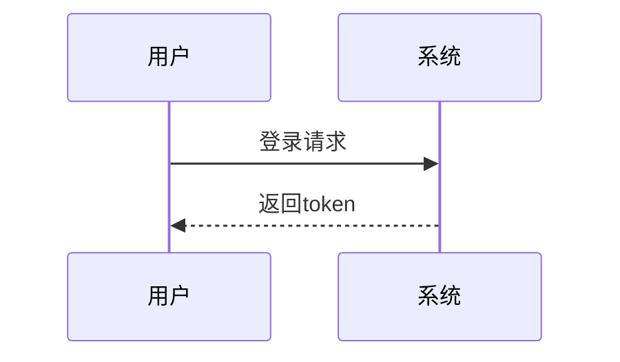
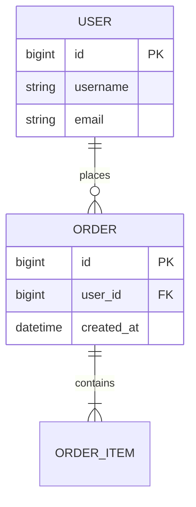
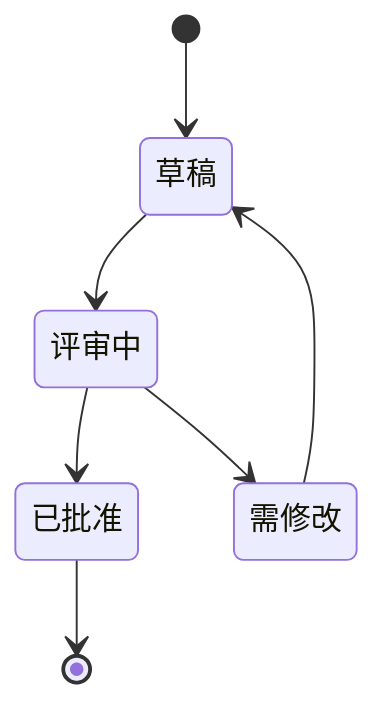
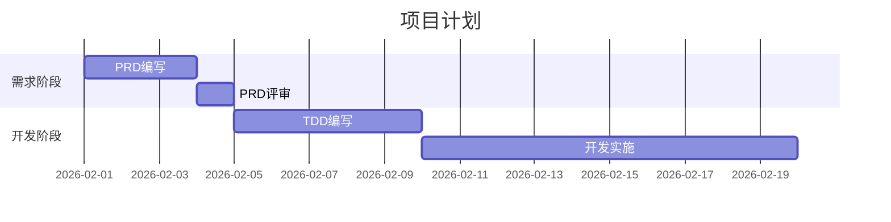

# Markdown格式规范

> 定义所有Markdown文档的格式和写作规范

## 规则概述

本规范定义了Markdown文档的格式要求，包括标题、列表、表格、代码块、Mermaid图表等的标准写法，确保文档格式统一美观。

---

## 标题规范

### 标题层级

**正确使用**：
```markdown
# 一级标题（文档标题）
## 二级标题（章节）
### 三级标题（小节）
#### 四级标题（子项）
```

**规则**：
- ✅ 一级标题：每个文档只有1个，作为文档标题
- ✅ 二级标题：主要章节，如"一、需求概述"
- ✅ 三级标题：章节下的小节，如"1.1 需求背景"
- ✅ 四级标题：小节下的细分，如"功能点1"
- ❌ 避免使用五级及以下标题
- ❌ 避免跳级（如从一级直接到三级）

---

### 标题格式

**正确格式**：
```markdown
# 标题

正文内容...
```

**规则**：
- ✅ `#` 后面必须有一个空格
- ✅ 标题后必须空一行再写正文
- ✅ 标题前建议空一行（除了第一个标题）
- ❌ 不要在标题末尾加标点符号

**示例**：
```markdown
# 产品需求文档

> 文档简介

## 一、需求概述

本章节描述...

### 1.1 需求背景

背景说明...
```

---

### 标题编号

**章节编号规则**：
```markdown
# 文档标题（不编号）

## 一、需求概述
## 二、功能需求
## 三、非功能需求

### 1.1 需求背景
### 1.2 需求目标
### 1.3 需求范围

### 2.1 功能架构
### 2.2 核心功能详述
```

**规则**：
- 二级标题：使用中文数字编号（一、二、三）
- 三级标题：使用阿拉伯数字编号（1.1、1.2）
- 四级标题：不编号，直接使用标题名

---

## 段落规范

### 段落间距

**规则**：
- ✅ 段落之间空一行
- ✅ 章节之间空两行
- ❌ 避免连续空行超过2行

**示例**：
```markdown
第一段内容。

第二段内容。


## 新章节

章节内容。
```

---

### 段落对齐

**规则**：
- ✅ 左对齐（默认）
- ❌ 不使用居中或右对齐
- ❌ 不使用首行缩进

---

## 列表规范

### 无序列表

**格式**：
```markdown
- 第一项
- 第二项
- 第三项
  - 子项1
  - 子项2
```

**规则**：
- ✅ 使用 `-` 作为无序列表符号
- ✅ `-` 后必须有一个空格
- ✅ 子列表缩进2个空格
- ❌ 避免混用 `-`、`*`、`+`

---

### 有序列表

**格式**：
```markdown
1. 第一项
2. 第二项
3. 第三项
   1. 子项1
   2. 子项2
```

**规则**：
- ✅ 使用数字编号
- ✅ 数字后使用 `.` 和一个空格
- ✅ 子列表缩进3个空格
- ✅ 保持数字连续递增

---

### 任务列表

**格式**：
```markdown
- [ ] 未完成任务
- [x] 已完成任务
- [ ] 另一个未完成任务
```

**规则**：
- ✅ 用于验收标准、检查清单
- ✅ `[ ]` 表示未完成
- ✅ `[x]` 表示已完成
- ✅ `[ ]` 前后都有空格

---

### 混合列表

**格式**：
```markdown
1. 第一项
   - 子项A
   - 子项B
2. 第二项
   - [ ] 任务1
   - [ ] 任务2
```

**规则**：
- ✅ 可以在有序列表下嵌套无序列表
- ✅ 可以在列表下嵌套任务列表
- ✅ 注意缩进对齐

---

## 表格规范

### 基本表格

**格式**：
```markdown
| 列1 | 列2 | 列3 |
|-----|-----|-----|
| 值1 | 值2 | 值3 |
| 值4 | 值5 | 值6 |
```

**规则**：
- ✅ 表头必须有
- ✅ 使用 `|` 分隔列
- ✅ 使用 `---` 分隔表头和内容
- ✅ 建议对齐列（美观）
- ❌ 单元格不能为空，应使用 `-` 填充

---

### 对齐方式

**格式**：
```markdown
| 左对齐 | 居中 | 右对齐 |
|:-------|:----:|-------:|
| 内容1  | 内容2 | 内容3  |
```

**规则**：
- 左对齐：`:---`
- 居中：`:---:`
- 右对齐：`---:`
- 默认左对齐

---

### 表格内容规范

**规则**：
- ✅ 数字类：右对齐
- ✅ 文本类：左对齐
- ✅ 状态类：居中
- ✅ 无数据使用 `-` 而非空白
- ❌ 避免单元格内换行

**示例**：
```markdown
| 字段名 | 类型 | 必填 | 说明 |
|-------|------|:----:|------|
| id | 整数 | ✅ | 主键 |
| name | 字符串 | ✅ | 用户名 |
| age | 整数 | ❌ | 年龄 |
```

---

### 复杂表格

**包含列表的表格**：
```markdown
| 功能 | 子功能 |
|------|--------|
| 用户管理 | - 新增用户<br>- 编辑用户<br>- 删除用户 |
```

**规则**：
- ✅ 使用 `<br>` 换行
- ✅ 保持简洁，避免过于复杂
- 复杂内容建议单独成段

---

## 代码规范

### 行内代码

**格式**：
```markdown
使用 `code` 标记代码。
```

**规则**：
- ✅ 使用反引号 `` ` `` 包裹
- ✅ 用于：变量名、函数名、命令、路径
- ❌ 不要用于强调文本

**示例**：
```markdown
调用 `getUserInfo()` 函数获取用户信息。
文件位于 `/api/users.js` 路径下。
```

---

### 代码块

**格式**：
````markdown
```javascript
function hello() {
  console.log('Hello, World!');
}
```
````

**规则**：
- ✅ 使用三个反引号 ``` 包裹
- ✅ 必须指定语言标识
- ✅ 代码前后各空一行
- ✅ 保持代码缩进

---

### 常用语言标识

```markdown
```javascript  - JavaScript代码
```python      - Python代码
```java        - Java代码
```sql         - SQL语句
```json        - JSON数据
```bash        - Shell命令
```markdown    - Markdown示例
```mermaid     - Mermaid图表
```
```

---

### 示例代码格式

**接口示例**：
````markdown
**请求示例**：
```json
{
  "username": "admin",
  "password": "123456"
}
```

**响应示例**：
```json
{
  "code": 200,
  "message": "success",
  "data": {
    "token": "xxx"
  }
}
```
````

---

## 引用规范

### 普通引用

**格式**：
```markdown
> 这是引用内容。
```

**规则**：
- ✅ 使用 `>` 标记
- ✅ `>` 后有一个空格
- ✅ 用于：文档简介、重要提示

**示例**：
```markdown
> 本文档定义了产品需求的标准格式。

> ⚠️ 注意：此功能需要管理员权限。
```

---

### 多级引用

**格式**：
```markdown
> 一级引用
>
> > 二级引用
```

**规则**：
- ✅ 用于引用的引用
- ❌ 避免超过两级

---

## 强调规范

### 加粗

**格式**：
```markdown
**加粗文本**
```

**规则**：
- ✅ 使用 `**` 包裹
- ✅ 用于：重点内容、关键词
- ❌ 不要滥用

---

### 斜体

**格式**：
```markdown
*斜体文本*
```

**规则**：
- ✅ 使用 `*` 包裹
- ✅ 用于：术语、引用、注释
- ❌ 中文环境少用

---

### 删除线

**格式**：
```markdown
~~删除的文本~~
```

**规则**：
- ✅ 使用 `~~` 包裹
- ✅ 用于：标记废弃内容

---

### 组合使用

**格式**：
```markdown
**加粗和 *斜体***
```

**规则**：
- ✅ 可以组合使用
- ❌ 不要过度组合

---

## 链接规范

### 普通链接

**格式**：
```markdown
[链接文本](URL)
```

**示例**：
```markdown
参考 [PRD编写标准](./prd-standard.md)
访问 [官方网站](https://example.com)
```

**规则**：
- ✅ 内部链接使用相对路径
- ✅ 外部链接使用完整URL
- ✅ 链接文本应有意义

---

### 引用式链接

**格式**：
```markdown
[链接文本][标识]

[标识]: URL "标题"
```

**示例**：
```markdown
参考 [PRD标准][1] 和 [TDD标准][2]

[1]: ./prd-standard.md "PRD编写标准"
[2]: ./tdd-standard.md "TDD编写标准"
```

**规则**：
- ✅ 用于多次引用同一链接
- ✅ 链接定义放在文档末尾

---

### 自动链接

**格式**：
```markdown
<https://example.com>
<email@example.com>
```

**规则**：
- ✅ 用于显示完整URL
- ✅ 用于邮箱地址

---

## 图片规范

### 图片引用

**格式**：
```markdown

```

**示例**：
```markdown


```

**规则**：
- ✅ 必须有图片描述
- ✅ 本地图片使用相对路径
- ✅ 建议图片单独存放在 `images/` 目录

---

### 图片大小

**格式**：
```markdown

```

**规则**：
- ✅ 需要控制大小时使用HTML标签
- ✅ 指定 `alt` 属性
- ❌ 不要使用过大的图片

---

## Mermaid图表规范

### 流程图 (Flowchart)

**格式**：
````markdown

````

**规则**：
- ✅ 使用中文标签
- ✅ 节点ID使用大写字母
- ✅ 逻辑清晰，从上到下
- ✅ `TD` (上到下) 或 `LR` (左到右)

---

### 时序图 (Sequence Diagram)

**格式**：
````markdown

````

**规则**：
- ✅ 使用中文参与者名称
- ✅ `->>` 实线箭头
- ✅ `-->>` 虚线箭头

---

### ER图 (Entity Relationship)

**格式**：
````markdown

````

**规则**：
- ✅ 表名使用大写
- ✅ 标注主键 PK 和外键 FK
- ✅ 标注关系类型

---

### 状态图 (State Diagram)

**格式**：
````markdown

````

**规则**：
- ✅ 使用中文状态名
- ✅ 逻辑流转清晰
- ✅ 使用 `stateDiagram-v2`

---

### 甘特图 (Gantt)

**格式**：
````markdown

````

**规则**：
- ✅ 使用中文阶段名和任务名
- ✅ 指定日期格式
- ✅ 任务依赖关系清晰

---

### Mermaid通用规则

**规则**：
- ✅ 必须使用 ` ```mermaid ` 标记
- ✅ 所有标签使用中文
- ✅ 节点ID使用英文字母
- ✅ 保持图表简洁清晰
- ✅ 图表前后各空一行
- ❌ 避免图表过于复杂

---

## 分隔线规范

**格式**：
```markdown
---
```

**规则**：
- ✅ 使用三个短横线 `---`
- ✅ 分隔线前后各空一行
- ✅ 用于分隔大的章节
- ❌ 不要过度使用

**示例**：
```markdown
## 章节1

内容...

---

## 章节2

内容...
```

---

## 特殊标记

### Emoji使用

**规则**：
- ✅ 可用于状态标识
- ✅ 可用于提示信息
- ❌ 不要滥用

**常用Emoji**：
```markdown
✅ 正确、通过、已完成
❌ 错误、不通过、未完成
⚠️ 警告、注意
📋 文档、清单
🔵 草稿
🟡 评审中
🟢 已批准
🔴 需修改
⭐ 重要、优秀
```

---

### 特殊符号

**规则**：
- ✅ 使用HTML实体代码
- ✅ 常用符号可直接使用

**常用符号**：
```markdown
&nbsp;   - 空格
&lt;     - <
&gt;     - >
&copy;   - ©
&trade;  - ™
```

---

## 文档元信息

### Front Matter

**格式**：
```markdown
---
title: 文档标题
author: 作者
date: 2026-02-09
version: v1.0
---
```

**规则**：
- ✅ 放在文档开头
- ✅ 使用YAML格式
- ✅ 包含必要的元信息

---

## 注释规范

### HTML注释

**格式**：
```markdown
<!-- 这是注释，不会显示 -->
```

**规则**：
- ✅ 用于临时标记
- ✅ 用于TODO提示
- ❌ 不要在正式文档中留注释

---

## AI行为约束

### 格式自动检查

**检查项**：
- [ ] 标题格式正确
- [ ] 列表格式统一
- [ ] 表格有表头
- [ ] 代码块有语言标识
- [ ] Mermaid图表语法正确
- [ ] 无连续空行超过2行

---

### 格式自动修正

**AI应该**：
- ✅ 自动修正标题格式
- ✅ 自动统一列表符号
- ✅ 自动对齐表格
- ✅ 自动添加代码块语言标识

---

## 检查清单

### 基本格式检查

- [ ] 标题层级正确
- [ ] 段落间距合理
- [ ] 列表格式统一
- [ ] 表格格式正确
- [ ] 代码块有语言标识

### 高级格式检查

- [ ] Mermaid图表正确渲染
- [ ] 链接有效
- [ ] 图片可访问
- [ ] 无格式错误

### 内容检查

- [ ] 无错别字
- [ ] 术语使用一致
- [ ] 表达清晰
- [ ] 逻辑连贯

---

## 相关规范

- [文档质量检查规范](../doc-quality/RULE.md)
- [PRD编写标准](../doc-writing/prd-standard.md)
- [TDD编写标准](../doc-writing/tdd-standard.md)
- [测试用例标准](../doc-writing/test-standard.md)

---

## 参考资源

- [Markdown官方规范](https://commonmark.org/)
- [GitHub Flavored Markdown](https://github.github.com/gfm/)
- [Mermaid官方文档](https://mermaid.js.org/)

---

**版本**: v1.0  
**最后更新**: 2026-02-09  
**维护者**: [填写]
