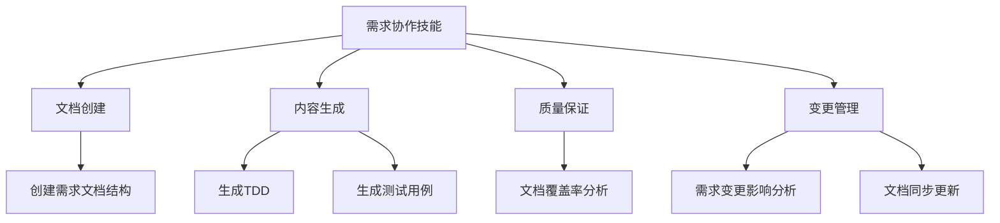
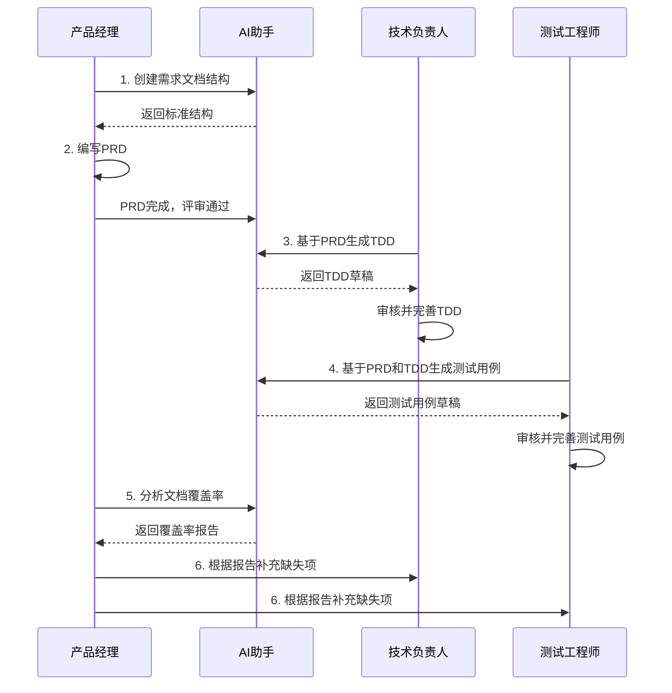

# 技能索引

> 产研测一体化AI协同技能集

## 📋 技能概览

本技能集为产研测一体化文档协作提供AI辅助能力，涵盖文档创建、内容生成、质量检查等全流程。

---

## 🎯 技能架构



---

## 📚 技能清单

### 1. 生成PRD文档
**技能文件**: [generate-prd/SKILL.md](generate-prd/SKILL.md)  
**使用时机**: 新需求启动时  
**主要功能**:
- AI辅助生成PRD文档草稿
- 自动创建标准化文档结构
- 智能推断需求内容
- 质量检查和完善建议

**前置条件**:
- 提供需求背景、目标、核心功能等基本信息

**快速使用**:
```
用户: 生成"用户权限管理"的PRD
AI: [自动执行生成流程]
```

**适用角色**: 产品经理

---

### 2. 从PRD生成TDD
**技能文件**: [generate-tdd/SKILL.md](generate-tdd/SKILL.md)  
**使用时机**: PRD评审通过后  
**主要功能**:
- 基于PRD自动生成TDD草稿
- 自动设计技术架构
- 自动生成接口和数据库设计
- 生成Mermaid架构图和ER图

**前置条件**:
- ✅ PRD已完成并评审通过
- ✅ 技术栈已确定

**快速使用**:
```
用户: 基于PRD生成TDD
AI: [自动执行生成流程]
```

**适用角色**: 技术负责人、架构师

---

### 3. 从PRD和TDD生成测试用例
**技能文件**: [generate-test/SKILL.md](generate-test/SKILL.md)  
**使用时机**: PRD和TDD均评审通过后  
**主要功能**:
- 基于PRD和TDD生成测试用例草稿
- 自动生成功能测试用例（正向、异常、边界）
- 自动生成接口测试用例
- 自动生成性能和安全测试用例

**前置条件**:
- ✅ PRD已完成并评审通过
- ✅ TDD已完成并评审通过

**快速使用**:
```
用户: 基于PRD和TDD生成测试用例
AI: [自动执行生成流程]
```

**适用角色**: 测试负责人、测试工程师

---

### 4. 文档覆盖率分析
**技能文件**: [analyze-coverage/SKILL.md](analyze-coverage/SKILL.md)  
**使用时机**: 文档评审前、需求变更后  
**主要功能**:
- 分析PRD → TDD覆盖率
- 分析PRD → 测试用例覆盖率
- 分析TDD → 测试用例覆盖率
- 检查文档一致性
- 生成覆盖率报告

**前置条件**:
- ✅ 至少有PRD文档

**快速使用**:
```
用户: 分析需求文档的覆盖率
AI: [执行分析并输出报告]
```

**适用角色**: 产品经理、技术负责人、测试负责人、项目经理

---

### 5. 需求变更管理 ✨ 新增
**技能文件**: [refine-requirement-docs/SKILL.md](refine-requirement-docs/SKILL.md)  
**使用时机**: PRD发生变更时  
**主要功能**:
- 自动分析PRD变更内容
- 识别变更类型（新增/修改/删除功能）
- 评估对TDD和测试用例的影响
- 生成变更影响报告
- 协助同步更新下游文档

**前置条件**:
- ✅ PRD已发生变更
- ✅ TDD文档已存在（可选）
- ✅ 测试用例文档已存在（可选）

**快速使用**:
```
用户: PRD发生了变更，帮我分析影响
AI: [执行变更分析并生成报告]
```

**适用角色**: 产品经理、技术负责人、测试负责人

---

## 🔄 技能协作流程



---

## 📖 使用指南

### 典型工作流

#### 场景1：新需求从0到1

1. **PRD生成**（产品经理）
   ```
   用户: 生成"移动端首页改版"的PRD
   AI: 使用 generate-prd 技能生成PRD草稿
   ```
   - AI自动生成完整PRD结构
   - 人工审核并完善内容
   - 补充原型图和设计稿

2. **TDD生成**（技术负责人）
   ```
   用户: 基于"移动端首页改版"PRD生成TDD
   AI: 使用 generate-tdd 技能生成TDD草稿
   ```
   - 人工审核架构设计
   - 完善核心技术方案

3. **测试用例生成**（测试工程师）
   ```
   用户: 基于"移动端首页改版"PRD和TDD生成测试用例
   AI: 使用 generate-test 技能生成测试用例草稿
   ```
   - 人工审核测试覆盖
   - 补充复杂场景用例

4. **覆盖率检查**（任何角色）
   ```
   用户: 分析"移动端首页改版"的文档覆盖率
   AI: 使用 analyze-coverage 技能生成分析报告
   ```
   - 根据报告补充缺失项
   - 修正不一致的地方

---

#### 场景2：需求变更 ✨ 优化

1. **更新PRD**（产品经理）
   - 人工修改PRD内容
   - 更新版本历史

2. **变更影响分析**（使用新技能 🎯）
   ```
   用户: PRD发生了变更，帮我分析影响
   AI: 使用 refine-requirement-docs 技能分析变更
   ```
   - 自动识别变更类型
   - 生成详细的影响分析报告
   - 列出TDD和测试用例需要更新的具体位置

3. **同步更新文档**（可选择自动或手动）
   ```
   用户: 自动同步所有文档
   AI: 
   - 自动更新TDD相关内容
   - 自动新增/修改测试用例
   - 自动更新版本号和版本引用
   ```

4. **重新检查覆盖率**
   ```
   用户: 重新分析文档覆盖率
   AI: 生成更新后的覆盖率报告，验证同步完成
   ```

---

## 🎓 最佳实践

### 对产品经理

1. **使用AI辅助生成PRD**
   - 使用 generate-prd 技能快速生成PRD草稿
   - AI会自动创建标准结构并填充内容

2. **充分利用AI辅助**
   - AI可以帮助生成Mermaid流程图
   - AI可以检查PRD完整性

3. **及时同步更新**
   - PRD修改后及时通知技术和测试
   - 使用覆盖率分析确保同步

---

### 对技术负责人

1. **PRD评审通过后再生成TDD**
   - 避免PRD频繁变更导致返工
   - 确保对PRD理解充分

2. **AI生成的是草稿，不是最终版**
   - 架构设计需要人工审核
   - 性能和安全方案需要详细设计

3. **保持TDD与PRD一致**
   - 技术方案要满足PRD需求
   - 不要随意添加PRD未提及的功能

---

### 对测试工程师

1. **基于PRD和TDD生成测试用例**
   - 不要只基于PRD，会遗漏接口测试
   - 不要只基于TDD，会忽略业务场景

2. **AI生成的用例是基础，需补充**
   - 复杂业务场景需人工设计
   - 边界值需要根据实际调整

3. **使用覆盖率分析查漏补缺**
   - 定期检查测试覆盖率
   - 重点关注P0/P1用例覆盖

---

## 💡 技能组合使用

### 组合1：快速启动新需求

```
技能顺序：
1. generate-prd（生成PRD草稿）
2. [人工审核并完善PRD]
3. generate-tdd（生成TDD）
4. generate-test（生成测试用例）
5. analyze-coverage（检查覆盖率）

时间节省：约70-80%
```

---

### 组合2：需求变更同步 ✨ 优化

```
技能顺序：
1. [人工更新PRD]
2. refine-requirement-docs（分析变更影响）🆕
3. refine-requirement-docs（自动同步TDD和测试用例）🆕
4. analyze-coverage（验证同步完成）

时间节省：约70-80%（相比手动同步）
```

---

### 组合3：文档质量提升

```
技能顺序：
1. analyze-coverage（发现问题）
2. generate-tdd或generate-test（补充缺失）
3. analyze-coverage（再次检查）

质量提升：覆盖率从70-80%提升到90-95%
```

---

## 🔧 维护和扩展

### 技能版本管理
- 每个技能文件包含版本信息
- 技能更新时更新版本号
- 保持技能间的兼容性

### 未来计划

#### 短期计划
- [x] 添加需求变更影响分析技能 ✅ 已完成
- [ ] 添加基于TDD生成代码框架技能
- [ ] 添加测试报告生成技能

#### 中期计划
- [ ] 添加需求问答机器人技能
- [ ] 添加文档翻译技能（中英互译）
- [ ] 添加文档导出技能（PDF、Word）

#### 长期计划
- [ ] 添加需求推荐技能（基于历史需求）
- [ ] 添加工作量评估技能
- [ ] 添加风险识别技能

---

## 📊 效率提升数据

| 环节 | 传统方式 | 使用AI技能 | 节省时间 |
|------|---------|-----------|---------|
| 创建需求结构 | 10分钟 | 1分钟 | 90% |
| 编写TDD | 4小时 | 1小时（AI生成+人工完善） | 75% |
| 编写测试用例 | 3小时 | 45分钟（AI生成+人工完善） | 75% |
| 覆盖率检查 | 1小时 | 5分钟 | 92% |
| **总计** | **8小时16分钟** | **2小时51分钟** | **65.6%** |

*数据基于中等复杂度需求，实际节省时间因项目而异*

---

## ❓ 常见问题

### Q1: AI生成的文档可以直接使用吗？
**A**: 不能。AI生成的是草稿，需要人工审核和完善。特别是架构设计、业务逻辑等核心内容必须人工确认。

### Q2: 技能会自动执行吗？
**A**: 不会。技能需要用户明确调用或在对话中触发。AI会提示可用的技能但不会自动执行。

### Q3: 可以自定义技能吗？
**A**: 可以。可以复制现有技能并修改，或创建新的技能文件。

### Q4: 技能和规则有什么区别？
**A**: 技能定义"要做什么"（操作步骤），规则定义"怎么做才对"（标准约束）。技能是主动调用的，规则是隐式生效的。

### Q5: 如何知道该用哪个技能？
**A**: AI会根据你的请求自动推荐合适的技能。也可以查看本文档的"使用指南"部分。

---

## 🔗 相关资源

### 规则体系
- [规则索引](../../rules/README.md)
- [文档结构规范](../../rules/doc-structure/RULE.md)
- [文档编写标准](../../rules/doc-writing/)
- [协作流程规范](../../rules/doc-workflow/RULE.md)

### 模板
- [PRD模板](generate-prd/templates/PRD_template.md)
- [TDD模板](generate-tdd/templates/TDD_template.md)
- [测试用例模板](generate-test/templates/TCD_template.md)

---

## 🤝 贡献指南

欢迎贡献新技能或改进现有技能：

1. 参考现有技能文件结构
2. 遵循技能编写规范
3. 提供清晰的使用示例
4. 更新本索引文档

---

## 📝 更新日志

| 版本 | 日期 | 修改内容 |
|------|------|----------|
| v1.1 | 2026-02-09 | 新增需求变更管理技能(refine-requirement-docs) |
| v1.0 | 2026-02-09 | 初始版本，包含4个核心技能 |

---

**技能体系维护者**: [填写负责人]  
**最后更新**: 2026-02-09
