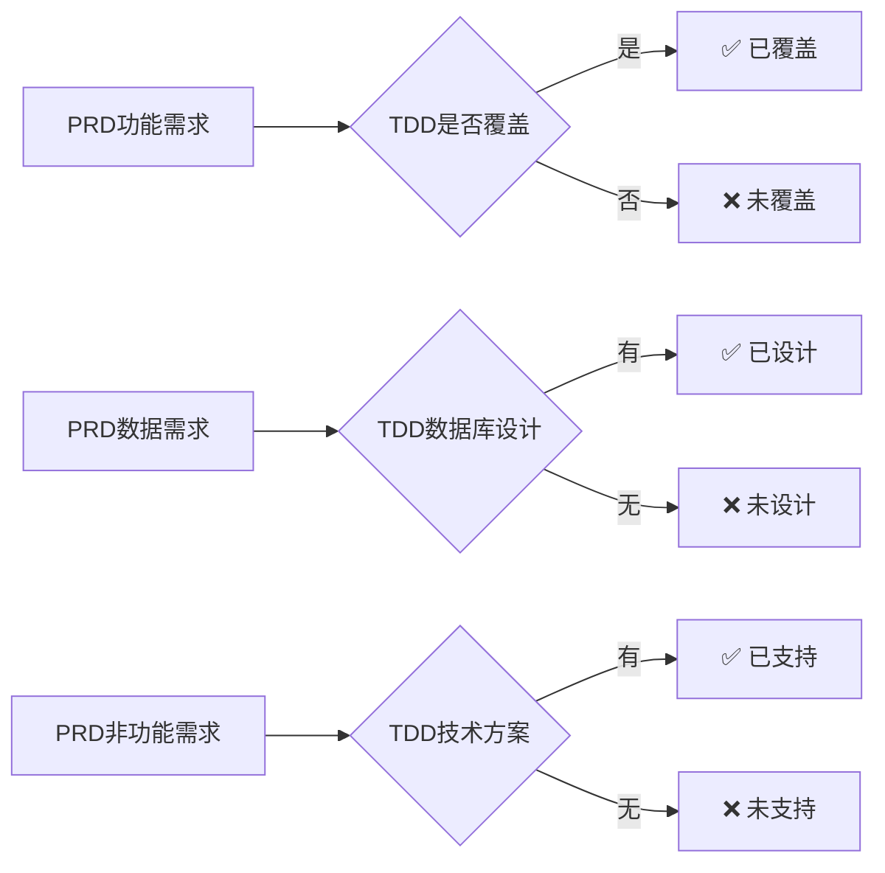
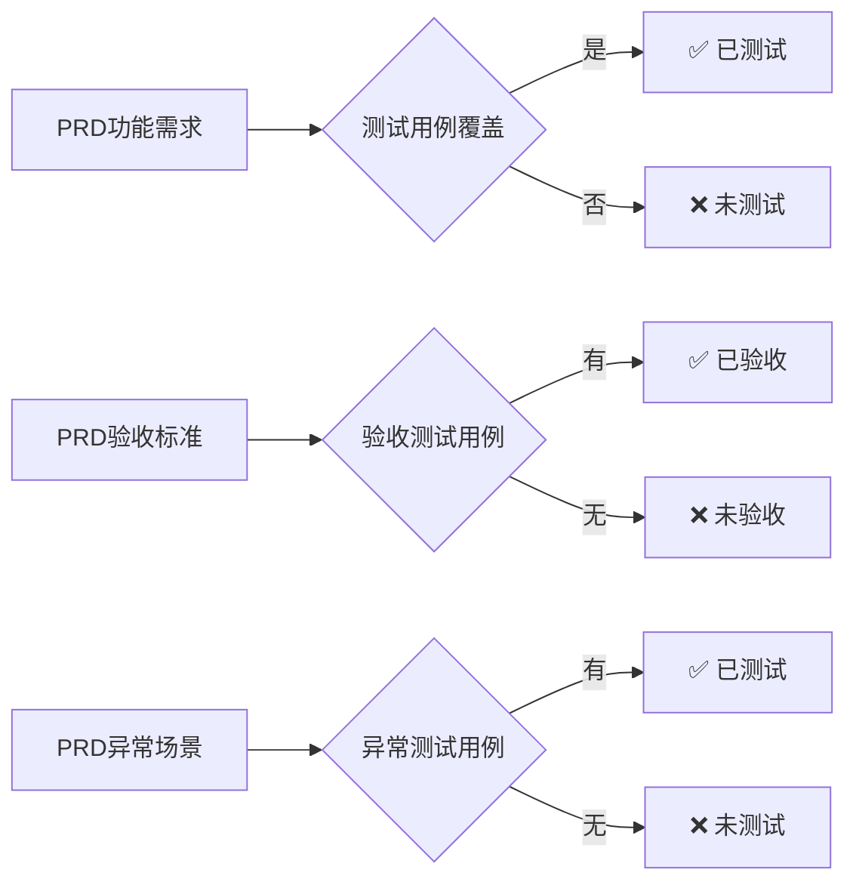
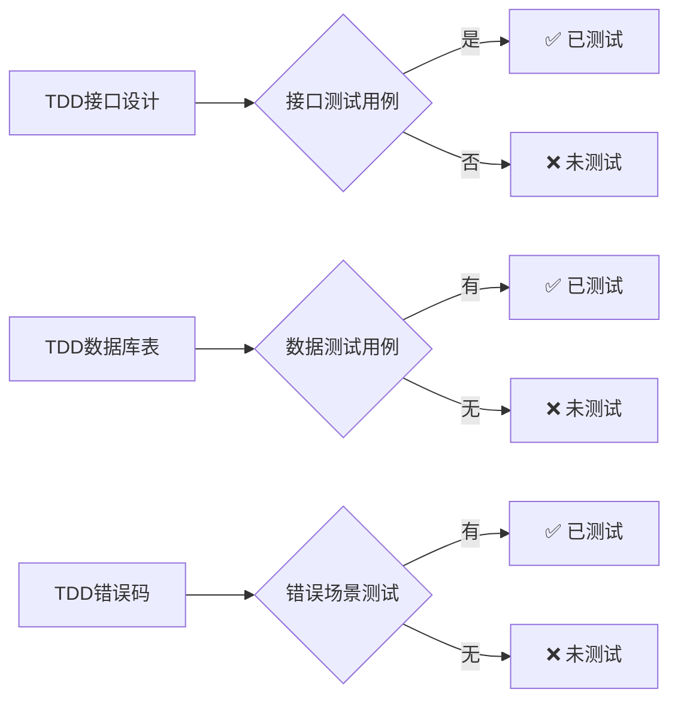

# 文档覆盖率分析技能

## 技能概述

分析PRD、TDD、测试用例三个文档之间的覆盖关系和一致性，识别遗漏和不一致的地方，确保文档质量。

---

## 使用场景

### 何时使用
- ✅ PRD、TDD、测试用例全部完成后
- ✅ 文档评审前的质量检查
- ✅ 需求变更后的同步检查
- ✅ 发现文档不一致时

### 何时不使用
- ❌ 文档尚未完成
- ❌ 只有PRD没有TDD或测试用例

---

## 前置条件

### 必需条件
1. PRD文档存在且可读
2. TDD文档存在且可读（可选但建议）
3. 测试用例文档存在且可读（可选但建议）

---

## 分析维度

### 维度1：PRD → TDD 覆盖率



**检查项**：

#### 功能覆盖
- [ ] PRD每个核心功能在TDD有对应模块或服务
- [ ] PRD业务规则在TDD有技术实现方案
- [ ] PRD交互流程在TDD有前端设计

#### 数据覆盖
- [ ] PRD数据实体在TDD有数据库表设计
- [ ] PRD数据字段在TDD表结构中存在
- [ ] PRD数据关系在TDD ER图中体现

#### 接口覆盖
- [ ] PRD页面需求在TDD有对应的API接口
- [ ] PRD功能操作在TDD有对应的接口

#### 非功能需求覆盖
- [ ] PRD性能要求在TDD有优化方案
- [ ] PRD安全要求在TDD有安全设计
- [ ] PRD兼容性要求在TDD技术选型中考虑

---

### 维度2：PRD → 测试用例 覆盖率



**检查项**：

#### 功能测试覆盖
- [ ] PRD每个功能点至少有1个测试用例
- [ ] PRD核心功能至少有正向和异常两种用例
- [ ] PRD业务规则有对应的测试用例

#### 验收测试覆盖
- [ ] PRD验收标准每一项有对应测试用例
- [ ] 测试用例能验证验收标准

#### 异常场景覆盖
- [ ] PRD异常处理表格每一项有测试用例
- [ ] 常见异常场景有覆盖

---

### 维度3：TDD → 测试用例 覆盖率



**检查项**：

#### 接口测试覆盖
- [ ] TDD每个接口至少有1个测试用例
- [ ] TDD接口的参数验证有测试
- [ ] TDD接口的权限控制有测试
- [ ] TDD接口的错误码有测试

#### 数据测试覆盖
- [ ] TDD关键表有数据完整性测试
- [ ] TDD表约束和索引有验证

---

### 维度4：文档一致性检查

**检查项**：

#### 基础信息一致性
- [ ] 需求名称在三个文档中一致
- [ ] 版本号对应关系正确
- [ ] 文档状态合理

#### 术语一致性
- [ ] 三个文档中的专业术语统一
- [ ] 功能名称表述一致
- [ ] 数据实体命名一致

#### 内容一致性
- [ ] TDD技术方案满足PRD需求
- [ ] 测试用例验证PRD验收标准
- [ ] 测试用例覆盖TDD接口

---

## 分析步骤

### 步骤1：读取三个文档

**AI操作**：
```
正在读取文档...
✅ PRD: docs/需求文档/{年月}-{需求名称}/product/PRD.md
✅ TDD: docs/需求文档/{年月}-{需求名称}/develop/TDD.md
✅ TCD: docs/需求文档/{年月}-{需求名称}/test/TCD.md

文档版本：
- PRD: v1.0
- TDD: v1.0
- TCD: v1.0
```

---

### 步骤2：提取关键信息

**从PRD提取**：
- 功能需求清单（章节二）
- 数据实体清单（章节五）
- 验收标准清单（章节六）
- 性能要求
- 安全要求

**从TDD提取**：
- 模块清单（2.3节）
- 接口清单（5.1节）
- 数据库表清单（4.1节）
- ER图关系

**从测试用例提取**：
- 功能测试用例清单（章节二）
- 接口测试用例清单（章节五）
- 边界值测试清单（章节三）
- 性能测试清单（章节七）
- 安全测试清单（章节八）

---

### 步骤3：执行覆盖率分析

#### 分析1：PRD功能 vs TDD模块

```
PRD功能清单：
1. 用户登录功能
2. 用户注册功能
3. 密码重置功能
4. 个人信息管理

TDD模块清单：
1. 认证模块（auth）
2. 用户管理模块（user）

覆盖情况：
✅ 用户登录功能 → 认证模块
✅ 用户注册功能 → 认证模块
✅ 密码重置功能 → 认证模块
✅ 个人信息管理 → 用户管理模块

覆盖率：4/4 = 100%
```

#### 分析2：PRD功能 vs 测试用例

```
PRD功能清单：
1. 用户登录功能
2. 用户注册功能
3. 密码重置功能
4. 个人信息管理

测试用例覆盖：
✅ 用户登录功能 → TC-LOGIN-001~005 (5个用例)
✅ 用户注册功能 → TC-REG-001~008 (8个用例)
❌ 密码重置功能 → 未找到测试用例
✅ 个人信息管理 → TC-USER-001~004 (4个用例)

覆盖率：3/4 = 75%
⚠️ 未覆盖：密码重置功能
```

#### 分析3：TDD接口 vs 测试用例

```
TDD接口清单：
1. POST /api/auth/login - 用户登录
2. POST /api/auth/register - 用户注册
3. POST /api/auth/reset-password - 重置密码
4. GET /api/users/:id - 获取用户信息
5. PUT /api/users/:id - 更新用户信息

接口测试用例：
✅ POST /api/auth/login → TC-API-001~005 (5个用例)
✅ POST /api/auth/register → TC-API-006~010 (5个用例)
❌ POST /api/auth/reset-password → 未找到测试用例
✅ GET /api/users/:id → TC-API-011~013 (3个用例)
✅ PUT /api/users/:id → TC-API-014~018 (5个用例)

覆盖率：4/5 = 80%
⚠️ 未覆盖：POST /api/auth/reset-password
```

#### 分析4：PRD验收标准 vs 测试用例

```
PRD验收标准：
- [ ] 用户能正常登录系统
- [ ] 用户能注册新账号
- [ ] 登录失败3次后账号锁定
- [ ] 页面加载时间 < 2秒
- [ ] 无高危安全漏洞

验收测试用例：
✅ 用户能正常登录系统 → TC-LOGIN-001
✅ 用户能注册新账号 → TC-REG-001
❌ 登录失败3次后账号锁定 → 未找到测试用例
✅ 页面加载时间 < 2秒 → TC-PERF-001
✅ 无高危安全漏洞 → TC-SEC-001~005

覆盖率：4/5 = 80%
⚠️ 未覆盖：登录失败3次后账号锁定
```

---

### 步骤4：一致性检查

#### 需求名称一致性
```
PRD需求名称：用户认证系统
TDD需求名称：用户认证系统
TCD需求名称：用户认证系统
✅ 一致
```

#### 版本对应性
```
PRD版本：v1.0
TDD引用PRD版本：v1.0
TCD引用PRD版本：v1.0
TCD引用TDD版本：v1.0
✅ 版本对应正确
```

#### 术语一致性
```
扫描术语使用...
发现不一致：
❌ PRD使用"用户"，TDD使用"User"
建议：统一使用"用户"
```

---

### 步骤5：生成分析报告

---

## 分析报告格式

```markdown
# 文档覆盖率分析报告

**需求**: {年月}-{需求名称}  
**分析时间**: 2026-02-09 10:00:00  
**文档版本**: PRD v1.0 / TDD v1.0 / TCD v1.0

---

## 📊 覆盖率总览

| 分析维度 | 覆盖率 | 状态 |
|---------|--------|------|
| PRD → TDD 功能覆盖 | 95% (19/20) | ✅ 优秀 |
| PRD → TDD 数据覆盖 | 100% (8/8) | ✅ 优秀 |
| PRD → TDD 接口覆盖 | 90% (18/20) | ✅ 良好 |
| PRD → 测试用例 功能覆盖 | 85% (17/20) | ⚠️ 合格 |
| PRD → 测试用例 验收覆盖 | 90% (9/10) | ✅ 良好 |
| TDD → 测试用例 接口覆盖 | 95% (19/20) | ✅ 优秀 |
| **综合覆盖率** | **92.5%** | **✅ 良好** |

---

## ✅ 已覆盖项 (详细列表)

### PRD → TDD 已覆盖功能

| PRD功能 | TDD模块 | 覆盖程度 |
|---------|---------|---------|
| 用户登录 | 认证模块 | 完全覆盖 |
| 用户注册 | 认证模块 | 完全覆盖 |
| [更多...] | [...] | [...] |

### PRD → 测试用例 已覆盖功能

| PRD功能 | 测试用例 | 用例数量 |
|---------|---------|---------|
| 用户登录 | TC-LOGIN-001~005 | 5 |
| 用户注册 | TC-REG-001~008 | 8 |
| [更多...] | [...] | [...] |

---

## ❌ 未覆盖项 (需要关注)

### PRD → TDD 未覆盖

| PRD功能/需求 | 类型 | 建议 |
|-------------|------|------|
| 密码重置功能 | 功能需求 | 在TDD中添加密码重置服务设计 |
| 用户头像存储 | 数据需求 | 在数据库设计中添加头像字段或文件存储方案 |

### PRD → 测试用例 未覆盖

| PRD功能/验收标准 | 建议测试用例 |
|-----------------|-------------|
| 密码重置功能 | 添加 TC-RESET-001~005：密码重置流程测试 |
| 登录失败3次锁定 | 添加 TC-LOGIN-006：连续失败锁定测试 |

### TDD → 测试用例 未覆盖

| TDD接口 | 建议测试用例 |
|---------|-------------|
| POST /api/auth/reset-password | 添加 TC-API-030~034：重置密码接口测试 |
| GET /api/users/export | 添加 TC-API-035~037：导出用户接口测试 |

---

## ⚠️ 一致性问题

### 术语不一致

| 位置 | 当前术语 | 建议统一为 |
|------|---------|-----------|
| TDD模块名称 | User | 用户 |
| 测试用例 | 用户端 | 用户 |

### 版本不一致

无版本不一致问题

---

## 💡 改进建议

### 高优先级 (必须修复)

1. **补充密码重置功能的技术设计**
   - 在TDD中添加密码重置服务
   - 设计密码重置接口
   - 添加相关数据库字段

2. **补充密码重置功能的测试用例**
   - 功能测试：TC-RESET-001~005
   - 接口测试：TC-API-030~034

3. **补充登录失败锁定的测试用例**
   - TC-LOGIN-006：连续失败3次锁定测试

### 中优先级 (建议优化)

4. **统一术语使用**
   - 将TDD和测试用例中的英文术语改为中文
   - 保持三个文档术语一致

5. **完善数据测试**
   - 添加数据完整性测试用例
   - 添加数据库约束验证测试

### 低优先级 (可选)

6. **补充边界值测试**
   - 为所有输入字段添加边界值测试

---

## 📈 质量评估

| 质量维度 | 评分 | 评价 |
|---------|------|------|
| 完整性 | 92/100 | 文档完整，少量功能待补充 |
| 覆盖率 | 92/100 | 覆盖率良好，部分细节待完善 |
| 一致性 | 88/100 | 基本一致，术语需统一 |
| 可追溯性 | 95/100 | 功能点可追溯，关联清晰 |
| **总分** | **91.75/100** | **优秀** |

---

## ✅ 下一步行动

1. [ ] 技术负责人补充密码重置功能的TDD设计
2. [ ] 测试负责人补充密码重置和登录锁定的测试用例
3. [ ] 统一三个文档的术语使用
4. [ ] 重新执行覆盖率分析，确认达到95%+

---

**分析完成时间**: 2026-02-09 10:05:00  
**分析耗时**: 5分钟
```

---

## 使用方法

### 基本用法

**用户**：
```
分析需求文档的覆盖率
```

**AI**：
```
正在分析需求文档覆盖率...
[执行分析]
✅ 分析完成，综合覆盖率：92.5%
[输出详细报告]
```

---

### 指定需求

**用户**：
```
分析"202602-移动端首页改版"的文档覆盖率
```

---

### 只分析特定维度

**用户**：
```
只分析PRD和TDD的覆盖关系
```

**AI**：
```
仅分析PRD → TDD覆盖率，跳过测试用例分析。
```

---

## 常见问题

### Q1: 分析需要多长时间？
**A**: 通常1-3分钟，取决于文档大小和复杂度。

### Q2: 覆盖率多少算合格？
**A**: 
- 90%+：优秀
- 80-89%：良好
- 70-79%：合格
- <70%：不合格

### Q3: 发现未覆盖项怎么办？
**A**: 根据分析报告的建议，补充TDD设计或测试用例。

### Q4: 可以只分析两个文档吗？
**A**: 可以。如果TDD或测试用例不存在，会跳过相关分析。

### Q5: 术语不一致严重吗？
**A**: 取决于程度。如果影响理解或沟通，建议统一。

---

## 相关资源

### 规则
- [文档质量检查规范](../../rules/doc-quality/RULE.md)
- [协作流程规范](../../rules/doc-workflow/RULE.md)

### 技能
- [生成TDD](../generate-tdd/SKILL.md)
- [生成测试用例](../generate-test/SKILL.md)

---

**技能维护者**: [填写]  
**最后更新**: 2026-02-09  
**版本**: v1.0
