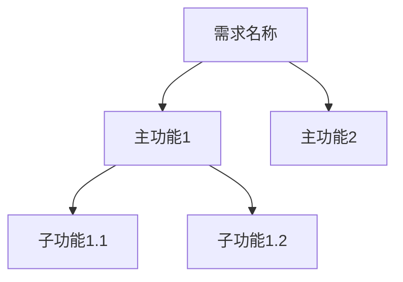

# 生成PRD技能

## 技能概述

AI辅助生成PRD（产品需求文档）草稿，帮助产品经理快速完成标准化的需求文档编写。

---

## 使用场景

### 何时使用
- ✅ 需要快速创建PRD文档
- ✅ 有初步需求想法，需要AI辅助完善
- ✅ 需要规范化的文档结构
- ✅ 需要基于现有信息生成PRD草稿

### 何时不使用
- ❌ 完全从零开始的复杂需求（建议先人工梳理）
- ❌ PRD已存在只需局部修改
- ❌ 需求尚未明确，缺少基本信息

---

## 前置条件

### 必需信息
至少提供以下信息之一：
1. **需求背景**：为什么要做这个需求
2. **核心功能**：主要实现什么功能
3. **目标用户**：给谁用，解决什么问题

### 可选信息
- 业务目标和量化指标
- 竞品参考或类似功能
- 技术约束或限制
- 时间节点要求

---

## 使用步骤

### 步骤1：收集需求信息

**AI提问收集**：

**问题1**：需求基本信息
```
请提供以下信息：
1. 需求名称：[简短描述，如"移动端首页改版"]
2. 需求背景：[为什么要做这个需求？当前有什么问题？]
3. 目标用户：[谁会使用这个功能？]
4. 核心功能：[主要实现哪些功能？]
```

**问题2**：需求目标
```
请明确需求目标：
1. 业务目标：[期望达成什么业务效果？]
2. 量化指标：[如何衡量成功？如用户增长X%，转化率提升Y%]
3. 成功标准：[什么情况下认为需求成功？]
```

**问题3**：需求范围
```
请明确需求范围：
1. 本期包含：[哪些功能在本期实现？]
2. 本期不包含：[哪些功能暂不实现？为什么？]
3. 边界限制：[有哪些约束条件？]
```

---

### 步骤2：确认文档信息

**AI确认**：
```
确认文档基本信息：
- 需求名称：[从步骤1获取]
- 创建年月：[默认当月，格式：YYYYMM]
- 产品负责人：[询问用户]
- 开发负责人：[询问用户或待定]
- 测试负责人：[询问用户或待定]
```

---

### 步骤3：生成文档结构

**AI执行**：

1. **创建文件夹**（如不存在）
```bash
docs/需求文档/{年月}-{需求名称}/product/
```

2. **生成PRD.md文件**
基于 [PRD_template.md](./templates/PRD_template.md) 模板和收集的信息生成。

**模板使用说明**：
- 模板位置：`.cursor/skills/generate-prd/templates/PRD_template.md`
- 模板变量替换：
  - `{{需求名称}}` → 实际需求名称
  - `{{创建日期}}` → 当前日期（YYYY-MM-DD）
- AI应基于模板结构生成内容，替换占位符并填充实际内容

---

### 步骤4：生成PRD内容

**AI自动生成以下章节**：

#### 一、需求概述
**1.1 需求背景**
- 基于用户提供的背景信息生成
- 补充业务价值分析
- 添加合理的假设和推断

**1.2 需求目标**
- 转换业务目标为SMART格式
- 确保至少1个量化指标
- 区分短期和长期目标

**1.3 需求范围**
- 使用✅和❌标识包含和不包含的功能
- 说明边界和限制
- 明确优先级

**1.4 目标用户**
- 基于用户信息创建用户画像
- 描述典型使用场景
- 分析用户痛点

---

#### 二、功能需求

**2.1 功能架构**
- 基于核心功能生成Mermaid功能树
- 至少2层结构（主功能-子功能）



**2.2 核心功能详述**
为每个核心功能生成：
- **功能描述**：清晰说明功能价值
- **用户故事**：作为[角色]，我想要[功能]，以便[目标]
- **功能要点**：3-5个关键点
- **业务规则**：数据验证、权限约束
- **交互流程**：生成Mermaid时序图

---

#### 三、非功能需求

**3.1 性能要求**
生成性能指标表格：
- 页面加载时间：基于页面复杂度推断
- 接口响应时间：< 1秒（标准值）
- 并发用户数：基于目标用户规模估算

**3.2 安全要求**
- 数据安全：加密、备份标准方案
- 访问控制：基于用户角色设计权限
- 合规要求：隐私保护基本要求

**3.3 兼容性要求**
- 浏览器：主流浏览器最近2个版本
- 设备：PC/移动/平板
- 分辨率：常见分辨率范围

**3.4 可用性要求**
- 易用性目标
- 可维护性要求
- 可扩展性考虑

---

#### 四、交互设计

**4.1 页面结构**
- 描述整体布局
- 使用ASCII图示意

**4.2 页面清单**
生成页面列表表格：

| 页面名称 | 页面路径 | 说明 | 优先级 |
|---------|---------|------|--------|
| [生成] | [推断] | [描述] | P0/P1/P2 |

**4.3 交互细节**
- 关键交互行为
- 状态变化和反馈
- 异常处理方式

**4.4 异常处理**
生成异常处理表格，包含常见场景。

---

#### 五、数据需求

**5.1 数据字典**
基于功能需求推断核心数据实体：

| 字段名称 | 字段类型 | 必填 | 说明 | 示例值 |
|---------|---------|------|------|--------|
| id | 整数 | 是 | 唯一标识 | 1001 |

**5.2 数据来源**
- 说明数据来源
- 是否需要对接外部系统
- 数据质量要求

**5.3 数据流转**
生成Mermaid数据流图。

---

#### 六、验收标准

生成任务列表格式的验收标准：

**6.1 功能验收**
- [ ] 核心功能完整实现
- [ ] 业务规则正确执行

**6.2 性能验收**
- [ ] 性能指标达标
- [ ] 无内存泄漏

**6.3 兼容性验收**
- [ ] 主流浏览器测试通过
- [ ] 移动端适配正常

**6.4 安全验收**
- [ ] 无高危漏洞
- [ ] 权限控制正常

**6.5 体验验收**
- [ ] 界面美观符合规范
- [ ] 操作流畅无卡顿

---

#### 七、项目计划

**7.1 里程碑**
生成标准项目阶段表格：

| 阶段 | 开始日期 | 结束日期 | 交付物 |
|------|---------|---------|--------|
| 需求评审 | [推算] | [推算] | PRD |
| 技术设计 | [推算] | [推算] | TDD |
| 开发测试 | [推算] | [推算] | 功能代码 |
| 上线发布 | [推算] | [推算] | 线上功能 |

**7.2 风险管理**
生成常见风险表格。

---

#### 八、附录

**8.1 参考资料**
- 预留位置，提示人工补充

**8.2 专业术语**
- 提取关键术语，生成术语表

**8.3 原型图/设计稿**
- 预留位置，提示添加图片或链接

---

#### 九、版本历史

初始化版本记录：

| 版本号 | 修改日期 | 修改人 | 修改内容 |
|--------|----------|--------|----------|
| v1.0 | [今天日期] | [产品负责人] | 初始版本 |

---

#### 十、评审记录

创建空表格待填：

| 评审日期 | 参与人 | 评审意见 | 处理状态 |
|---------|--------|---------|---------|
| - | - | - | - |

---

### 步骤5：质量检查

**AI自动检查**：

**结构完整性**
- [ ] 包含所有必需章节（一至十）
- [ ] 章节顺序正确
- [ ] 标题层级符合规范

**内容质量**
- [ ] 需求背景有理有据
- [ ] 需求目标可量化（至少1个指标）
- [ ] 功能描述清晰完整
- [ ] 至少1个Mermaid图
- [ ] 验收标准使用任务列表
- [ ] 用户故事格式正确

**格式规范**
- [ ] 表格格式正确
- [ ] Mermaid图表正确
- [ ] 无占位符（"待补充"等）
- [ ] 文档元信息完整

**输出检查报告**。

---

### 步骤6：人工审核和完善

**AI提示**：
```
✅ PRD草稿已生成：docs/需求文档/{年月}-{需求名称}/product/PRD.md

📋 请人工审核和完善以下内容：
1. 需求背景是否准确反映实际情况
2. 功能描述是否完整，有无遗漏
3. 验收标准是否明确可检查
4. 交互设计是否需要添加原型图
5. 项目计划是否符合实际排期

⚠️ 注意事项：
- AI生成的是草稿，核心内容需人工确认
- 数据推断可能不准确，需要实际数据支撑
- 交互细节需要结合UI设计完善
- 性能指标需要根据实际情况调整

✏️ 完善后请更新：
- 文档状态：🔵 草稿 → 🟡 评审中
- 补充原型图或设计稿
- 确认负责人信息
- 添加参考资料链接
```

---

## 生成规则

### 内容推断规则

#### 性能指标推断
```
页面类型 → 加载时间要求
- 简单页面（列表、详情）：< 1秒
- 复杂页面（图表、大表格）：< 2秒
- 首页/入口页面：< 1.5秒

用户规模 → 并发要求
- 小型应用（< 1000用户）：100并发
- 中型应用（1000-10000用户）：500并发
- 大型应用（> 10000用户）：1000+并发
```

#### 功能优先级推断
```
P0（必须）：
- 核心业务流程功能
- 无此功能无法使用

P1（重要）：
- 提升体验的功能
- 大多数用户需要

P2（可选）：
- 辅助功能
- 少数用户使用
```

#### 页面路由推断
```
功能名称 → 路由规则
- 列表页：/resource-name
- 详情页：/resource-name/:id
- 新增页：/resource-name/new
- 编辑页：/resource-name/:id/edit
```

---

### 质量保证规则

#### 必需元素
- ✅ 文档元信息表格完整
- ✅ 至少1个Mermaid功能架构图
- ✅ 至少1个Mermaid流程图或数据流图
- ✅ 用户故事格式正确
- ✅ 验收标准使用任务列表
- ✅ 版本历史已初始化

#### 禁止元素
- ❌ 空白章节或"待补充"占位符
- ❌ 技术实现细节（如"使用Vue3"）
- ❌ 模糊表述（"尽量"、"大概"）
- ❌ 无法检查的验收标准

#### 推荐实践
- ✅ 提供具体数据和示例
- ✅ 使用表格提升可读性
- ✅ 用图表辅助说明
- ✅ 标注需要人工补充的内容

---

## 交互模式

### 模式1：问答式生成（推荐）

**适用**：信息不足，需要逐步收集

**流程**：
1. AI提问收集基本信息
2. AI确认并补充遗漏信息
3. AI生成PRD草稿
4. AI执行质量检查
5. AI提示人工审核要点

---

### 模式2：基于现有信息生成

**适用**：用户已提供详细需求描述

**流程**：
1. AI分析用户提供的信息
2. AI提取关键要素
3. AI直接生成PRD草稿
4. AI执行质量检查
5. AI提示需要人工确认的部分

---

### 模式3：基于竞品参考生成

**适用**：有明确的竞品或参考案例

**流程**：
1. 用户提供竞品信息或链接
2. AI分析竞品功能
3. AI基于竞品生成功能需求
4. AI补充本产品特色
5. AI生成完整PRD草稿

---

## 命令示例

### 示例1：基本创建

**用户**：
```
帮我生成一个"用户权限管理"的PRD
```

**AI**：
```
好的，我来帮你生成"用户权限管理"的PRD。

请先回答几个问题：

1. 需求背景：为什么需要用户权限管理功能？
2. 目标用户：谁会使用这个功能（管理员、普通用户）？
3. 核心功能：需要实现哪些权限管理能力？
```

---

### 示例2：详细信息生成

**用户**：
```
生成PRD：移动端首页改版

背景：当前首页信息展示不够清晰，用户反馈找不到常用功能
目标：提升首页易用性，核心功能点击率提升30%
用户：移动端APP用户，日活5000+
功能：
- 个性化推荐模块
- 快捷入口定制
- 数据可视化展示
```

**AI**：
```
收到，基于你提供的信息生成PRD...

[AI自动分析信息]
[AI生成完整PRD]
[AI执行质量检查]

✅ PRD已生成：docs/需求文档/202602-移动端首页改版/product/PRD.md
```

---

### 示例3：参考竞品生成

**用户**：
```
参考微信的小程序收藏功能，生成我们的"内容收藏"PRD
```

**AI**：
```
好的，我会参考微信小程序收藏功能的设计。

请确认以下信息：
1. 收藏的内容类型：[文章/视频/商品/...]？
2. 收藏场景：用户在哪里可以收藏？
3. 特殊需求：相比微信，我们有什么特色功能？

[等待用户回答后继续生成]
```

---

## 高级功能

### 功能1：批量生成多个功能模块

当需求包含多个独立模块时，可以：
1. 先生成主PRD
2. 为每个模块生成详细的功能描述
3. 确保模块间的数据关联正确

---

### 功能2：基于现有PRD增量生成

当需要在现有PRD基础上添加功能：
1. 读取现有PRD
2. 分析现有功能架构
3. 生成新功能章节
4. 更新功能架构图
5. 更新版本历史

---

### 功能3：生成配套的用户故事地图

除了标准PRD，还可以生成：
- 用户旅程地图
- 功能优先级矩阵
- 需求分析报告

---

## 常见问题

### Q1: PRD生成需要多长时间？
**A**: 通常2-5分钟，取决于需求复杂度和信息完整性。

### Q2: 生成的PRD可以直接用于开发吗？
**A**: 不能。PRD草稿需要产品经理审核、完善，补充原型图等，评审通过后才能进入开发。

### Q3: 如何确保生成的PRD质量？
**A**: AI会执行自动质量检查，但核心内容准确性需要人工确认。

### Q4: 可以修改生成的内容吗？
**A**: 可以。PRD草稿完全可编辑，建议人工审核后根据实际情况修改。

### Q5: 如何处理复杂的业务逻辑？
**A**: 复杂业务逻辑建议先人工梳理清楚，再让AI辅助生成文档结构。

### Q6: 生成的Mermaid图不合理怎么办？
**A**: 可以在生成后手动调整Mermaid代码，或提供更详细的功能结构信息重新生成。

---

## 检查清单

生成PRD后，使用此清单验证：

**结构检查**
- [ ] 包含所有必需章节（一至十）
- [ ] 章节顺序正确
- [ ] 文档元信息完整

**内容检查**
- [ ] 需求背景清晰有据
- [ ] 需求目标可量化
- [ ] 功能描述完整
- [ ] 至少1个功能架构图
- [ ] 至少1个流程图或数据流图
- [ ] 用户故事格式正确
- [ ] 验收标准明确可检查

**格式检查**
- [ ] 表格格式正确
- [ ] Mermaid图可正常渲染
- [ ] 无占位符和"待补充"
- [ ] 任务列表语法正确

**质量检查**
- [ ] 术语使用一致
- [ ] 无技术实现细节
- [ ] 避免模糊表述
- [ ] 示例数据合理

---

## 相关资源

### 规则
- [PRD编写标准](../../rules/doc-writing/prd-standard.md)
- [文档结构规范](../../rules/doc-structure/RULE.md)
- [文档质量检查规范](../../rules/doc-quality/RULE.md)

### 技能
- [生成TDD](../generate-tdd/SKILL.md)
- [生成测试用例](../generate-test/SKILL.md)
- [分析文档覆盖率](../analyze-coverage/SKILL.md)

### 模板
- [PRD模板](./templates/PRD_template.md)

---

## 最佳实践

### 1. 充分准备再生成
在生成前尽量收集完整信息，减少后期修改。

### 2. 分阶段生成
对于复杂需求，可以先生成基础框架，再逐步完善细节。

### 3. 保持迭代思维
PRD不是一次性完成的，可以通过多轮生成和修改逐步完善。

### 4. 结合原型图
AI生成文字描述后，建议补充原型图使交互设计更清晰。

### 5. 重视验收标准
验收标准决定了需求的成功标准，要特别注意其明确性和可检查性。

---

## 示例场景

### 场景：电商平台优惠券功能

**用户输入**：
```
生成"优惠券功能"PRD

背景：
- 当前没有优惠券功能，促销手段单一
- 竞品都有优惠券，我们需要跟进
- 运营反馈需要更多营销工具

目标：
- 上线优惠券功能，提升转化率15%
- 支持多种优惠券类型
- 用户领券-用券流程流畅

功能：
- 用户领券、查看、使用
- 商家创建、发放、管理优惠券
- 多种优惠券类型（满减、折扣、兑换）
```

**AI生成过程**：
1. 分析需求信息，提取关键要素
2. 确认文档信息（年月、负责人）
3. 生成PRD结构：
   - 需求概述：背景、目标、范围、用户
   - 功能需求：用户端+商家端功能架构
   - 非功能需求：性能、安全、兼容性
   - 交互设计：页面清单、流程图
   - 数据需求：优惠券表、用户优惠券表
   - 验收标准：功能、性能、体验
   - 项目计划：里程碑、风险
4. 生成功能架构Mermaid图
5. 生成用户领券流程时序图
6. 生成数据流转图
7. 执行质量检查
8. 输出完善建议

**生成结果**：
```
✅ PRD已生成：docs/需求文档/202602-优惠券功能/product/PRD.md

📊 质量检查结果：
- 完整性: 100/100 ✅
- 清晰性: 92/100 ✅
- 一致性: 95/100 ✅
- 可执行性: 90/100 ✅
总分: 94/100 (优秀)

💡 完善建议：
1. 补充优惠券使用规则的详细说明
2. 添加优惠券叠加使用的策略
3. 补充优惠券过期提醒的交互细节
4. 建议添加原型图辅助说明

📋 下一步：
1. 产品经理审核并完善细节
2. 添加原型图或设计稿
3. 确认开发和测试负责人
4. 提交产品评审
```

---

**技能维护者**: [填写]  
**最后更新**: 2026-02-09  
**版本**: v1.0
