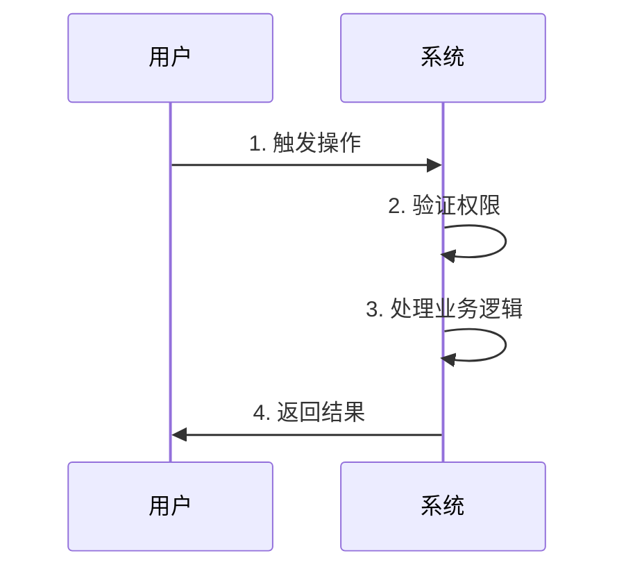
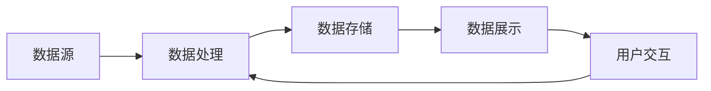

# {{需求名称}} - 产品需求文档 (PRD)

| 文档信息 | 内容 |
|---------|------|
| 需求名称 | {{需求名称}} |
| 创建日期 | {{创建日期}} |
| 产品负责人 | [填写负责人姓名] |
| 开发负责人 | [填写负责人姓名] |
| 测试负责人 | [填写负责人姓名] |
| 文档状态 | 🔵 草稿 |
| 版本号 | v1.0 |

---

## 一、需求概述

### 1.1 需求背景

[描述需求产生的背景和原因]

**业务背景**：
- 现状问题：[当前存在的问题]
- 业务影响：[问题带来的业务影响]
- 解决必要性：[为什么要解决这个问题]

**市场背景**：
- 竞品分析：[竞品的解决方案]
- 用户反馈：[用户的需求和期望]

### 1.2 需求目标

[明确需求要达成的目标，使用SMART原则]

**核心目标**：
- 目标1：[具体、可衡量的目标]
- 目标2：[具体、可衡量的目标]

**量化指标**：
- 指标1：[如：用户留存率提升10%]
- 指标2：[如：操作时间缩短30%]

### 1.3 需求范围

**包含范围**（本期实现）：
- ✅ 功能点1
- ✅ 功能点2
- ✅ 功能点3

**不包含范围**（本期不实现）：
- ❌ 功能点A（后续版本考虑）
- ❌ 功能点B（不在规划内）

### 1.4 目标用户

**用户角色**：
- 角色1：[用户画像描述]
- 角色2：[用户画像描述]

**使用场景**：
- 场景1：[典型使用场景描述]
- 场景2：[典型使用场景描述]

---

## 二、功能需求

### 2.1 功能架构

```mermaid
graph TD
    A[{{需求名称}}] --> B[功能模块1]
    A --> C[功能模块2]
    A --> D[功能模块3]
    B --> B1[子功能1.1]
    B --> B2[子功能1.2]
    C --> C1[子功能2.1]
    C --> C2[子功能2.2]
```

### 2.2 核心功能详述

#### 功能1：[功能名称]

**功能描述**：
[详细描述功能的作用和价值]

**用户故事**：
作为[用户角色]，我想要[功能描述]，以便[达成目标]。

**功能要点**：
1. 要点1：[具体说明]
2. 要点2：[具体说明]
3. 要点3：[具体说明]

**业务规则**：
- 规则1：[业务逻辑规则]
- 规则2：[数据验证规则]
- 规则3：[权限控制规则]

**交互流程**：



#### 功能2：[功能名称]

[按照功能1的格式继续描述]

### 2.3 辅助功能

#### 功能A：[功能名称]
[简要描述辅助功能]

#### 功能B：[功能名称]
[简要描述辅助功能]

---

## 三、非功能需求

### 3.1 性能要求

| 性能指标 | 要求 | 说明 |
|---------|------|------|
| 页面加载时间 | < 2秒 | 首屏加载完成时间 |
| 接口响应时间 | < 1秒 | 95%的接口响应时间 |
| 并发用户数 | 1000+ | 系统支持的同时在线用户 |
| 数据处理量 | 10万条/分钟 | 数据批量处理能力 |

### 3.2 安全要求

**数据安全**：
- 敏感数据加密存储
- 传输过程使用HTTPS
- 用户密码加密处理

**访问控制**：
- 基于角色的权限控制（RBAC）
- 操作日志记录
- 异常登录检测

**数据备份**：
- 每日自动备份
- 保留最近30天备份
- 支持数据恢复

### 3.3 兼容性要求

**浏览器兼容**：
- ✅ Chrome 90+
- ✅ Firefox 88+
- ✅ Safari 14+
- ✅ Edge 90+

**设备兼容**：
- ✅ PC端（Windows、macOS）
- ✅ 移动端（iOS 14+、Android 10+）
- ✅ 平板设备

**分辨率支持**：
- 最小分辨率：1280×720
- 推荐分辨率：1920×1080
- 移动端自适应

### 3.4 可用性要求

**易用性**：
- 新用户5分钟内完成核心操作
- 关键操作不超过3步
- 提供操作引导和帮助文档

**可维护性**：
- 代码符合团队规范
- 关键业务有完整注释
- 提供技术文档

---

## 四、交互设计

### 4.1 页面结构

**整体布局**：
[描述页面整体布局结构，或插入线框图]

```
+----------------------------------+
|          导航栏/Header            |
+--------+-------------------------+
| 侧边栏  |      主内容区域         |
| 菜单   |                         |
|        |                         |
+--------+-------------------------+
|          页脚/Footer             |
+----------------------------------+
```

### 4.2 页面清单

| 页面名称 | 页面路径 | 说明 | 优先级 |
|---------|---------|------|--------|
| 首页 | /home | 系统首页 | P0 |
| 列表页 | /list | 数据列表 | P0 |
| 详情页 | /detail/:id | 详情展示 | P0 |
| 设置页 | /settings | 系统设置 | P1 |

### 4.3 交互细节

#### 4.3.1 主页面交互

**布局说明**：
[描述页面布局]

**交互元素**：
1. 按钮1：[功能说明、交互行为]
2. 表单1：[字段说明、验证规则]
3. 列表1：[数据展示、操作项]

**状态说明**：
- 正常状态：[显示效果]
- 加载状态：[Loading效果]
- 成功状态：[成功提示]
- 失败状态：[错误提示]

#### 4.3.2 关键操作流程

**流程1：[操作名称]**

步骤说明：
1. 用户点击[按钮/链接]
2. 系统展示[表单/弹窗]
3. 用户填写/选择[数据]
4. 系统验证并提交
5. 显示操作结果

交互规范：
- 必填项标记`*`号
- 验证失败显示红色提示
- 成功后显示Toast提示

### 4.4 异常处理

| 异常场景 | 交互反馈 | 用户指引 |
|---------|---------|---------|
| 网络错误 | 显示错误提示 | 提示检查网络并重试 |
| 权限不足 | 显示权限提示 | 引导联系管理员 |
| 数据为空 | 显示空状态页 | 提示创建或导入数据 |
| 操作失败 | 显示错误信息 | 提供重试或取消选项 |

---

## 五、数据需求

### 5.1 数据字典

**核心数据实体**：

#### 实体1：[实体名称]

| 字段名称 | 字段类型 | 必填 | 说明 | 示例值 |
|---------|---------|------|------|--------|
| id | 整数 | 是 | 唯一标识 | 1001 |
| name | 字符串 | 是 | 名称 | "示例名称" |
| status | 枚举 | 是 | 状态 | active/inactive |
| created_at | 日期时间 | 是 | 创建时间 | 2026-02-09 10:00:00 |

### 5.2 数据来源

- 数据来源1：[说明数据从哪里来]
- 数据来源2：[说明数据从哪里来]

### 5.3 数据流转



---

## 六、验收标准

### 6.1 功能验收

**核心功能**：
- [ ] 功能1正常运行，满足业务需求
- [ ] 功能2正常运行，满足业务需求
- [ ] 功能3正常运行，满足业务需求

**辅助功能**：
- [ ] 辅助功能A实现并可用
- [ ] 辅助功能B实现并可用

### 6.2 性能验收

- [ ] 页面加载时间 < 2秒
- [ ] 接口响应时间 < 1秒
- [ ] 支持1000+并发用户
- [ ] 无内存泄漏问题

### 6.3 兼容性验收

- [ ] Chrome浏览器正常使用
- [ ] Firefox浏览器正常使用
- [ ] Safari浏览器正常使用
- [ ] 移动端适配正常

### 6.4 安全验证

- [ ] 通过安全测试，无高危漏洞
- [ ] 权限控制正常，无越权问题
- [ ] 敏感数据加密存储
- [ ] 操作日志记录完整

### 6.5 体验验收

- [ ] 界面美观，符合设计规范
- [ ] 交互流畅，无明显卡顿
- [ ] 错误提示友好，有明确指引
- [ ] 新用户能快速上手

---

## 七、项目计划

### 7.1 里程碑

| 阶段 | 开始日期 | 结束日期 | 交付物 |
|------|---------|---------|--------|
| 需求评审 | [日期] | [日期] | PRD评审通过 |
| 技术设计 | [日期] | [日期] | TDD完成 |
| 开发阶段 | [日期] | [日期] | 功能开发完成 |
| 测试阶段 | [日期] | [日期] | 测试通过 |
| 上线发布 | [日期] | [日期] | 正式上线 |

### 7.2 风险管理

| 风险项 | 影响程度 | 可能性 | 应对措施 |
|--------|----------|--------|----------|
| [风险1] | 高/中/低 | 高/中/低 | [应对方案] |
| [风险2] | 高/中/低 | 高/中/低 | [应对方案] |

---

## 八、附录

### 8.1 参考资料

- [相关文档链接]
- [竞品分析报告]
- [用户研究报告]

### 8.2 专业术语

| 术语 | 解释 |
|------|------|
| [术语1] | [解释说明] |
| [术语2] | [解释说明] |

### 8.3 原型图/设计稿

[插入或链接到原型图、设计稿]

---

## 九、版本历史

| 版本号 | 修改日期 | 修改人 | 修改内容 |
|--------|----------|--------|----------|
| v1.0   | {{创建日期}} | [填写] | 初始版本 |

---

## 十、评审记录

| 评审日期 | 参与人 | 评审意见 | 处理状态 |
|---------|--------|---------|---------|
| [日期] | [姓名] | [意见内容] | 已处理/待处理 |
