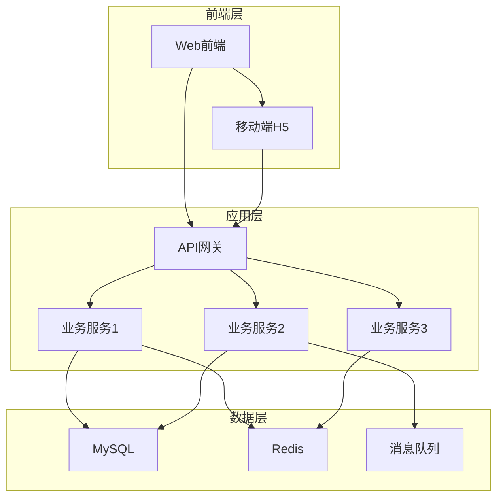
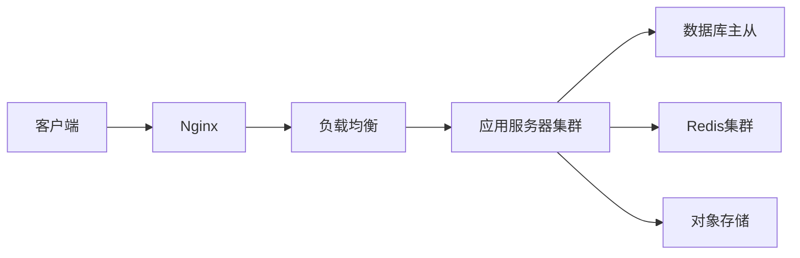
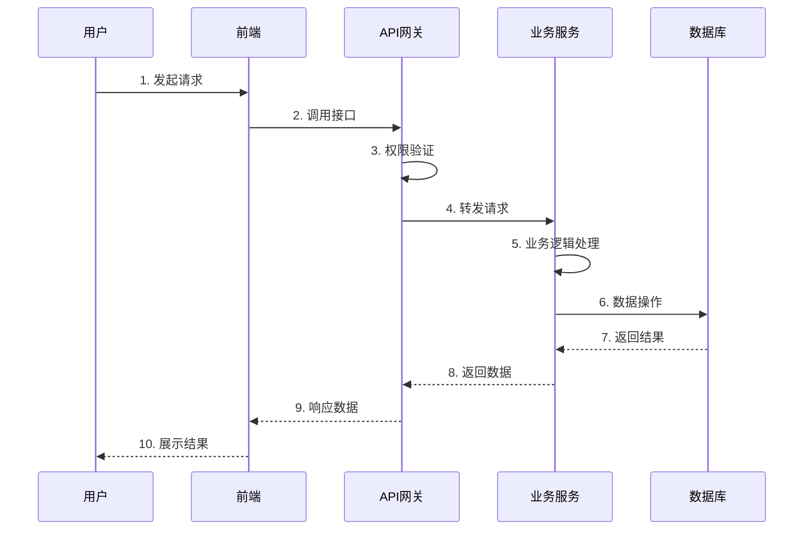
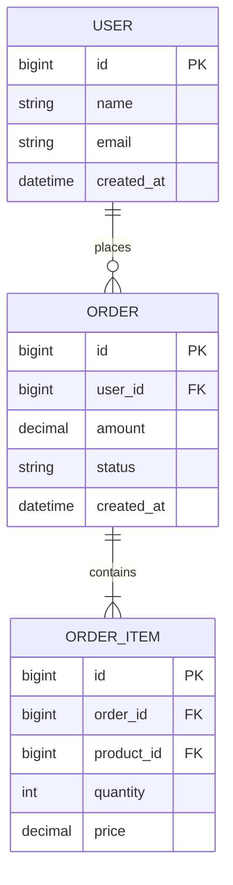
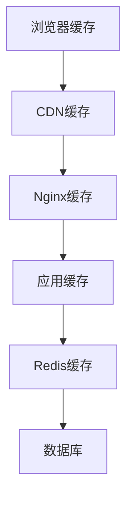
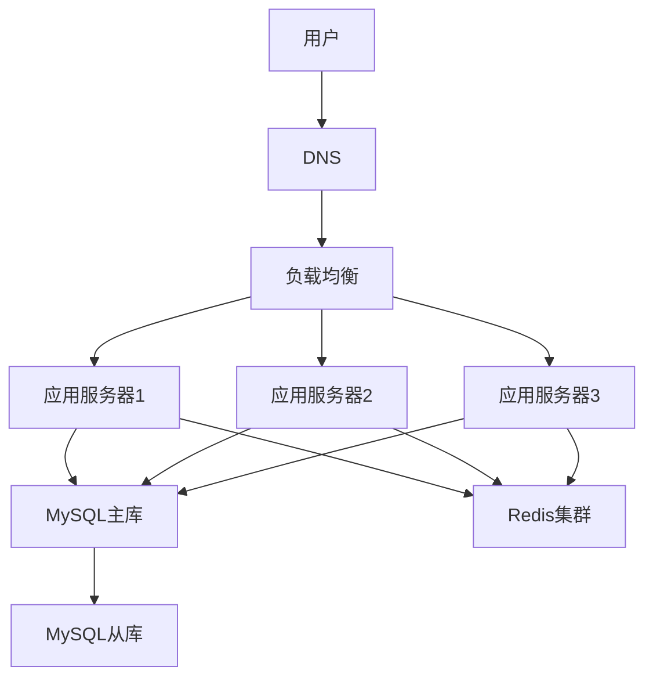

# {{需求名称}} - 技术设计文档 (TDD)

| 文档信息 | 内容 |
|---------|------|
| 需求名称 | {{需求名称}} |
| 创建日期 | {{创建日期}} |
| 技术负责人 | [填写负责人姓名] |
| 开发团队 | [填写团队成员] |
| 文档状态 | 🔵 草稿 |
| 版本号 | v1.0 |

---

## 一、技术方案概述

### 1.1 需求背景

[简述需求背景，与PRD保持一致]

### 1.2 技术目标

**核心目标**：
- 目标1：[技术实现目标]
- 目标2：[性能优化目标]
- 目标3：[架构优化目标]

**技术挑战**：
- 挑战1：[技术难点及解决思路]
- 挑战2：[性能瓶颈及优化方案]

### 1.3 技术选型

| 技术点 | 现有方案 | 新方案 | 选型理由 |
|--------|---------|--------|----------|
| 前端框架 | [当前] | [选择] | [理由] |
| 后端框架 | [当前] | [选择] | [理由] |
| 数据库 | [当前] | [选择] | [理由] |
| 缓存方案 | [当前] | [选择] | [理由] |
| 消息队列 | [当前] | [选择] | [理由] |

**技术栈清单**：
- 前端：[框架、UI库、工具库]
- 后端：[框架、中间件、工具库]
- 数据库：[数据库类型、版本]
- 基础设施：[服务器、容器、云服务]

---

## 二、架构设计

### 2.1 整体架构



**架构说明**：
- 前端层：[说明前端架构设计]
- 应用层：[说明服务划分和职责]
- 数据层：[说明数据存储策略]

### 2.2 系统模块

#### 模块1：[模块名称]

**模块职责**：
[描述模块的核心职责]

**技术实现**：
- 实现方式：[具体技术方案]
- 依赖模块：[依赖的其他模块]
- 对外接口：[提供的接口]

#### 模块2：[模块名称]

[按照模块1的格式继续描述]

### 2.3 技术架构图



---

## 三、核心流程设计

### 3.1 业务流程1：[流程名称]

**流程描述**：
[详细描述业务流程的处理逻辑]

**流程图**：



**关键步骤**：

1. **步骤1**：[详细说明]
   - 输入：[输入数据]
   - 处理：[处理逻辑]
   - 输出：[输出结果]

2. **步骤2**：[详细说明]
   - 输入：[输入数据]
   - 处理：[处理逻辑]
   - 输出：[输出结果]

**异常处理**：
- 异常1：[处理方案]
- 异常2：[处理方案]

### 3.2 业务流程2：[流程名称]

[按照流程1的格式继续描述]

---

## 四、数据库设计

### 4.1 数据库架构

**数据库实例**：
- 主库：[配置说明]
- 从库：[配置说明]
- 备份策略：[备份方案]

**分库分表策略**：
- 分库规则：[如：按租户分库]
- 分表规则：[如：按时间分表]

### 4.2 表结构设计

#### 表1：`table_name_1`

**表说明**：[表的用途和业务含义]

| 字段名 | 类型 | 长度 | 必填 | 默认值 | 索引 | 说明 |
|--------|------|------|------|--------|------|------|
| id | BIGINT | - | 是 | - | PRI | 主键ID |
| name | VARCHAR | 100 | 是 | - | IDX | 名称 |
| type | TINYINT | - | 是 | 1 | IDX | 类型：1-类型A，2-类型B |
| status | TINYINT | - | 是 | 0 | IDX | 状态：0-禁用，1-启用 |
| created_at | DATETIME | - | 是 | CURRENT_TIMESTAMP | - | 创建时间 |
| updated_at | DATETIME | - | 是 | CURRENT_TIMESTAMP | - | 更新时间 |
| deleted_at | DATETIME | - | 否 | NULL | - | 删除时间（软删除） |

**索引设计**：
```sql
-- 主键
PRIMARY KEY (`id`)

-- 普通索引
INDEX `idx_name` (`name`),
INDEX `idx_type_status` (`type`, `status`),
INDEX `idx_created_at` (`created_at`)
```

**建表SQL**：
```sql
CREATE TABLE `table_name_1` (
  `id` bigint NOT NULL AUTO_INCREMENT COMMENT '主键ID',
  `name` varchar(100) NOT NULL COMMENT '名称',
  `type` tinyint NOT NULL DEFAULT '1' COMMENT '类型',
  `status` tinyint NOT NULL DEFAULT '0' COMMENT '状态',
  `created_at` datetime NOT NULL DEFAULT CURRENT_TIMESTAMP COMMENT '创建时间',
  `updated_at` datetime NOT NULL DEFAULT CURRENT_TIMESTAMP ON UPDATE CURRENT_TIMESTAMP COMMENT '更新时间',
  `deleted_at` datetime DEFAULT NULL COMMENT '删除时间',
  PRIMARY KEY (`id`),
  KEY `idx_name` (`name`),
  KEY `idx_type_status` (`type`, `status`),
  KEY `idx_created_at` (`created_at`)
) ENGINE=InnoDB DEFAULT CHARSET=utf8mb4 COMMENT='表说明';
```

#### 表2：`table_name_2`

[按照表1的格式继续描述]

### 4.3 数据字典

**枚举值定义**：

| 枚举类型 | 值 | 说明 | 备注 |
|---------|----|----|------|
| status | 0 | 禁用 | - |
| status | 1 | 启用 | 默认值 |
| type | 1 | 类型A | - |
| type | 2 | 类型B | - |

### 4.4 ER图



---

## 五、接口设计

### 5.1 接口规范

**基础URL**：
```
开发环境：http://dev-api.example.com
测试环境：http://test-api.example.com
生产环境：https://api.example.com
```

**通用请求头**：
```http
Content-Type: application/json
Authorization: Bearer {token}
X-Request-ID: {唯一请求ID}
```

**通用响应格式**：
```json
{
  "code": 200,
  "message": "success",
  "data": {},
  "timestamp": 1707456000000,
  "requestId": "uuid"
}
```

**状态码定义**：

| 状态码 | 说明 | 处理方式 |
|--------|------|----------|
| 200 | 成功 | 正常处理 |
| 400 | 请求参数错误 | 检查参数 |
| 401 | 未授权 | 重新登录 |
| 403 | 无权限 | 提示权限不足 |
| 404 | 资源不存在 | 提示资源不存在 |
| 500 | 服务器错误 | 稍后重试 |

### 5.2 接口列表

| 接口名称 | 请求方法 | 路径 | 说明 | 优先级 |
|---------|---------|------|------|--------|
| [接口1] | GET | /api/v1/xxx | [说明] | P0 |
| [接口2] | POST | /api/v1/xxx | [说明] | P0 |
| [接口3] | PUT | /api/v1/xxx/:id | [说明] | P1 |
| [接口4] | DELETE | /api/v1/xxx/:id | [说明] | P1 |

### 5.3 接口详情

#### 接口1：[接口名称]

**基本信息**：
- 接口名称：[名称]
- 请求方法：`GET/POST/PUT/DELETE`
- 请求路径：`/api/v1/xxx`
- 接口说明：[详细说明接口用途]

**请求参数**：

| 参数名 | 类型 | 必填 | 说明 | 示例值 |
|--------|------|------|------|--------|
| param1 | string | 是 | 参数说明 | "value1" |
| param2 | number | 否 | 参数说明 | 100 |
| param3 | array | 否 | 参数说明 | [1, 2, 3] |

**请求示例**：
```json
{
  "param1": "value1",
  "param2": 100,
  "param3": [1, 2, 3]
}
```

**响应参数**：

| 参数名 | 类型 | 说明 | 示例值 |
|--------|------|------|--------|
| id | number | 记录ID | 1001 |
| name | string | 名称 | "示例名称" |
| status | number | 状态 | 1 |

**响应示例**：
```json
{
  "code": 200,
  "message": "success",
  "data": {
    "id": 1001,
    "name": "示例名称",
    "status": 1
  }
}
```

**错误码**：

| 错误码 | 说明 | 解决方案 |
|--------|------|----------|
| 40001 | 参数错误 | 检查参数格式 |
| 40002 | 资源不存在 | 确认资源ID |

#### 接口2：[接口名称]

[按照接口1的格式继续描述]

---

## 六、安全设计

### 6.1 认证授权

**认证方式**：
- JWT Token认证
- Token有效期：2小时
- 刷新Token有效期：7天

**授权机制**：
- 基于RBAC（角色访问控制）
- 权限粒度：接口级别
- 权限缓存：Redis，过期时间30分钟

### 6.2 数据安全

**敏感数据加密**：
- 密码：BCrypt加密，加盐存储
- 身份证号：AES-256加密
- 手机号：部分脱敏显示（139****8888）

**传输安全**：
- 强制使用HTTPS
- TLS 1.2+
- 证书有效期监控

### 6.3 接口安全

**防重放攻击**：
- 请求签名验证
- 时间戳校验（5分钟有效）
- Nonce随机数验证

**限流策略**：
- 全局限流：1000 QPS
- 单用户限流：100 QPS
- 单IP限流：200 QPS

**防SQL注入**：
- 使用参数化查询
- ORM框架预处理
- 输入参数校验

### 6.4 日志审计

**操作日志**：
- 记录用户所有操作
- 保留时间：6个月
- 包含：操作人、时间、内容、IP

**安全日志**：
- 登录记录
- 权限变更
- 异常访问

---

## 七、性能优化

### 7.1 缓存策略

**缓存层级**：



**缓存方案**：

| 数据类型 | 缓存位置 | 过期时间 | 更新策略 |
|---------|---------|---------|---------|
| 静态资源 | CDN | 1天 | 版本号更新 |
| 用户信息 | Redis | 30分钟 | 主动更新 |
| 配置信息 | 本地缓存 | 5分钟 | 定时刷新 |
| 热点数据 | Redis | 1小时 | LRU淘汰 |

### 7.2 数据库优化

**查询优化**：
- 合理使用索引
- 避免全表扫描
- 分页查询限制

**连接池配置**：
```yaml
datasource:
  hikari:
    maximum-pool-size: 20
    minimum-idle: 5
    connection-timeout: 30000
```

**慢查询优化**：
- 慢查询阈值：1秒
- 定期分析慢查询日志
- 优化查询语句和索引

### 7.3 前端优化

**资源优化**：
- 代码分割（Code Splitting）
- 懒加载（Lazy Loading）
- 图片压缩和WebP格式
- 静态资源CDN加速

**渲染优化**：
- 虚拟滚动
- 防抖和节流
- 组件缓存
- SSR服务端渲染（可选）

---

## 八、部署方案

### 8.1 环境规划

| 环境 | 用途 | 配置 | 域名 |
|------|------|------|------|
| 开发环境 | 日常开发 | 2C4G | dev.example.com |
| 测试环境 | 功能测试 | 4C8G | test.example.com |
| 预发环境 | 上线验证 | 8C16G | pre.example.com |
| 生产环境 | 正式运行 | 16C32G×3 | www.example.com |

### 8.2 部署架构



### 8.3 Docker容器化

**Dockerfile示例**：
```dockerfile
FROM node:18-alpine
WORKDIR /app
COPY package*.json ./
RUN npm install --production
COPY . .
EXPOSE 3000
CMD ["npm", "start"]
```

**docker-compose配置**：
```yaml
version: '3.8'
services:
  app:
    build: .
    ports:
      - "3000:3000"
    environment:
      - NODE_ENV=production
    depends_on:
      - mysql
      - redis
```

### 8.4 发布流程

**发布步骤**：
1. 代码合并到主分支
2. 自动化构建和测试
3. 生成Docker镜像
4. 推送到镜像仓库
5. 灰度发布（10% → 50% → 100%）
6. 监控告警
7. 发布完成

**回滚方案**：
- 保留最近3个版本镜像
- 1分钟内可快速回滚
- 自动化回滚触发条件

---

## 九、监控告警

### 9.1 监控指标

**应用监控**：
- QPS（每秒请求数）
- 响应时间（P50、P95、P99）
- 错误率
- 服务可用性

**系统监控**：
- CPU使用率
- 内存使用率
- 磁盘使用率
- 网络流量

**业务监控**：
- 核心业务指标
- 用户行为数据
- 转化率统计

### 9.2 告警规则

| 告警项 | 触发条件 | 告警级别 | 通知方式 |
|--------|---------|---------|---------|
| 服务不可用 | 连续3次健康检查失败 | P0-紧急 | 短信+电话+群消息 |
| 错误率异常 | 错误率 > 5% | P1-严重 | 短信+群消息 |
| 响应时间慢 | P95 > 3秒 | P2-警告 | 群消息 |
| CPU使用率高 | CPU > 80% | P2-警告 | 群消息 |

---

## 十、风险评估

### 10.1 技术风险

| 风险项 | 影响程度 | 可能性 | 应对措施 |
|--------|----------|--------|----------|
| [风险1] | 高/中/低 | 高/中/低 | [具体应对方案] |
| [风险2] | 高/中/低 | 高/中/低 | [具体应对方案] |

### 10.2 性能风险

**并发风险**：
- 风险描述：[说明]
- 预防措施：[方案]
- 应急预案：[方案]

### 10.3 安全风险

**数据安全**：
- 风险描述：[说明]
- 预防措施：[方案]

---

## 十一、开发规范

### 11.1 代码规范

**命名规范**：
- 类名：大驼峰（PascalCase）
- 变量/方法：小驼峰（camelCase）
- 常量：全大写下划线（UPPER_CASE）
- 数据库表名：小写下划线（snake_case）

**注释规范**：
- 类和方法必须有注释
- 复杂业务逻辑必须注释
- 注释与代码保持同步

### 11.2 Git规范

**分支策略**：
- master：生产环境分支
- develop：开发分支
- feature/*：功能分支
- hotfix/*：紧急修复分支

**提交规范**：
```
feat: 新功能
fix: 修复bug
docs: 文档更新
style: 代码格式调整
refactor: 代码重构
test: 测试相关
chore: 构建/工具相关
```

---

## 十二、测试策略

### 12.1 测试范围

**单元测试**：
- 覆盖率要求：80%+
- 测试框架：Jest / JUnit

**集成测试**：
- 接口测试
- 数据库集成测试

**性能测试**：
- 压力测试
- 负载测试
- 并发测试

### 12.2 测试环境

[描述测试环境配置]

---

## 十三、附录

### 13.1 技术文档

- [框架文档链接]
- [第三方服务文档]

### 13.2 相关资源

- 代码仓库：[Git地址]
- 接口文档：[文档地址]
- 监控平台：[平台地址]

---

## 十四、版本历史

| 版本号 | 修改日期 | 修改人 | 修改内容 |
|--------|----------|--------|----------|
| v1.0   | {{创建日期}} | [填写] | 初始版本 |

---

## 十五、评审记录

| 评审日期 | 参与人 | 评审意见 | 处理状态 |
|---------|--------|---------|---------|
| [日期] | [姓名] | [意见内容] | 已处理/待处理 |
