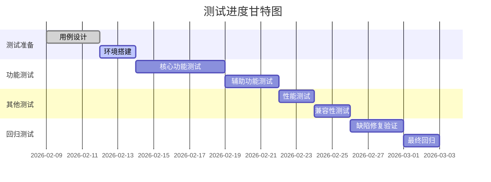

# {{需求名称}} - 测试用例文档

| 文档信息 | 内容 |
|---------|------|
| 需求名称 | {{需求名称}} |
| 创建日期 | {{创建日期}} |
| 测试负责人 | [填写负责人姓名] |
| 测试团队 | [填写团队成员] |
| 文档状态 | 🔵 草稿 |
| 版本号 | v1.0 |

---

## 一、测试概述

### 1.1 测试目标

**主要目标**：
- 验证功能实现是否符合PRD需求
- 确保系统性能满足指标要求
- 验证系统安全性和稳定性
- 保证用户体验符合设计预期

**量化指标**：
- 功能覆盖率：100%
- 用例执行率：100%
- 缺陷修复率：100%
- 核心功能通过率：100%

### 1.2 测试范围

**包含范围**：
- ✅ 功能测试（核心功能和辅助功能）
- ✅ 性能测试（响应时间、并发量）
- ✅ 兼容性测试（浏览器、设备）
- ✅ 安全测试（权限、数据安全）
- ✅ 易用性测试（用户体验）

**不包含范围**：
- ❌ [暂不测试的功能]
- ❌ [后续版本测试的功能]

### 1.3 测试策略

**测试类型及占比**：

| 测试类型 | 测试比重 | 测试工具 | 负责人 |
|---------|---------|---------|--------|
| 功能测试 | 60% | 手工测试 | [姓名] |
| 性能测试 | 15% | JMeter | [姓名] |
| 自动化测试 | 15% | Selenium | [姓名] |
| 安全测试 | 10% | 手工+工具 | [姓名] |

### 1.4 测试环境

| 环境类型 | 配置 | 访问地址 | 说明 |
|---------|------|---------|------|
| 测试环境 | [配置信息] | test.example.com | 功能测试 |
| 性能测试环境 | [配置信息] | perf.example.com | 性能测试 |
| 预发环境 | [配置信息] | pre.example.com | 上线前验证 |

---

## 二、功能测试用例

### 2.1 功能模块1：[模块名称]

#### 用例组1：[功能点名称]

##### TC001：[测试用例标题]

| 项目 | 内容 |
|------|------|
| **用例编号** | TC001 |
| **用例标题** | [简明扼要的标题] |
| **测试类型** | 功能测试 |
| **优先级** | P0（核心功能）/ P1（重要功能）/ P2（一般功能）|
| **前置条件** | 1. 用户已登录 2. 具有相应权限 3. [其他前置条件] |
| **测试数据** | 账号：test_user 密码：Test@123 [其他测试数据] |

**测试步骤**：

| 步骤 | 操作 | 预期结果 | 实际结果 | 状态 |
|------|------|----------|----------|------|
| 1 | 打开XX页面 | 页面正常加载 | [填写] | ✅/❌ |
| 2 | 点击"XX"按钮 | 弹出XX弹窗 | [填写] | ✅/❌ |
| 3 | 输入XX信息 | 信息格式正确 | [填写] | ✅/❌ |
| 4 | 点击"确认"按钮 | 提示"操作成功" | [填写] | ✅/❌ |
| 5 | 检查数据 | 数据正确保存 | [填写] | ✅/❌ |

**预期结果**：
[描述整体预期结果]

**备注**：
[特殊说明或注意事项]

---

##### TC002：[测试用例标题]

[按照TC001格式继续编写]

---

### 2.2 功能模块2：[模块名称]

[按照模块1格式继续编写]

---

## 三、边界值测试

### 3.1 输入验证测试

| 用例编号 | 测试字段 | 测试场景 | 输入值 | 预期结果 | 实际结果 | 优先级 | 状态 |
|---------|---------|---------|--------|----------|----------|--------|------|
| TC101 | 用户名 | 空值 | "" | 提示"用户名不能为空" | [填写] | P1 | ⏸️ |
| TC102 | 用户名 | 最小长度 | "a" | 提示"用户名至少2个字符" | [填写] | P1 | ⏸️ |
| TC103 | 用户名 | 最大长度 | 20个字符 | 保存成功 | [填写] | P1 | ⏸️ |
| TC104 | 用户名 | 超长 | 21个字符 | 提示"用户名最多20个字符" | [填写] | P1 | ⏸️ |
| TC105 | 用户名 | 特殊字符 | "user@#$" | 提示"用户名只能包含字母数字下划线" | [填写] | P1 | ⏸️ |
| TC106 | 年龄 | 最小值 | 0 | 提示"年龄必须大于0" | [填写] | P1 | ⏸️ |
| TC107 | 年龄 | 最大值 | 150 | 提示"年龄不能超过150" | [填写] | P1 | ⏸️ |
| TC108 | 邮箱 | 格式错误 | "invalid" | 提示"邮箱格式不正确" | [填写] | P1 | ⏸️ |
| TC109 | 邮箱 | 格式正确 | "user@example.com" | 保存成功 | [填写] | P0 | ⏸️ |

### 3.2 数值范围测试

| 用例编号 | 测试项 | 边界类型 | 测试值 | 预期结果 | 实际结果 | 状态 |
|---------|--------|----------|--------|----------|----------|------|
| TC201 | 数量 | 最小边界-1 | -1 | 提示错误 | [填写] | ⏸️ |
| TC202 | 数量 | 最小边界 | 0 | 接受输入 | [填写] | ⏸️ |
| TC203 | 数量 | 最大边界 | 9999 | 接受输入 | [填写] | ⏸️ |
| TC204 | 数量 | 最大边界+1 | 10000 | 提示错误 | [填写] | ⏸️ |

---

## 四、异常场景测试

### 4.1 系统异常测试

| 用例编号 | 异常场景 | 触发方式 | 预期结果 | 实际结果 | 优先级 | 状态 |
|---------|---------|---------|----------|----------|--------|------|
| TC301 | 网络断开 | 断开网络连接后提交 | 提示"网络连接失败，请检查网络" | [填写] | P1 | ⏸️ |
| TC302 | 服务器异常 | 停止后端服务 | 提示"服务暂时不可用，请稍后重试" | [填写] | P1 | ⏸️ |
| TC303 | 数据库异常 | 数据库连接中断 | 提示"系统繁忙，请稍后重试" | [填写] | P1 | ⏸️ |
| TC304 | Session超时 | 等待Session过期后操作 | 跳转到登录页，提示"登录已过期" | [填写] | P1 | ⏸️ |
| TC305 | 并发冲突 | 同时修改同一数据 | 提示"数据已被修改，请刷新后重试" | [填写] | P2 | ⏸️ |

### 4.2 权限异常测试

| 用例编号 | 测试场景 | 操作步骤 | 预期结果 | 实际结果 | 优先级 | 状态 |
|---------|---------|---------|----------|----------|--------|------|
| TC401 | 未登录访问 | 未登录直接访问需权限页面 | 跳转到登录页 | [填写] | P0 | ⏸️ |
| TC402 | 无权限访问 | 普通用户访问管理员功能 | 提示"权限不足" | [填写] | P0 | ⏸️ |
| TC403 | Token过期 | Token过期后调用接口 | 返回401，提示重新登录 | [填写] | P1 | ⏸️ |
| TC404 | 跨权限操作 | 用户A操作用户B的数据 | 提示"无权操作" | [填写] | P0 | ⏸️ |

### 4.3 数据异常测试

| 用例编号 | 异常场景 | 测试数据 | 预期结果 | 实际结果 | 优先级 | 状态 |
|---------|---------|---------|----------|----------|--------|------|
| TC501 | SQL注入 | ' OR '1'='1 | 正常转义，不影响系统 | [填写] | P0 | ⏸️ |
| TC502 | XSS攻击 | `` | 内容被转义，不执行脚本 | [填写] | P0 | ⏸️ |
| TC503 | 超大文件上传 | 上传100MB文件 | 提示"文件大小超限" | [填写] | P1 | ⏸️ |
| TC504 | 错误文件格式 | 上传.exe文件 | 提示"不支持的文件格式" | [填写] | P1 | ⏸️ |

---

## 五、性能测试

### 5.1 响应时间测试

| 测试项 | 接口/页面 | 测试条件 | 性能指标 | 测试结果 | 是否达标 |
|--------|----------|---------|----------|----------|---------|
| 页面加载 | 首页 | 正常网络 | < 2秒 | [填写] | ✅/❌ |
| 接口响应 | 列表查询 | 100条数据 | < 500ms | [填写] | ✅/❌ |
| 接口响应 | 详情查询 | 单条数据 | < 200ms | [填写] | ✅/❌ |
| 接口响应 | 数据保存 | 正常数据量 | < 1秒 | [填写] | ✅/❌ |

### 5.2 并发性能测试

**测试场景**：[描述测试场景]

| 测试轮次 | 并发用户数 | 测试时长 | QPS | 平均响应时间 | 错误率 | 是否达标 |
|---------|-----------|---------|-----|-------------|--------|---------|
| 第1轮 | 100 | 5分钟 | [填写] | [填写] | [填写] | ✅/❌ |
| 第2轮 | 500 | 5分钟 | [填写] | [填写] | [填写] | ✅/❌ |
| 第3轮 | 1000 | 5分钟 | [填写] | [填写] | [填写] | ✅/❌ |
| 第4轮 | 2000 | 5分钟 | [填写] | [填写] | [填写] | ✅/❌ |

**性能分析**：
[分析性能测试结果，指出瓶颈和优化建议]

### 5.3 压力测试

**测试目标**：找到系统性能极限

| 测试项 | 压测策略 | 峰值QPS | 最大并发 | 系统表现 | 备注 |
|--------|---------|---------|---------|---------|------|
| 接口压测 | 逐步加压 | [填写] | [填写] | [填写] | [填写] |

### 5.4 稳定性测试

**测试目标**：验证系统长时间运行稳定性

| 测试项 | 测试时长 | 并发数 | 内存变化 | CPU变化 | 错误情况 | 结论 |
|--------|---------|--------|---------|---------|---------|------|
| 长时间运行 | 24小时 | 500 | [填写] | [填写] | [填写] | ✅/❌ |

---

## 六、兼容性测试

### 6.1 浏览器兼容性

| 浏览器 | 版本 | 操作系统 | 测试功能 | 测试结果 | 问题描述 |
|--------|------|---------|---------|---------|---------|
| Chrome | 120+ | Windows 10 | 全功能 | ✅ | - |
| Chrome | 120+ | macOS | 全功能 | ✅ | - |
| Firefox | 115+ | Windows 10 | 全功能 | [填写] | [填写] |
| Safari | 17+ | macOS | 全功能 | [填写] | [填写] |
| Edge | 120+ | Windows 10 | 全功能 | [填写] | [填写] |

### 6.2 设备兼容性

**移动端测试**：

| 设备类型 | 设备型号 | 系统版本 | 屏幕尺寸 | 测试结果 | 问题描述 |
|---------|---------|---------|---------|---------|---------|
| iPhone | iPhone 14 | iOS 17 | 6.1" | [填写] | [填写] |
| iPhone | iPhone SE | iOS 17 | 4.7" | [填写] | [填写] |
| Android | 华为P50 | Android 12 | 6.5" | [填写] | [填写] |
| Android | 小米13 | Android 13 | 6.36" | [填写] | [填写] |
| iPad | iPad Pro | iPadOS 17 | 11" | [填写] | [填写] |

### 6.3 分辨率适配

| 分辨率 | 设备类型 | 测试结果 | 问题描述 |
|--------|---------|---------|---------|
| 1920×1080 | PC | ✅ | - |
| 1366×768 | PC | [填写] | [填写] |
| 1280×720 | PC | [填写] | [填写] |
| 375×667 | 移动端 | [填写] | [填写] |
| 414×896 | 移动端 | [填写] | [填写] |

---

## 七、安全测试

### 7.1 身份认证测试

| 用例编号 | 测试项 | 测试方法 | 预期结果 | 实际结果 | 状态 |
|---------|--------|---------|----------|----------|------|
| SEC001 | 弱密码验证 | 使用简单密码注册 | 提示密码强度不足 | [填写] | ⏸️ |
| SEC002 | 密码加密 | 查看数据库密码字段 | 密码已加密存储 | [填写] | ⏸️ |
| SEC003 | Token验证 | 使用无效Token访问 | 返回401未授权 | [填写] | ⏸️ |
| SEC004 | 登录失败锁定 | 连续5次错误密码 | 账号临时锁定 | [填写] | ⏸️ |

### 7.2 权限控制测试

| 用例编号 | 测试项 | 测试方法 | 预期结果 | 实际结果 | 状态 |
|---------|--------|---------|----------|----------|------|
| SEC101 | 越权访问 | 普通用户访问管理接口 | 返回403禁止访问 | [填写] | ⏸️ |
| SEC102 | 水平越权 | 用户A访问用户B数据 | 提示无权限 | [填写] | ⏸️ |
| SEC103 | 垂直越权 | 下级访问上级功能 | 提示无权限 | [填写] | ⏸️ |

### 7.3 数据安全测试

| 用例编号 | 测试项 | 测试方法 | 预期结果 | 实际结果 | 状态 |
|---------|--------|---------|----------|----------|------|
| SEC201 | SQL注入 | 输入SQL注入语句 | 正常转义，不执行SQL | [填写] | ⏸️ |
| SEC202 | XSS攻击 | 输入恶意脚本 | 内容被转义 | [填写] | ⏸️ |
| SEC203 | CSRF攻击 | 跨站请求 | 请求被拒绝 | [填写] | ⏸️ |
| SEC204 | 敏感信息泄露 | 查看页面源码/接口响应 | 无敏感信息暴露 | [填写] | ⏸️ |

---

## 八、易用性测试

### 8.1 用户体验测试

| 测试项 | 评价标准 | 测试结果 | 问题描述 | 优化建议 |
|--------|---------|---------|---------|---------|
| 页面布局 | 美观、清晰、符合习惯 | [打分1-5] | [填写] | [填写] |
| 操作流程 | 简单、高效、符合逻辑 | [打分1-5] | [填写] | [填写] |
| 错误提示 | 明确、友好、有指引 | [打分1-5] | [填写] | [填写] |
| 响应速度 | 快速、无卡顿 | [打分1-5] | [填写] | [填写] |
| 学习成本 | 新用户易上手 | [打分1-5] | [填写] | [填写] |

### 8.2 可访问性测试

| 测试项 | 测试方法 | 测试结果 | 备注 |
|--------|---------|---------|------|
| 键盘导航 | 仅使用键盘操作 | [填写] | [填写] |
| 屏幕阅读器 | 使用读屏软件 | [填写] | [填写] |
| 色盲模式 | 模拟色盲视角 | [填写] | [填写] |

---

## 九、测试进度

### 9.1 用例统计

| 模块 | 用例总数 | 已执行 | 通过 | 失败 | 阻塞 | 未执行 | 执行率 | 通过率 |
|------|---------|--------|------|------|------|--------|--------|--------|
| 功能模块1 | 0 | 0 | 0 | 0 | 0 | 0 | 0% | 0% |
| 功能模块2 | 0 | 0 | 0 | 0 | 0 | 0 | 0% | 0% |
| 功能模块3 | 0 | 0 | 0 | 0 | 0 | 0 | 0% | 0% |
| **合计** | **0** | **0** | **0** | **0** | **0** | **0** | **0%** | **0%** |

### 9.2 测试进度跟踪

---

## 十、缺陷管理

### 10.1 缺陷统计

| 缺陷级别 | 新建 | 已修复 | 待修复 | 已关闭 | 延期修复 | 总计 |
|---------|------|--------|--------|--------|----------|------|
| P0-致命 | 0 | 0 | 0 | 0 | 0 | 0 |
| P1-严重 | 0 | 0 | 0 | 0 | 0 | 0 |
| P2-一般 | 0 | 0 | 0 | 0 | 0 | 0 |
| P3-轻微 | 0 | 0 | 0 | 0 | 0 | 0 |
| **合计** | **0** | **0** | **0** | **0** | **0** | **0** |

### 10.2 缺陷清单

#### 致命缺陷（P0）

| 缺陷ID | 缺陷标题 | 发现人 | 发现日期 | 状态 | 修复人 | 修复日期 |
|--------|---------|--------|----------|------|--------|----------|
| - | - | - | - | - | - | - |

#### 严重缺陷（P1）

| 缺陷ID | 缺陷标题 | 发现人 | 发现日期 | 状态 | 修复人 | 修复日期 |
|--------|---------|--------|----------|------|--------|----------|
| - | - | - | - | - | - | - |

### 10.3 缺陷趋势

[插入缺陷趋势图表]

---

## 十一、测试总结

### 11.1 测试结论

**整体评估**：
- [ ] ✅ 通过 - 符合上线标准
- [ ] ⚠️ 有条件通过 - 存在非阻塞问题，可以上线
- [ ] ❌ 不通过 - 存在阻塞问题，不建议上线

**具体说明**：
[填写测试结论的详细说明]

### 11.2 遗留问题

| 问题编号 | 问题描述 | 严重程度 | 影响范围 | 处理计划 |
|---------|---------|----------|----------|---------|
| [编号] | [描述] | [级别] | [范围] | [计划] |

### 11.3 风险提示

**上线风险**：
1. 风险1：[描述风险及应对措施]
2. 风险2：[描述风险及应对措施]

**优化建议**：
1. 建议1：[描述优化建议]
2. 建议2：[描述优化建议]

### 11.4 测试收获

**经验总结**：
[总结本次测试的经验和教训]

**改进建议**：
[对测试流程和方法的改进建议]

---

## 十二、附录

### 12.1 测试工具

| 工具名称 | 用途 | 版本 |
|---------|------|------|
| Postman | 接口测试 | 10.x |
| JMeter | 性能测试 | 5.x |
| Selenium | 自动化测试 | 4.x |
| Chrome DevTools | 调试工具 | 最新版 |

### 12.2 测试数据

[描述测试数据来源和准备方式]

### 12.3 测试脚本

[链接到自动化测试脚本仓库]

---

## 十三、版本历史

| 版本号 | 修改日期 | 修改人 | 修改内容 |
|--------|----------|--------|----------|
| v1.0   | {{创建日期}} | [填写] | 初始版本 |

---

## 十四、评审记录

| 评审日期 | 参与人 | 评审意见 | 处理状态 |
|---------|--------|---------|---------|
| [日期] | [姓名] | [意见内容] | 已处理/待处理 |
