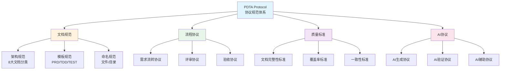
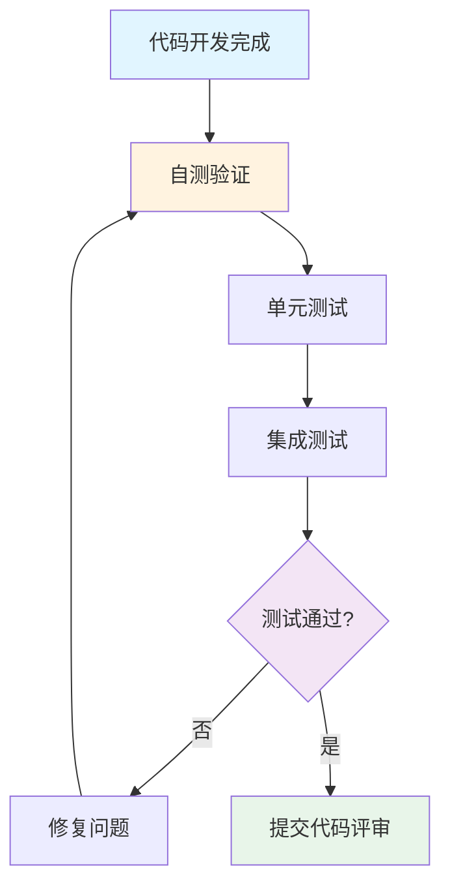
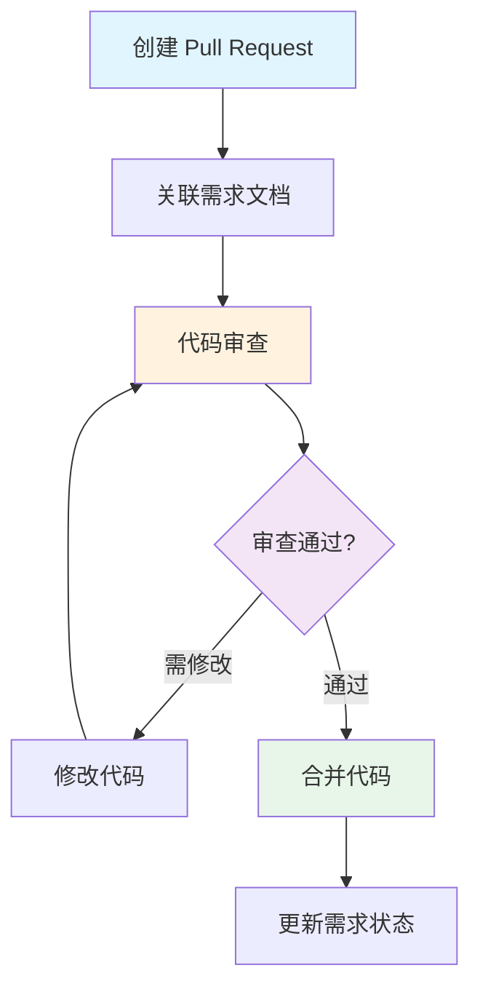
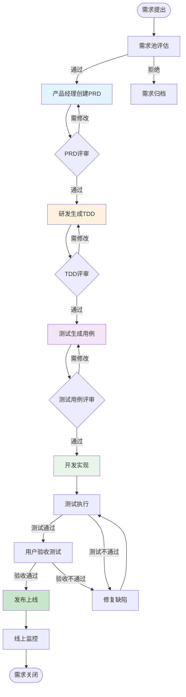
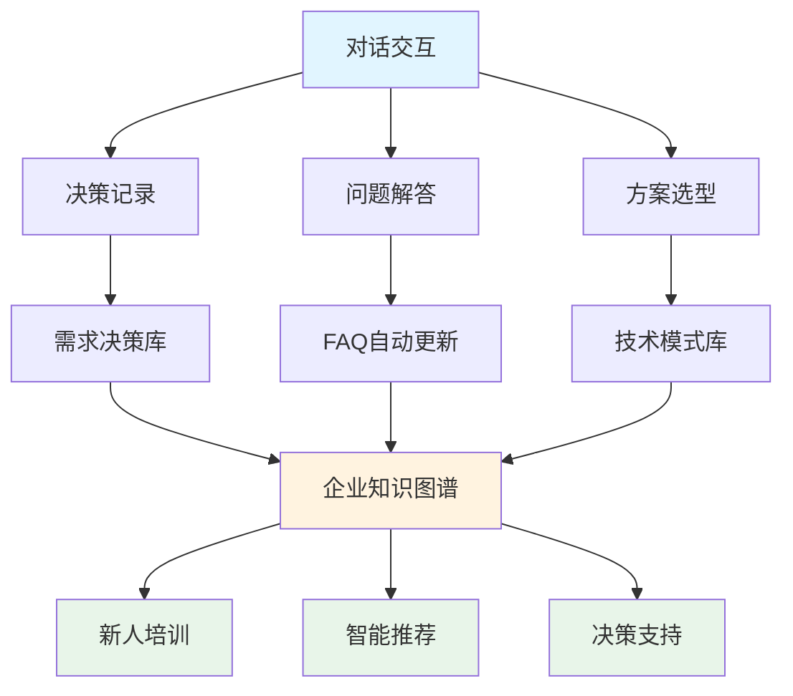
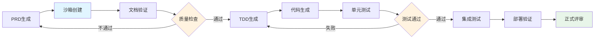
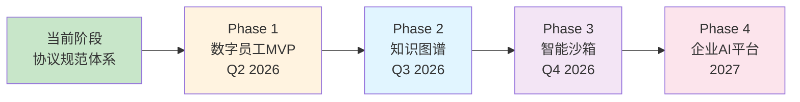

# 产研测AI同频协议 - PDTA Protocol

<p align="center">
  <strong>Product-Development-Test-AI Alignment Protocol</strong><br>
  产研测AI同频协议规范体系
</p>

<p align="center">
  <a href="#项目简介">项目简介</a> •
  <a href="#快速开始">快速开始</a> •
  <a href="#协议规范">协议规范</a> •
  <a href="#核心特性">核心特性</a> •
  <a href="#文档架构">文档架构</a>
</p>

---

## 📖 项目简介

**PDTA Protocol** 是一个产研测AI同频协议规范体系，定义了产品、研发、测试、AI 四方协同的标准化文档规范、流程协议和质量标准。

### 🎯 核心定位

- **协议规范体系**：不是工具或平台，而是一套可落地的协议标准
- **面向产研测AI**：覆盖产品、研发、测试、AI 四方协同的完整场景
- **四位一体**：文档架构 + 流程协议 + 质量标准 + AI辅助
- **开箱即用**：提供标准模板、实施指南和最佳实践

### ✨ 核心价值

- 📋 **降低沟通成本**：统一语言和标准，消除跨角色认知差异
- 🔄 **提升协作效率**：标准化流程让需求流转更顺畅、更透明
- 📊 **保证文档质量**：可量化的质量标准，自动化验证机制
- 🤖 **AI提效**：智能生成PRD/TDD/TEST，大幅减少重复劳动
- 🎯 **快速落地应用**：新人通过模板和规范，1天即可上手

### 🏗 协议架构



**协议结构**：
```
pdta-protocol/
├── docs/                      # 规范文档
│   ├── product/              # 产品文档规范
│   ├── requirement/          # 需求管理规范（PRD/TDD/TEST）
│   ├── technical/            # 技术文档规范
│   ├── operations/           # 运维文档规范
│   └── ...
├── .cursor/
│   ├── rules/                # 协议规则（文档架构规范）
│   └── skills/               # AI协议技能（生成/验证）
├── package.json
└── README.md
```

**说明**：
- **协议标准**：定义产研测AI四方协同的标准化协议
- **文档规范**：统一的文档架构、模板和命名规范
- **流程协议**：标准化的需求流转、评审、验收流程
- **可落地性**：提供完整的模板、示例和工具支持

## 🚀 快速开始

### 第一步：了解协议规范

```bash
# 克隆PDTA协议规范体系
git clone https://github.com/your-org/pdta-protocol.git
cd pdta-protocol
```

### 第二步：学习规范体系

阅读核心规范文档：

1. **文档架构规范**：`.cursor/rules/doc-architecture.mdc`
   - 8大文档分类标准
   - 目录结构规范
   - 命名规范
   - index.md 规范

2. **需求管理协议**：`docs/requirement/`
   - PRD 标准模板和规范
   - TDD 标准模板和规范
   - 测试用例标准模板和规范
   - 需求流转协议

3. **AI协议标准**：`.cursor/skills/`
   - AI生成协议（generate-prd/tdd/test）
   - AI验证协议（analyze-coverage）
   - AI辅助协议（refine-requirement-docs）

### 第三步：应用到项目

#### 3.1 配置代码仓库（可选）

如果你的项目包含多个代码仓库（如服务端、客户端、管理端等），可以使用 git 子模块管理：

```bash
# 添加服务端代码仓库
git submodule add <服务端代码仓库地址> codes/server

# 添加移动端代码仓库
git submodule add <移动端代码仓库地址> codes/mobile

# 添加管理端代码仓库
git submodule add <管理端代码仓库地址> codes/admin

# 添加其他代码仓库
git submodule add <其他代码仓库地址> codes/<仓库名称>

# 克隆项目时，同时拉取子模块
git clone --recursive <本项目地址>

# 已克隆项目后，初始化和更新子模块
git submodule init
git submodule update
```

**codes/ 目录结构示例**：
```
codes/
├── server/           # 服务端代码（git子模块）
├── mobile/           # 移动端代码（git子模块）
├── admin/            # 管理端代码（git子模块）
├── web/              # Web端代码（git子模块）
└── shared/           # 共享代码库（git子模块）
```

**子模块管理常用命令**：
```bash
# 更新所有子模块到最新版本
git submodule update --remote

# 进入子模块目录进行开发
cd codes/server
git checkout develop
git pull

# 提交子模块更新
git add codes/server
git commit -m "chore: update server submodule"
```

### 第四步：编写需求文档

根据[文档架构规范](./.cursor/rules/doc-architecture.mdc)组织和编写文档。

#### 4.1 文档分类说明

- `docs/product/` - 产品文档规范
- `docs/requirement/` - 需求管理规范（PRD/TDD/TEST）
- `docs/technical/` - 技术文档规范
- `docs/operations/` - 运维文档规范
- `docs/user/` - 用户手册规范
- `docs/training/` - 培训资料规范
- `docs/project/` - 项目管理规范
- `docs/knowledge/` - 知识库规范

#### 4.2 创建需求文档流程

```bash
# 1. 创建需求文件夹（格式：YYYYMM-需求名称）
mkdir -p docs/requirement/202602-用户登录功能
```

**使用 AI 协议生成文档**（在 Cursor 中）：

```markdown
# 2. 生成 PRD（产品需求文档）
@generate-prd 用户登录功能

# 3. 生成 TDD（技术设计文档）
@generate-tdd 基于 PRD 生成技术设计

# 4. 生成测试用例
@generate-test 基于 PRD/TDD 生成测试用例

# 5. 分析文档覆盖率
@analyze-coverage 检查文档覆盖率和一致性

# 6. 需求变更时同步更新
@refine-requirement-docs 需求变更后同步更新文档
```

**完整的需求文档结构**：
```
docs/requirement/202602-用户登录功能/
├── index.md                  # 需求概述
├── product/                  # 产品需求
│   ├── PRD.md               # 产品需求文档
│   └── attachments/         # 原型图、流程图
├── technical/               # 技术设计
│   ├── TDD.md              # 技术设计文档
│   ├── database.md         # 数据库设计
│   ├── api-design.md       # 接口设计
│   └── ui-design.md        # UI设计
├── testing/                 # 测试文档
│   ├── test-cases.md       # 测试用例
│   └── test-report.md      # 测试报告
└── review/                  # 评审记录
    ├── prd-review.md       # PRD评审记录
    ├── tdd-review.md       # TDD评审记录
    └── acceptance.md       # 验收记录
```

### 第五步：代码开发

需求文档评审通过后，进入代码开发阶段。

#### 5.1 创建开发计划

基于 TDD（技术设计文档）创建开发计划：

```markdown
# 在 Cursor 中使用 AI 协议
@generate-prd # 如果还没有PRD，先生成PRD
@generate-tdd # 基于 PRD 生成技术设计文档

# 根据 TDD 创建开发任务拆解
- 阅读 TDD 中的技术方案、数据库设计、API设计
- 将功能拆解为可独立开发的任务
- 评估每个任务的工作量和依赖关系
- 制定开发排期
```

**开发计划示例**：

```
docs/requirement/202602-用户登录功能/
└── technical/
    ├── TDD.md              # 技术设计文档（开发依据）
    ├── database.md         # 数据库设计
    ├── api-design.md       # 接口设计
    └── dev-plan.md         # 开发计划（新增）
```

#### 5.2 开发验证

开发完成后，进行自验证和测试：

**验证流程**：



**验证检查项**：

- [ ] **功能完整性**：所有功能点已实现，符合 PRD 需求
- [ ] **技术方案**：代码实现遵循 TDD 技术设计
- [ ] **单元测试**：通过所有单元测试用例
- [ ] **集成测试**：通过集成测试和端到端测试
- [ ] **代码质量**：无 lint 错误，代码格式规范
- [ ] **测试覆盖**：测试覆盖率达到标准（如 80%）

#### 5.3 代码审查

开发验证通过后，提交代码审查（Code Review）：

**审查流程**：



**1. 创建 Pull Request**

开发完成后，提交代码并创建 PR，在 PR 描述中需要包含：

- **需求文档链接**：关联对应的需求文档路径
- **变更说明**：简要描述本次提交的功能实现
- **测试情况**：说明单元测试、集成测试的执行结果
- **相关文档**：关联 PRD、TDD、测试用例等文档

**2. 代码审查要点**

审查者需要检查以下方面：

- [ ] **需求符合性**：代码实现是否符合 PRD 要求
- [ ] **技术方案**：是否遵循 TDD 设计方案
- [ ] **代码质量**：代码可读性、可维护性、性能
- [ ] **安全性**：是否存在安全漏洞
- [ ] **测试完整性**：测试用例是否覆盖所有场景
- [ ] **文档更新**：API 文档、技术文档是否同步更新

**3. 记录审查结果**

审查完成后，在需求文档中记录审查结果：

```
docs/requirement/202602-用户登录功能/
└── review/
    ├── prd-review.md       # PRD评审记录
    ├── tdd-review.md       # TDD评审记录
    └── code-review.md      # 代码审查记录
```

**审查记录模板**：

```markdown
# 代码审查记录

## 基本信息
- PR链接：https://github.com/xxx/pull/123
- 审查人：张三、李四
- 审查日期：2026-02-15
- 审查结果：✅ 通过 / ⚠️ 需修改 / ❌ 不通过

## 审查意见

### 功能完整性
- ✅ 所有功能点已实现

### 代码质量
- ✅ 代码结构清晰
- ⚠️ 建议优化错误处理逻辑

### 测试覆盖
- ✅ 单元测试完整
- ✅ 集成测试通过

## 待改进项
1. 优化登录失败的错误提示
2. 补充异常场景的单元测试

## 审查结论
代码质量良好，建议修改后合并。
```

---

## 🔄 协议规范

PDTA Protocol 定义了标准化的产研测AI协同规范，包括文档规范、流程协议、质量标准和AI协议。

### 完整协同流程协议



## 🎨 核心特性

### 📋 文档规范标准

- **8大文档分类**：产品、用户、需求、技术、运维、培训、项目、知识库
- **统一目录结构**：标准化的目录层级和组织方式
- **命名规范**：文件、目录的统一命名规范
- **index.md 规范**：每个目录的首页标准和 VitePress 适配

### 🔄 流程协议标准

- **需求流转协议**：PRD → TDD → TEST 标准流转流程
- **评审协议**：PRD评审、TDD评审、测试用例评审的标准流程
- **验收协议**：需求验收的标准和流程
- **变更协议**：需求变更时的影响分析和同步更新协议

### 📊 质量标准体系

- **文档完整性标准**：PRD/TDD/TEST 必须包含的内容项
- **覆盖率标准**：功能点覆盖、测试用例覆盖的评判标准
- **一致性标准**：PRD/TDD/TEST 之间的一致性检查标准
- **可追溯标准**：需求全生命周期的追溯性要求

### 🤖 AI协议标准

- **AI生成协议**：基于规范的 PRD/TDD/TEST 智能生成协议
- **AI验证协议**：文档质量、覆盖率、一致性的自动验证协议
- **AI辅助协议**：需求变更分析、影响范围识别的辅助协议
- **可扩展性**：标准化的 AI Skill 接口和扩展协议

## 📁 文档架构

```
docs/
├── product/          # 产品文档规范
├── user/             # 用户手册规范
├── requirement/      # 需求管理规范（PRD/TDD/TEST）
├── technical/        # 技术文档规范
├── operations/       # 运维文档规范
├── training/         # 培训资料规范
├── project/          # 项目管理规范
├── knowledge/        # 知识库规范
├── index.md          # VitePress 文档首页
└── CHANGELOG.md      # 系统更新日志
```

详细的文档架构规范请参考：[文档架构规范](./.cursor/rules/doc-architecture.mdc)

## 🛠 技术栈

- **文档框架**：[VitePress](https://vitepress.dev/) - 基于 Vite 的现代化文档生成器
- **图表支持**：[Mermaid](https://mermaid.js.org/) - 用代码绘制流程图、架构图
- **AI 能力**：[Cursor AI Skills](https://cursor.sh/) - AI 辅助文档生成
- **版本控制**：Git - 文档版本管理和协作
- **自动侧边栏**：[vitepress-sidebar](https://github.com/jooy2/vitepress-sidebar) - 自动生成侧边栏

## 🤖 AI 协议标准

PDTA Protocol 定义了基于规范的 AI 协议标准，包括生成协议、验证协议和辅助协议。

### AI 协议列表

| AI 协议 | 功能说明 | 应用场景 | 输入 | 输出 |
|--------|---------|---------|------|------|
| 📝 **PRD 生成协议** | 基于规范自动生成产品需求文档 | 产品经理快速起草需求 | 需求描述 | 符合规范的 PRD 文档 |
| 🔧 **TDD 生成协议** | 基于 PRD 和规范自动生成技术设计 | 研发人员生成技术方案 | PRD 文档 | 符合规范的 TDD 文档 |
| ✅ **测试用例生成协议** | 基于 PRD/TDD 和规范生成测试用例 | 测试工程师制定测试计划 | PRD + TDD | 符合规范的测试用例 |
| 📊 **覆盖率验证协议** | 验证文档覆盖率和一致性 | 评审前检查文档质量 | PRD/TDD/TEST | 覆盖率分析报告 |
| 🔄 **需求变更协议** | 需求变更时自动同步更新 | 需求变更后同步文档 | 变更的 PRD | 更新后的 TDD/TEST |

## 📖 应用场景

### 👨‍💼 对于产品团队

**应用协议规范**：
1. **需求管理**：按照需求管理协议维护需求池
2. **PRD编写**：使用 PRD 生成协议快速起草需求文档
3. **需求评审**：按照评审协议组织 PRD 评审
4. **需求跟踪**：使用流程协议跟踪需求状态
5. **用户手册**：按照用户手册规范编写操作指南

### 👨‍💻 对于研发团队

**应用协议规范**：
1. **技术设计**：使用 TDD 生成协议快速设计技术方案
2. **API文档**：按照技术文档规范维护接口文档
3. **代码实现**：参考技术设计规范进行开发
4. **技术沉淀**：按照知识库规范记录技术经验

### 🧪 对于测试团队

**应用协议规范**：
1. **测试设计**：使用测试用例生成协议创建测试用例
2. **测试执行**：按照测试规范执行测试
3. **质量分析**：使用覆盖率验证协议分析测试质量
4. **缺陷跟踪**：按照测试报告规范记录缺陷

### 👔 对于项目管理

**应用协议规范**：
1. **项目规划**：按照项目管理规范规划里程碑
2. **进度跟踪**：使用流程协议跟踪需求状态
3. **会议管理**：按照项目管理规范记录会议纪要
4. **团队培训**：按照培训资料规范组织培训

### 🚀 对于运维团队

**应用协议规范**：
1. **部署文档**：按照运维文档规范维护部署指南
2. **监控告警**：按照监控规范配置监控规则
3. **应急处理**：按照应急手册规范处理故障
4. **发布管理**：按照 SOP 规范执行发布流程

## 💡 最佳实践

### 协议应用建议

1. **统一认知**：团队成员共同学习和认可协议规范
2. **模板先行**：使用标准模板开始文档编写
3. **AI辅助**：善用 AI 协议提升文档效率
4. **持续验证**：定期使用覆盖率验证协议检查质量
5. **不断优化**：根据实际应用反馈优化协议规范

### 团队协作建议

1. **定期评审**：每周组织文档评审会议
2. **知识共享**：定期组织规范培训和案例分享
3. **新人培训**：新员工入职时系统学习协议规范
4. **持续改进**：根据团队反馈优化协议标准

## ❓ 常见问题

<details>
<summary><strong>Q1：PDTA Protocol 和普通文档管理有什么区别？</strong></summary>

**A**：PDTA Protocol 不是文档管理工具，而是一个协议规范体系：
- 定义了产研测AI四方协同的标准化协议
- 提供了统一的文档架构、模板和流程规范
- 基于协议的 AI 智能辅助能力
- 可直接落地应用的质量标准和验证机制
</details>

<details>
<summary><strong>Q2：如何确保团队遵守协议规范？</strong></summary>

**A**：建议采用以下机制：
- 团队培训：系统学习协议规范
- 模板强制：提供标准模板，降低学习成本
- AI 辅助：使用 AI 协议自动生成符合规范的文档
- 评审机制：在评审环节检查是否符合规范
- 持续优化：根据反馈不断完善协议标准
</details>

<details>
<summary><strong>Q3：AI 协议的输出可以直接使用吗？</strong></summary>

**A**：不建议直接使用。AI 协议生成的是符合规范的文档草稿，需要：
1. 人工审核内容的准确性和完整性
2. 补充业务特定的细节信息
3. 调整语言表达和格式
4. 通过团队评审后才能正式使用
</details>

<details>
<summary><strong>Q4：如何处理需求变更？</strong></summary>

**A**：使用需求变更协议：
1. 在 PRD 中标注变更内容
2. 使用需求变更协议分析影响
3. 同步更新 TDD 和测试用例
4. 重新组织评审会议
5. 通知相关人员
</details>

<details>
<summary><strong>Q5：协议规范如何扩展？</strong></summary>

**A**：协议规范支持扩展：
- 基于现有规范添加新的文档分类
- 扩展 AI 协议支持更多场景
- 根据团队特点定制模板
- 贡献最佳实践案例
</details>

## 🔮 未来展望

PDTA Protocol 不仅是当前的协议规范体系，更是面向未来的企业AI协同基础设施。

### 🤖 企业数字员工（AI Agent）

**愿景**：基于PDTA协议，构建能够理解和遵循标准化规范的企业数字员工。

**核心能力**：
- 🧠 **协议识别**：深度理解PDTA文档规范、流程协议和质量标准
- 💬 **对话协同**：与人类员工自然对话，协同完成需求管理全流程
- ✍️ **智能生成**：自动生成、更新、验证PRD/TDD/TEST文档
- 🔍 **影响分析**：分析需求变更影响范围，提供决策建议
- 📊 **质量保证**：自动检查文档覆盖率、一致性、完整性

**典型场景示例**：

```
👨 产品经理："我需要为移动端添加指纹登录功能"

🤖 数字员工："理解了。基于PDTA协议，我会帮你生成PRD。请补充以下信息：
              1. 支持的设备范围？(iOS/Android/全部)
              2. 降级方案是什么？(密码/短信验证码)
              3. 优先级和排期？"

👨 产品经理："支持iOS和Android，降级用密码，本月完成"

🤖 数字员工："好的，我已生成PRD草稿并创建完整文档结构：
              📋 docs/requirement/202602-指纹登录/product/PRD.md
              🔧 我还帮你生成了TDD框架和测试用例模板
              📊 建议评审要点：安全性设计、生物识别SDK选型
              是否需要我通知相关人员进行评审？"
```

**需求变更场景**：

```
👨 产品经理："指纹登录需要改为支持人脸识别"

🤖 数字员工："检测到需求变更。基于PDTA协议分析影响范围：
              📋 PRD: 需更新功能描述、交互流程、安全设计
              🔧 TDD: 需修改生物识别SDK集成方案（ARKit/MLKit）
              ✅ TEST: 需新增人脸识别测试用例、更新安全测试
              ⏱️ 工作量评估: +3人日（中等影响）
              💡 建议: 重新进行技术评审，确认SDK选型
              是否同步更新所有文档？"
```

### 📚 对话式知识沉淀

**价值**：将人机对话和协作过程转化为企业知识资产。

**知识沉淀层次**：



**知识结构化存储**：

```
docs/knowledge/
├── conversations/          # 结构化对话记录
│   └── 202602-指纹登录/
│       ├── prd-discussion.json     # PRD讨论记录
│       ├── tdd-discussion.json     # TDD讨论记录
│       └── decisions.md            # 关键决策记录
├── decisions/              # 决策库（自动生成）
│   ├── 202602-指纹登录-技术选型.md
│   ├── 202602-指纹登录-降级方案.md
│   └── 202602-指纹登录-安全设计.md
├── qa/                     # 自动提取的Q&A
│   ├── product-qa.md       # 产品问题库
│   ├── technical-qa.md     # 技术问题库
│   └── testing-qa.md       # 测试问题库
├── patterns/               # 识别的模式和最佳实践
│   ├── common-requirements.md      # 常见需求模式
│   ├── technical-patterns.md       # 技术方案模式
│   └── testing-patterns.md         # 测试策略模式
└── graph/                  # 知识图谱
    ├── requirements-graph.json     # 需求关系图谱
    └── tech-stack-graph.json       # 技术栈图谱
```

**知识应用场景**：
- 🎓 **新人培训**：通过历史对话快速学习业务和技术经验
- 💡 **智能推荐**：基于相似需求推荐历史方案和决策
- 🎯 **决策支持**：提供数据驱动的决策建议和风险预警
- 📈 **持续优化**：识别重复问题，优化流程和模板

### 🧪 软件沙箱环境

**愿景**：在隔离的沙箱环境中验证需求可行性，降低试错成本。

**能力分级**：

#### Level 1: 文档沙箱 🟢 近期实现

```
功能：
- 在隔离环境中生成/修改文档
- 运行质量检查和覆盖率分析
- 模拟评审流程和验收测试
- A/B对比不同方案的文档质量

价值：
- 评审前快速验证文档完整性
- 对比多个方案的优劣
- 降低文档返工率
```

#### Level 2: 代码沙箱 🟡 中期目标

```
功能：
- 根据TDD自动生成代码框架
- 生成API接口和数据模型
- 运行单元测试验证
- 生成Mock服务供前端联调

价值：
- 技术方案评审前验证可行性
- 快速原型验证需求合理性
- 缩短开发周期
```

#### Level 3: 全栈沙箱 🔴 长期愿景

```
功能：
- 完整的开发测试环境模拟
- 自动化端到端测试
- 性能压测和安全扫描
- 灰度发布模拟

价值：
- 需求评审时提供可运行的原型
- 上线前全链路验证
- 降低生产环境风险
```

**沙箱应用流程**：



### 🌐 演进路线图



### 💡 如何参与未来建设

我们欢迎社区一起探索和实现这些未来愿景！

**参与方式**：
- 🔬 **技术研究**：探索AI Agent、知识图谱、沙箱技术
- 🛠️ **工具开发**：开发数字员工、沙箱环境等工具
- 📖 **协议扩展**：完善Agent协议、Knowledge协议规范
- 🎯 **场景验证**：在实际项目中试点验证
- 💬 **社区讨论**：参与GitHub Discussions分享想法

**联系我们**：
- 📧 邮箱：pdta-protocol@example.com
- 💬 讨论组：加入未来展望讨论
- 🚀 试点项目：报名参与MVP试点

---

<p align="center">
  <strong>共同构建面向未来的企业AI协同基础设施</strong><br>
  Building the Future of Enterprise AI Collaboration
</p>

## 🤝 参与贡献

PDTA Protocol 是一个开放的协议规范体系，欢迎共同完善和推广！

### 贡献方式

1. 📋 **完善规范**：补充和完善文档规范、流程协议、质量标准
2. 🤖 **优化 AI 协议**：改进 AI 生成协议、验证协议的标准和实现
3. 📖 **提供示例**：提供实际应用案例和最佳实践
4. 🔍 **标准验证**：验证协议规范的可行性和有效性
5. 💡 **提出建议**：提出协议优化和标准改进建议

### 工作流程

1. Fork 本仓库
2. 创建功能分支 (`git checkout -b feature/improve-protocol`)
3. 提交更改 (`git commit -m 'docs: improve protocol specification'`)
4. 推送到分支 (`git push origin feature/improve-protocol`)
5. 提交 Pull Request
6. 等待社区评审和合并

## 📄 许可证

[MIT License](LICENSE)

## 💬 获取帮助

遇到问题或有好的建议？

- 📧 **邮箱**：pdta-protocol@example.com
- 💬 **社区讨论**：GitHub Discussions
- 📝 **问题反馈**：[提交 Issue](链接)

---

<p align="center">
  <strong>PDTA Protocol - 产研测AI同频协议规范体系</strong><br>
  Product-Development-Test-AI Alignment Protocol
</p>

<p align="center">
  建立统一的协同语言和标准 | Made with ❤️ by Your Team
</p>
