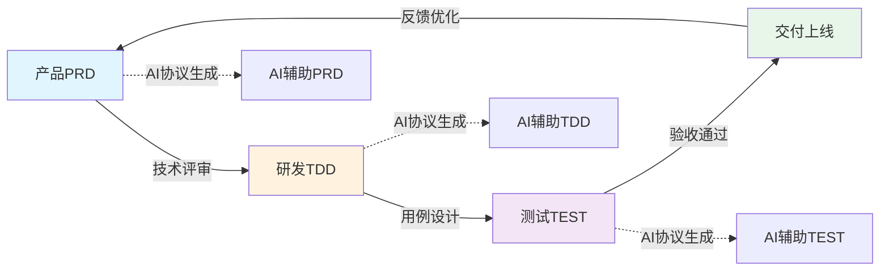

## 📖 关于 PDTA Protocol

**PDTA Protocol（产研测AI同频协议）** 是一个协议规范体系，定义了产品、研发、测试、AI 四方协同的标准化文档规范、流程协议和质量标准。

### 🌟 核心价值

- 📋 **统一语言**：建立产研测AI四方统一的沟通语言和协议标准
- 🔄 **流程规范**：PRD → TDD → TEST 标准化流转协议
- 🤖 **AI协议**：基于规范的AI智能生成和验证协议
- 📊 **质量标准**：定义文档质量、覆盖率、一致性的评判标准
- 📚 **可落地**：可直接应用的模板、流程和工具

### 🎨 协议特性

- ✅ **标准化**：统一的文档架构、模板和命名规范
- ✅ **可验证**：明确的质量标准和验证协议
- ✅ **AI驱动**：基于协议的AI智能辅助能力
- ✅ **可扩展**：灵活的扩展机制，适应不同场景

## 🚀 快速开始

### 📋 了解协议规范
1. 阅读 [文档架构规范](/.cursor/rules/doc-architecture.mdc) 了解8大文档分类
2. 查看 [需求管理协议](./requirement/) 了解 PRD/TDD/TEST 标准
3. 学习 [AI协议标准](/.cursor/skills/) 了解 AI 生成和验证协议
4. 参考 [质量标准](./requirement/) 了解文档质量评判标准

### 👥 应用指南

#### 对于新团队
1. 学习 [协议规范体系](./training/) 建立统一认知
2. 采用 [标准模板](./requirement/template/) 开始文档编写
3. 应用 [流程协议](./project/) 规范团队协作
4. 使用 [AI协议](/.cursor/skills/) 提升文档效率

#### 对于产品团队
1. 采用 [PRD规范和模板](./requirement/template/PRD-template.md) 编写需求
2. 使用 [AI生成协议](/.cursor/skills/generate-prd/) 快速起草
3. 遵循 [产品文档规范](./product/) 组织产品文档
4. 按照 [评审协议](./requirement/) 组织需求评审

#### 对于研发团队
1. 采用 [TDD规范和模板](./requirement/template/TDD-template.md) 设计方案
2. 使用 [AI生成协议](/.cursor/skills/generate-tdd/) 快速设计
3. 遵循 [技术文档规范](./technical/) 编写技术文档
4. 按照 [质量标准](./requirement/) 确保文档质量

#### 对于测试团队
1. 采用 [测试用例规范和模板](./requirement/template/TEST-template.md) 编写用例
2. 使用 [AI生成协议](/.cursor/skills/generate-test/) 快速生成
3. 应用 [覆盖率标准](/.cursor/skills/analyze-coverage/) 验证完整性
4. 按照 [验收协议](./requirement/) 执行验收

#### 对于运维团队
1. 采用 [运维文档规范](./operations/) 编写运维文档
2. 使用 [SOP标准模板](./operations/sop/) 制定操作流程
3. 遵循 [应急手册规范](./operations/runbook/) 编写应急文档

## 📝 参与贡献

PDTA Protocol 是一个开放的协议规范体系，欢迎共同完善！

### 贡献方式
1. 📋 **完善规范**：补充和完善 [文档规范](/.cursor/rules/doc-architecture.mdc) 
2. 🤖 **优化协议**：改进 [AI协议标准](/.cursor/skills/) 的定义和实现
3. 📖 **提供示例**：贡献实际应用案例和最佳实践
4. 🔍 **验证标准**：验证协议规范的可行性和有效性

### 工作流程
1. Fork 协议规范仓库
2. 补充或完善相关规范内容
3. 提交 Pull Request 并说明改进点
4. 社区评审通过后合并

## 💬 获取帮助

遇到问题或有好的建议？

- 📧 **邮箱**：pdta-protocol@example.com
- 💬 **社区讨论**：GitHub Discussions
- 📝 **问题反馈**：[提交 Issue](链接)

---

## 🔄 协议流程示意

下面是 PDTA 协议的核心流程图，展示了从需求到交付的完整流转过程：

---

  <strong>PDTA Protocol - 产研测AI同频协议规范体系</strong> 
  Product-Development-Test-AI Alignment Protocol

