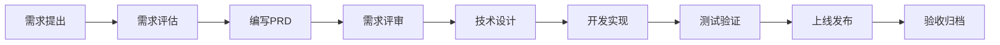
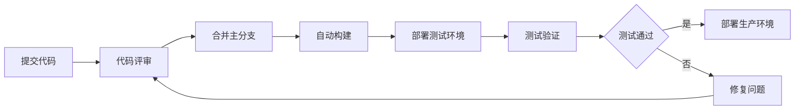

# 项目管理

## 📖 目录说明

项目管理文档包含团队协作、流程规范、进度跟踪等内容。本目录由项目经理维护，确保项目有序推进。

## 📁 内容分类

- **团队管理** - 团队成员、角色职责、协作方式
- **流程规范** - 需求流程、开发流程、发布流程
- **里程碑** - 项目重要节点和目标
- **会议记录** - 各类会议的记录和决议
- **项目报告** - 周报、月报、总结报告

## 👥 团队组成

### 核心团队

| 角色 | 姓名 | 职责 | 联系方式 |
|-----|------|------|---------|
| 项目经理 | XXX | 项目统筹、进度管理 | XXX |
| 产品经理 | XXX | 需求管理、产品设计 | XXX |
| 技术负责人 | XXX | 技术架构、技术决策 | XXX |
| 前端负责人 | XXX | 前端开发、前端架构 | XXX |
| 后端负责人 | XXX | 后端开发、接口设计 | XXX |
| 测试负责人 | XXX | 测试计划、质量保证 | XXX |
| 运维负责人 | XXX | 部署维护、监控告警 | XXX |

详见 [团队详情](./team.md)

## 📋 项目流程

### 需求开发流程

### 发布流程

## 📅 迭代计划

### 当前迭代

- **迭代周期**：2周
- **迭代目标**：[目标描述]
- **开始时间**：YYYY-MM-DD
- **结束时间**：YYYY-MM-DD

### 迭代管理
- **需求池**：查看 [需求池](../requirement/backlog/)
- **进度跟踪**：每日站会、周报
- **风险管理**：识别风险、制定应对措施

## 📊 项目度量

### 关键指标

| 指标 | 当前值 | 目标值 | 趋势 |
|-----|--------|--------|------|
| 需求完成率 | 85% | > 90% | ↑ |
| Bug修复率 | 92% | > 95% | ↑ |
| 代码覆盖率 | 75% | > 80% | → |
| 发布成功率 | 98% | > 99% | ↑ |

### 质量度量
- **代码质量**：Sonar扫描、代码评审
- **测试质量**：测试覆盖率、缺陷密度
- **发布质量**：线上故障率、回滚率

## 🗓️ 会议安排

### 常规会议

| 会议名称 | 频率 | 时间 | 参与人 | 目的 |
|---------|------|------|--------|------|
| 站会 | 每日 | 10:00 | 全体开发 | 同步进度、识别问题 |
| 周会 | 每周 | 周一 10:00 | 全体成员 | 总结回顾、计划安排 |
| 需求评审 | 按需 | - | 产品+技术 | 评审需求可行性 |
| 技术评审 | 按需 | - | 技术团队 | 评审技术方案 |
| 迭代规划 | 每两周 | - | 全体成员 | 规划下个迭代 |
| 复盘会议 | 迭代结束 | - | 全体成员 | 总结经验教训 |

## 📝 文档规范

### 文档要求
- 使用统一模板
- 内容清晰完整
- 及时更新维护
- 遵循命名规范

### 文档评审
- PRD需经过产品评审
- TDD需经过技术评审
- 重要决策需记录ADR

## 🔗 快速链接

- [需求池](../requirement/backlog/)
- [流程规范](./process/)
- [会议记录](./meetings/)
- [项目报告](./reports/)

## 👥 维护者

- **负责人**：项目经理
- **更新频率**：每周更新
- **协作工具**：Jira、Confluence、钉钉
