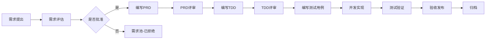

# 需求管理

## 📖 目录说明

需求管理是项目的核心文档目录，管理需求的全生命周期，保证需求可追溯。本目录包含需求池、需求文档、技术设计、测试用例等完整的需求管理体系。

## 📁 目录结构

- **backlog/** - 需求池（待评估、已批准、已拒绝）
- **template/** - 文档模板（PRD、TDD、TEST模板）
- **YYYYMM-需求名称/** - 具体需求文件夹
  - product/ - 产品需求文档（PRD）
  - technical/ - 技术设计文档（TDD）
  - testing/ - 测试用例和测试报告
  - review/ - 评审记录
- **archives/** - 历史需求归档

## 📝 需求文档规范

### 需求文件夹命名

格式：`YYYYMM-需求简短名称`

示例：
- ✅ `202602-用户登录注册`
- ✅ `202603-订单管理`
- ❌ `需求1`、`新需求`

### 文档版本管理

每个文档应包含 frontmatter 版本信息：

```yaml
---
version: 1.0.0
created: 2026-02-09
updated: 2026-02-15
author: 张三
reviewers: [李四, 王五]
status: draft | review | approved | development | testing | published
---
```

### 需求流程



## 🔗 快速链接

- [需求池](./backlog/)
- [文档模板](./template/)

## 👥 维护者

- **产品经理**：负责 PRD
- **技术负责人**：负责 TDD
- **测试工程师**：负责测试用例
- **更新频率**：按需求迭代更新
