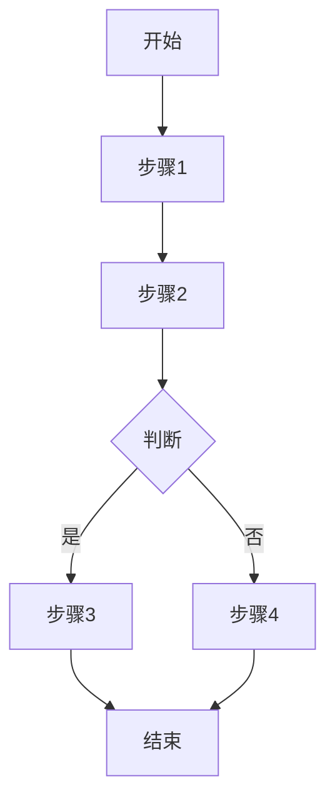
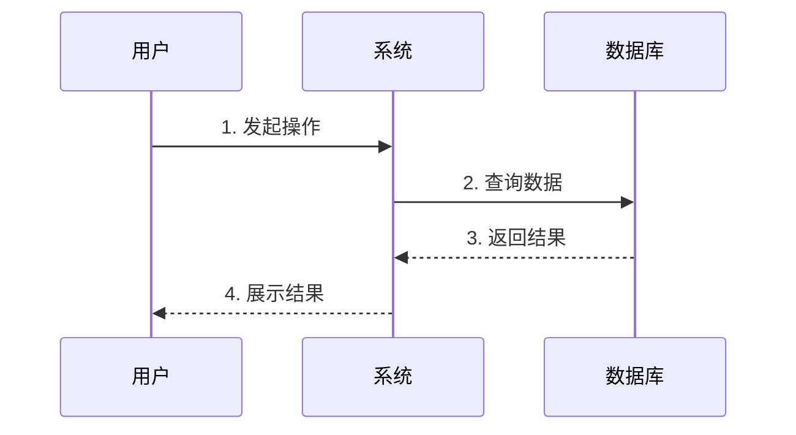

# PRD - [需求名称]

## 文档信息

| 文档信息 | 内容 |
|---------|------|
| 需求名称 | [与文件夹名称一致] |
| 创建日期 | YYYY-MM-DD |
| 产品负责人 | [姓名] |
| 开发负责人 | [姓名] |
| 测试负责人 | [姓名] |
| 文档状态 | 🔵 草稿 / 🟡 评审中 / 🟢 已批准 / 🔴 已废弃 / ✅ 已完成 |
| 版本号 | v1.0 |

---

## 一、需求概述

### 1.1 背景与目标

**业务背景**：
- 描述当前存在的问题或机会
- 为什么需要这个功能

**需求目标**：
- 期望达成的业务目标
- 可量化的指标（如提升XX%）

### 1.2 目标用户

| 用户角色 | 描述 | 使用场景 |
|---------|------|---------|
| 角色1 | 角色描述 | 主要使用场景 |
| 角色2 | 角色描述 | 主要使用场景 |

### 1.3 成功标准

- [ ] 标准1：具体可衡量的标准
- [ ] 标准2：用户反馈或数据指标
- [ ] 标准3：性能或质量要求

---

## 二、功能需求

### 2.1 功能清单

| 功能编号 | 功能名称 | 优先级 | 描述 |
|---------|---------|--------|------|
| F01 | 功能1 | P0 | 功能简要说明 |
| F02 | 功能2 | P1 | 功能简要说明 |
| F03 | 功能3 | P2 | 功能简要说明 |

**优先级说明**：
- **P0**：必须有，核心功能
- **P1**：应该有，重要功能
- **P2**：可以有，次要功能
- **P3**：暂不考虑

### 2.2 功能详细说明

#### F01 - [功能名称]

**功能描述**：
详细描述功能的作用和价值

**使用场景**：
1. 场景1：用户在XX情况下，需要...
2. 场景2：当XX发生时，用户希望...

**操作流程**：

**功能要点**：
- 要点1：具体说明
- 要点2：具体说明
- 要点3：具体说明

**交互说明**：
- 页面元素
- 用户操作
- 系统反馈

**业务规则**：
1. 规则1：详细说明
2. 规则2：详细说明

**异常处理**：
- 异常情况1 → 处理方式
- 异常情况2 → 处理方式

---

## 三、非功能需求

### 3.1 性能要求

- **响应时间**：页面加载 < 2秒
- **并发支持**：支持XXX并发用户
- **数据处理**：单次处理XX条数据

### 3.2 安全要求

- 数据加密传输（HTTPS）
- 敏感信息脱敏
- 权限控制要求

### 3.3 兼容性要求

- **浏览器**：Chrome、Firefox、Safari最新版
- **设备**：PC端、移动端适配
- **操作系统**：Windows、macOS、iOS、Android

### 3.4 可用性要求

- 系统可用性：99.9%
- 容错机制：详细说明
- 降级方案：详细说明

---

## 四、原型设计

### 4.1 页面结构

> 在 attachments/ 目录中放置原型图

- [原型图1 - 首页](./attachments/wireframe-home.png)
- [原型图2 - 详情页](./attachments/wireframe-detail.png)

### 4.2 交互流程

---

## 五、数据需求

### 5.1 数据字段

| 字段名 | 字段类型 | 必填 | 说明 |
|-------|---------|-----|------|
| id | string | 是 | 唯一标识 |
| name | string | 是 | 名称 |
| status | enum | 是 | 状态：active/inactive |
| created_at | datetime | 是 | 创建时间 |

### 5.2 数据流转

描述数据在系统中的流转过程

---

## 六、依赖关系

### 6.1 前置依赖

- 依赖项1：说明
- 依赖项2：说明

### 6.2 影响范围

- 影响模块1：具体影响
- 影响模块2：具体影响

---

## 七、验收标准

### 7.1 功能验收

- [ ] F01 功能按预期工作
- [ ] F02 功能按预期工作
- [ ] 所有业务规则正确执行

### 7.2 性能验收

- [ ] 响应时间满足要求
- [ ] 并发测试通过
- [ ] 压力测试通过

### 7.3 兼容性验收

- [ ] 各浏览器测试通过
- [ ] 移动端适配正常
- [ ] 各种屏幕尺寸正常显示

---

## 八、实施计划

### 8.1 时间规划

| 阶段 | 时间 | 负责人 | 交付物 |
|-----|------|--------|--------|
| PRD评审 | Week 1 | 产品经理 | PRD v1.0 |
| 技术设计 | Week 2 | 技术负责人 | TDD v1.0 |
| 开发实现 | Week 3-4 | 开发团队 | 功能代码 |
| 测试验证 | Week 5 | 测试团队 | 测试报告 |
| 上线发布 | Week 6 | 运维团队 | 生产环境 |

### 8.2 风险评估

| 风险项 | 可能性 | 影响程度 | 应对措施 |
|-------|--------|---------|---------|
| 风险1 | 高/中/低 | 高/中/低 | 具体措施 |
| 风险2 | 高/中/低 | 高/中/低 | 具体措施 |

---

## 九、变更记录

| 版本 | 日期 | 变更人 | 变更内容 |
|-----|------|--------|---------|
| v1.0 | YYYY-MM-DD | XXX | 初始版本 |
| v1.1 | YYYY-MM-DD | XXX | 调整XX功能 |

---

## 十、附录

### 10.1 术语表

| 术语 | 解释 |
|-----|------|
| 术语1 | 详细解释 |
| 术语2 | 详细解释 |

### 10.2 参考资料

- [相关文档1](链接)
- [相关文档2](链接)
