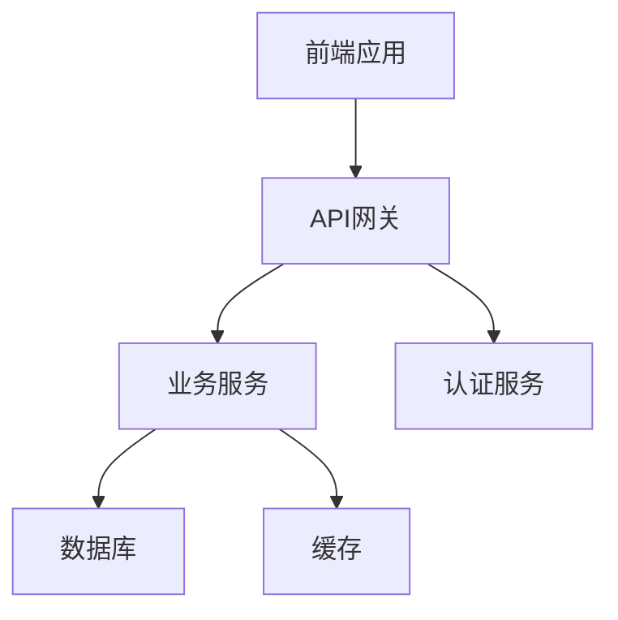
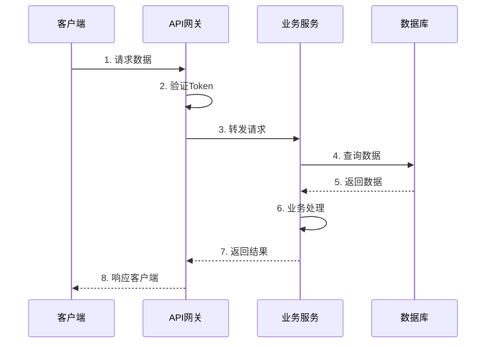
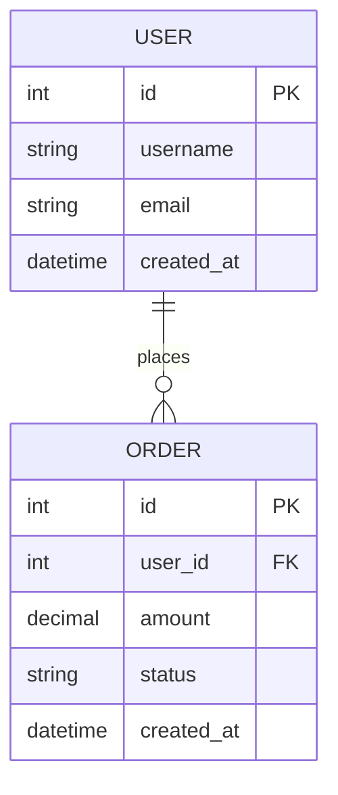
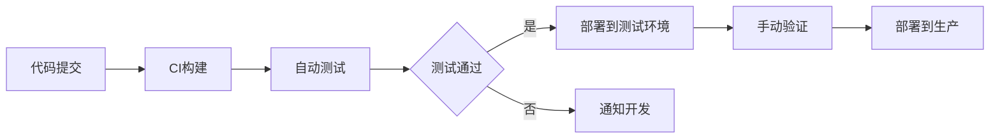

# TDD - [需求名称] 技术设计文档

## 文档信息

| 文档信息 | 内容 |
|---------|------|
| 需求名称 | [与PRD保持一致] |
| 创建日期 | YYYY-MM-DD |
| 技术负责人 | [姓名] |
| 前端负责人 | [姓名] |
| 后端负责人 | [姓名] |
| 文档状态 | 🔵 草稿 / 🟡 评审中 / 🟢 已批准 / 🔴 已废弃 |
| 版本号 | v1.0 |
| 关联PRD | [PRD链接] |

---

## 一、概述

### 1.1 需求背景

简要说明需求的技术背景和实现目标

### 1.2 技术目标

- 目标1：具体技术目标
- 目标2：性能/安全/可维护性目标
- 目标3：技术债务处理

### 1.3 技术选型

| 技术项 | 选择方案 | 理由 |
|-------|---------|------|
| 前端框架 | React/Vue | 理由说明 |
| 状态管理 | Redux/Pinia | 理由说明 |
| UI组件库 | Ant Design | 理由说明 |
| 后端语言 | Node.js/Java | 理由说明 |

---

## 二、系统设计

### 2.1 架构设计



**架构说明**：
- 层次划分
- 模块职责
- 交互关系

### 2.2 模块设计

#### 模块1：[模块名称]

**职责**：
- 职责1
- 职责2

**接口**：
- 对外提供的接口

**依赖**：
- 依赖的其他模块

### 2.3 核心流程



---

## 三、数据库设计

### 3.1 ER图



### 3.2 表结构设计

#### 表1：users (用户表)

| 字段名 | 类型 | 长度 | 必填 | 索引 | 说明 |
|-------|------|------|-----|------|------|
| id | BIGINT | - | 是 | PK | 主键ID |
| username | VARCHAR | 50 | 是 | UK | 用户名 |
| email | VARCHAR | 100 | 是 | IDX | 邮箱 |
| password | VARCHAR | 255 | 是 | - | 加密密码 |
| status | TINYINT | - | 是 | - | 状态：1-正常 0-禁用 |
| created_at | DATETIME | - | 是 | IDX | 创建时间 |
| updated_at | DATETIME | - | 是 | - | 更新时间 |

**索引设计**：
- PRIMARY KEY: `id`
- UNIQUE KEY: `username`
- INDEX: `idx_email` (`email`)
- INDEX: `idx_created_at` (`created_at`)

**业务规则**：
1. username 全局唯一
2. email 需要验证格式
3. password 采用 bcrypt 加密
4. status 默认为 1

### 3.3 数据迁移

**新增表**：
- users
- orders

**修改表**：
- 表名.字段名：修改说明

**数据迁移脚本**：
```sql
-- 创建用户表
CREATE TABLE users (
    id BIGINT PRIMARY KEY AUTO_INCREMENT,
    username VARCHAR(50) NOT NULL UNIQUE,
    email VARCHAR(100) NOT NULL,
    password VARCHAR(255) NOT NULL,
    status TINYINT DEFAULT 1,
    created_at DATETIME DEFAULT CURRENT_TIMESTAMP,
    updated_at DATETIME DEFAULT CURRENT_TIMESTAMP ON UPDATE CURRENT_TIMESTAMP,
    INDEX idx_email (email),
    INDEX idx_created_at (created_at)
) ENGINE=InnoDB DEFAULT CHARSET=utf8mb4 COMMENT='用户表';
```

---

## 四、接口设计

### 4.1 接口规范

**通用规范**：
- 协议：HTTPS
- 认证：JWT Token
- 数据格式：JSON
- 字符编码：UTF-8

**请求格式**：
```json
{
  "data": {},
  "timestamp": 1234567890,
  "sign": "签名"
}
```

**响应格式**：
```json
{
  "code": 0,
  "message": "success",
  "data": {},
  "timestamp": 1234567890
}
```

**状态码规范**：
| 状态码 | 说明 |
|-------|------|
| 0 | 成功 |
| 400 | 参数错误 |
| 401 | 未授权 |
| 403 | 无权限 |
| 404 | 资源不存在 |
| 500 | 服务器错误 |

### 4.2 接口列表

#### 4.2.1 用户注册

**接口地址**：`POST /api/v1/users/register`

**请求参数**：
| 参数名 | 类型 | 必填 | 说明 |
|-------|------|-----|------|
| username | string | 是 | 用户名，3-20字符 |
| email | string | 是 | 邮箱地址 |
| password | string | 是 | 密码，6-20字符 |
| code | string | 是 | 验证码 |

**请求示例**：
```json
{
  "username": "testuser",
  "email": "test@example.com",
  "password": "123456",
  "code": "1234"
}
```

**响应示例**：
```json
{
  "code": 0,
  "message": "注册成功",
  "data": {
    "user_id": 123,
    "username": "testuser",
    "token": "eyJhbGciOiJIUzI1NiIsInR5cCI6IkpXVCJ9..."
  }
}
```

**异常情况**：
| 错误码 | 说明 | 处理方式 |
|-------|------|---------|
| 4001 | 用户名已存在 | 提示用户更换用户名 |
| 4002 | 邮箱已注册 | 提示用户使用已有账号登录 |
| 4003 | 验证码错误 | 提示重新输入 |

---

## 五、前端设计

### 5.1 页面结构

```
src/
├── pages/              # 页面组件
│   ├── User/
│   │   ├── Login.tsx
│   │   └── Register.tsx
│   └── Home/
│       └── index.tsx
├── components/         # 通用组件
│   ├── Header/
│   └── Footer/
├── services/          # API服务
│   └── user.ts
├── stores/            # 状态管理
│   └── userStore.ts
└── utils/             # 工具函数
    └── request.ts
```

### 5.2 状态管理

**全局状态**：
```typescript
interface UserState {
  userInfo: UserInfo | null;
  token: string | null;
  isLogin: boolean;
}
```

**状态更新流程**：
1. 用户操作触发 action
2. action 调用 API
3. API 返回后更新 state
4. 组件响应 state 变化

### 5.3 路由设计

| 路径 | 组件 | 权限 | 说明 |
|-----|------|------|------|
| /login | Login | 公开 | 登录页 |
| /register | Register | 公开 | 注册页 |
| /home | Home | 需登录 | 首页 |
| /profile | Profile | 需登录 | 个人中心 |

---

## 六、安全设计

### 6.1 认证与鉴权

**认证方式**：JWT Token

**Token生成**：
```
Header.Payload.Signature
```

**Token 存储**：
- 位置：localStorage
- 有效期：7天
- 刷新机制：自动刷新

### 6.2 数据安全

**敏感数据加密**：
- 密码：bcrypt 加密
- 传输：HTTPS
- 存储：数据库加密字段

**XSS防护**：
- 输入过滤
- 输出转义
- CSP策略

**CSRF防护**：
- Token验证
- SameSite Cookie

### 6.3 权限控制

**权限模型**：RBAC（基于角色的访问控制）

**权限检查**：
1. 前端路由守卫
2. 后端接口验证
3. 数据权限过滤

---

## 七、性能优化

### 7.1 前端优化

- **代码分割**：路由懒加载
- **资源优化**：图片压缩、CDN加速
- **缓存策略**：浏览器缓存、Service Worker
- **首屏优化**：骨架屏、关键资源预加载

### 7.2 后端优化

- **数据库优化**：索引优化、查询优化
- **缓存策略**：Redis缓存热点数据
- **异步处理**：消息队列处理耗时任务
- **负载均衡**：多实例部署

### 7.3 性能指标

| 指标 | 目标值 | 监控方式 |
|-----|--------|---------|
| 首屏加载 | < 2s | 前端监控 |
| API响应 | < 200ms | APM监控 |
| 并发支持 | 1000 QPS | 压力测试 |

---

## 八、部署方案

### 8.1 环境配置

| 环境 | 域名 | 服务器 | 说明 |
|-----|------|--------|------|
| 开发环境 | dev.example.com | 1台 | 开发测试 |
| 测试环境 | test.example.com | 1台 | QA测试 |
| 生产环境 | www.example.com | 3台 | 正式服务 |

### 8.2 部署流程



### 8.3 回滚方案

1. 保留上一版本镜像
2. 发现问题立即回滚
3. 回滚时间 < 5分钟

---

## 九、监控与告警

### 9.1 监控指标

**业务监控**：
- 用户注册量
- 登录成功率
- 接口调用量

**技术监控**：
- 服务可用性
- 响应时间
- 错误率

### 9.2 告警规则

| 指标 | 阈值 | 告警方式 |
|-----|------|---------|
| 错误率 | > 5% | 短信+邮件 |
| 响应时间 | > 1s | 邮件 |
| 服务宕机 | 立即 | 电话+短信 |

---

## 十、风险评估

| 风险项 | 可能性 | 影响 | 应对措施 |
|-------|--------|------|---------|
| 并发压力 | 中 | 高 | 负载均衡+限流 |
| 数据安全 | 低 | 高 | 加密+备份 |
| 第三方依赖 | 中 | 中 | 降级方案 |

---

## 十一、变更记录

| 版本 | 日期 | 变更人 | 变更内容 |
|-----|------|--------|---------|
| v1.0 | YYYY-MM-DD | XXX | 初始版本 |
| v1.1 | YYYY-MM-DD | XXX | 调整数据库设计 |

---

## 十二、附录

### 12.1 技术术语

| 术语 | 解释 |
|-----|------|
| JWT | JSON Web Token |
| RBAC | Role-Based Access Control |

### 12.2 参考资料

- [RESTful API设计规范](链接)
- [数据库设计规范](链接)
